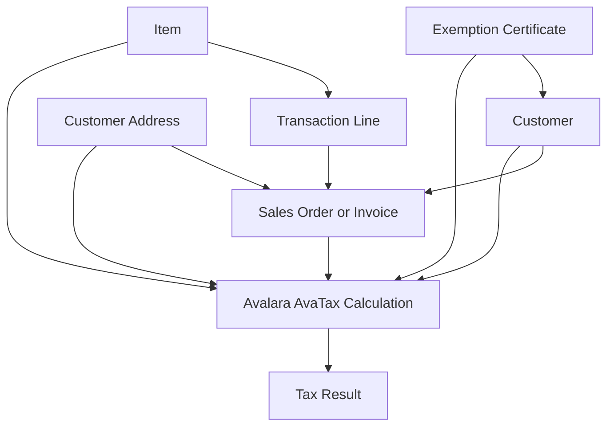
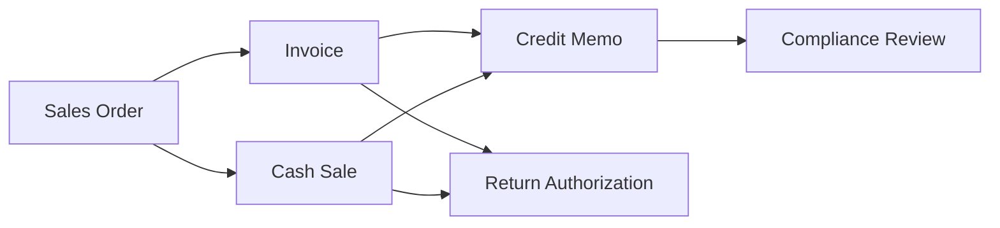
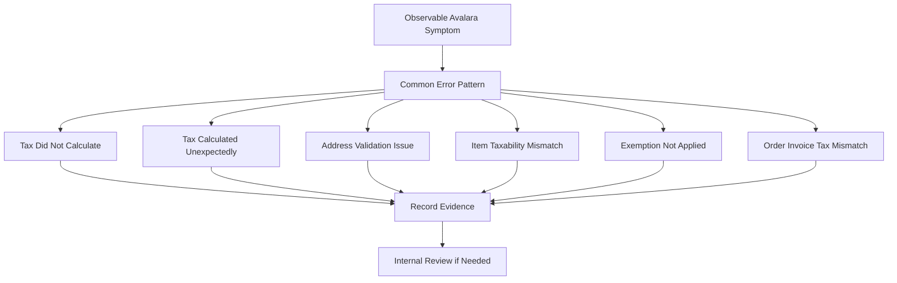
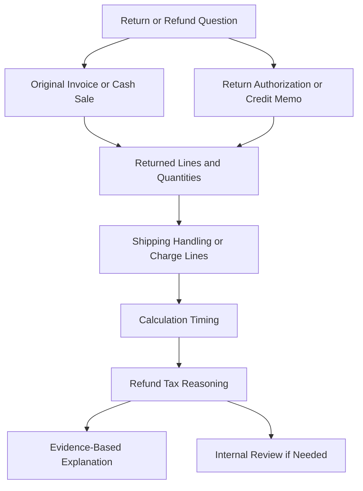
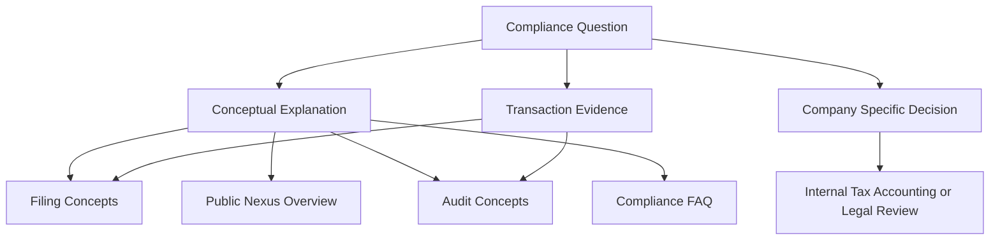
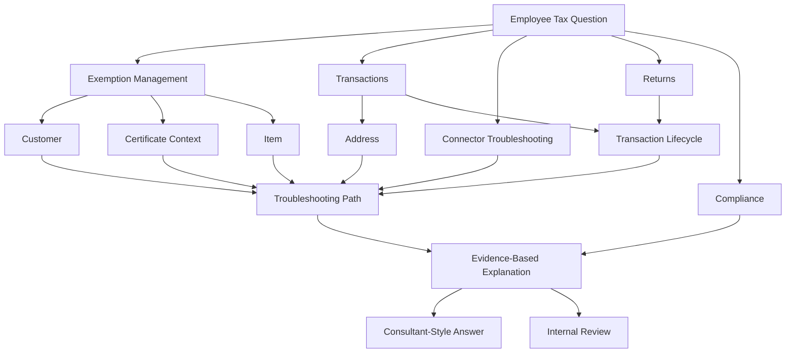
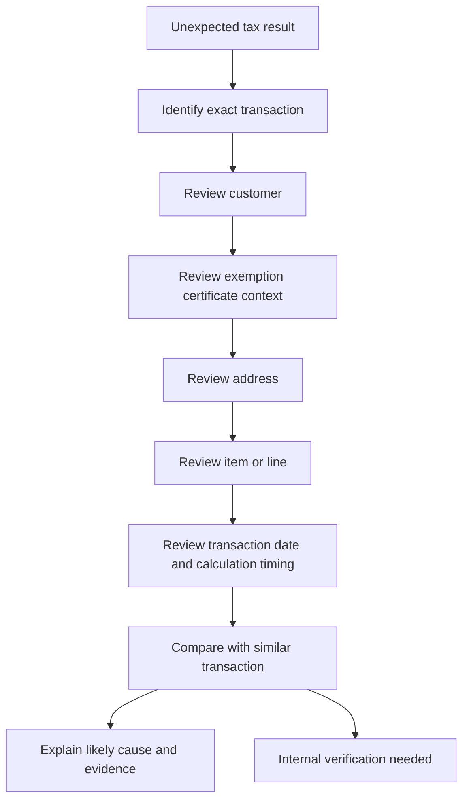

# Avalara Integration Knowledge Hub

## Purpose

This section organizes public-safe Avalara knowledge for the NetSuite Intelligence Platform.

The goal is not to reproduce Avalara documentation. The goal is to help readers and AI assistants reason through common NetSuite and Avalara questions using connected concepts, record relationships, business process context, and troubleshooting paths.

## Public-Safe Scope

This section may include:

- public Avalara concepts
- public AvaTax product capabilities
- NetSuite-centered reasoning
- generic integration patterns
- public-safe troubleshooting guidance
- record relationship explanations
- AI reasoning guidance

This section must not include company-specific tax setup, private examples, internal mappings, screenshots, proprietary process details, company nexus decisions, filing calendars, audit strategy, customer-specific examples, or internal tax positions.

Private implementation knowledge belongs in a private repository.

## Knowledge Clusters

### Exemption Management

The Exemption Management cluster explains how customer, certificate, item, address, transaction, and timing context can affect exemption-related tax results.

Start here:

1. [Exemption Certificates](exemptions/EXEMPTION_CERTIFICATES.md)
2. [Customer Exemptions](exemptions/CUSTOMER_EXEMPTIONS.md)
3. [Item Taxability](exemptions/ITEM_TAXABILITY.md)
4. [Why Is Customer Tax Exempt?](exemptions/WHY_IS_CUSTOMER_TAX_EXEMPT.md)
5. [Exemption Troubleshooting](exemptions/EXEMPTION_TROUBLESHOOTING.md)
6. [Common Exemption Scenarios](exemptions/COMMON_EXEMPTION_SCENARIOS.md)

Recommended learning path:

```text
Exemption Certificates
  -> Customer Exemptions
  -> Item Taxability
  -> Why Is Customer Tax Exempt?
  -> Exemption Troubleshooting
  -> Common Exemption Scenarios
```

### Transactions

The Transactions cluster explains how NetSuite transaction stages affect Avalara tax reasoning.

Start here:

1. [Sales Orders](transactions/SALES_ORDERS.md)
2. [Invoices](transactions/INVOICES.md)
3. [Cash Sales](transactions/CASH_SALES.md)
4. [Credit Memos](transactions/CREDIT_MEMOS.md)
5. [Transaction Lifecycle](transactions/TRANSACTION_LIFECYCLE.md)

Recommended learning path:

```text
Sales Orders
  -> Invoices
  -> Cash Sales
  -> Credit Memos
  -> Transaction Lifecycle
```

The most important Transactions article for AI reasoning is [Transaction Lifecycle](transactions/TRANSACTION_LIFECYCLE.md), because it teaches the assistant how to compare records across order, billing, payment, and correction stages.

### Connector Troubleshooting

The Connector Troubleshooting cluster explains how to investigate Avalara symptoms from a NetSuite-centered perspective.

Start here:

1. [Common Avalara Error Patterns](troubleshooting/COMMON_AVALARA_ERROR_PATTERNS.md)
2. [Tax Did Not Calculate](troubleshooting/TAX_DID_NOT_CALCULATE.md)
3. [Tax Calculated Unexpectedly](troubleshooting/TAX_CALCULATED_UNEXPECTEDLY.md)
4. [Address Validation Issues](troubleshooting/ADDRESS_VALIDATION_ISSUES.md)
5. [Item Taxability Mismatch](troubleshooting/ITEM_TAXABILITY_MISMATCH.md)
6. [Exemption Not Applied](troubleshooting/EXEMPTION_NOT_APPLIED.md)
7. [Order and Invoice Tax Mismatch](troubleshooting/ORDER_INVOICE_TAX_MISMATCH.md)

Recommended learning path:

```text
Common Avalara Error Patterns
  -> Tax Did Not Calculate
  -> Tax Calculated Unexpectedly
  -> Address Validation Issues
  -> Item Taxability Mismatch
  -> Exemption Not Applied
  -> Order and Invoice Tax Mismatch
```

The most important Connector Troubleshooting article for AI reasoning is [Common Avalara Error Patterns](troubleshooting/COMMON_AVALARA_ERROR_PATTERNS.md), because it teaches the assistant to classify the observable symptom before choosing a more specific troubleshooting path.

### Returns

The Returns cluster explains how returns, refunds, credit memos, and correction records relate back to original transaction tax results.

Start here:

1. [Return Lifecycle](returns/RETURN_LIFECYCLE.md)
2. [Refund Tax Reasoning](returns/REFUND_TAX_REASONING.md)
3. [Return Troubleshooting](returns/RETURN_TROUBLESHOOTING.md)

Recommended learning path:

```text
Return Lifecycle
  -> Refund Tax Reasoning
  -> Return Troubleshooting
  -> Transaction Lifecycle
```

The most important Returns article for AI reasoning is [Return Lifecycle](returns/RETURN_LIFECYCLE.md), because it teaches the assistant to compare return-related records against the original invoice or cash sale before explaining refund tax.

### Compliance

The Compliance cluster explains high-level public-safe compliance concepts without making company-specific filing, nexus, audit, registration, remittance, or legal decisions.

Start here:

1. [Filing Concepts](compliance/FILING_CONCEPTS.md)
2. [Public Nexus Overview](compliance/PUBLIC_NEXUS_OVERVIEW.md)
3. [Audit Concepts](compliance/AUDIT_CONCEPTS.md)
4. [Compliance FAQ](compliance/COMPLIANCE_FAQ.md)

Recommended learning path:

```text
Filing Concepts
  -> Public Nexus Overview
  -> Audit Concepts
  -> Compliance FAQ
```

The most important Compliance article for AI reasoning is [Compliance FAQ](compliance/COMPLIANCE_FAQ.md), because it teaches the assistant to classify questions as conceptual, transaction-specific, or company-specific before answering.

## Exemption Management Relationship Map



## Transaction Lifecycle Map



This lifecycle map is a generic reasoning model. It is not a company-specific process map.

## Connector Troubleshooting Map



This map teaches the assistant to route from symptom to diagnostic path before recommending escalation.

## Returns Reasoning Map



This map teaches the assistant that return tax questions should be reviewed against the original transaction and line-level refund context.

## Compliance Reasoning Map



This map teaches the assistant to distinguish public-safe concept explanations from company-specific compliance decisions.

## Cross-Cluster Reasoning Map



## Exemption Troubleshooting Flow



## Coverage Status

| Cluster | Foundation | Integration | Troubleshooting | Reference | Reasoning |
|---|---:|---:|---:|---:|---:|
| Exemption Management | 100% | 100% | 100% | 100% | 90% |
| Transactions | 100% | 100% | 80% | 80% | 100% |
| Connector Troubleshooting | 100% | 90% | 100% | 80% | 95% |
| Returns | 100% | 90% | 100% | 80% | 95% |
| Compliance | 100% | 80% | 80% | 90% | 95% |

Coverage percentages are directional, not formal validation scores. They represent whether the cluster can currently support useful AI-assisted reasoning.

## Suggested Next Work

Avalara is now close to consultant-grade v1 coverage.

Recommended remaining polish before moving to Pacejet:

- Review article-to-article links for consistency.
- Add targeted cross-links from older exemption and transaction articles into Returns and Compliance where helpful.
- Add benchmark employee questions for Avalara GPT evaluation.
- Confirm naming conventions and metadata consistency across the Avalara section.

After this polish pass, the next recommended platform is Pacejet, followed by SPS Commerce.

## AI Retrieval Guidance

When a user asks an Avalara question, retrieve based on the question type.

### Exemption-related retrieval signals

- customer tax exempt
- exemption certificate
- resale certificate
- no tax calculated
- tax calculated for exempt customer
- item taxability
- same customer different tax result
- Avalara exemption issue

The assistant should usually retrieve:

1. the scenario or troubleshooting article,
2. the specific concept article,
3. and the related transaction article.

### Transaction-related retrieval signals

- sales order tax
- invoice tax
- cash sale tax
- credit memo tax
- tax changed between order and invoice
- tax changed after invoicing
- tax correction
- why did tax change

The assistant should usually retrieve:

1. [Transaction Lifecycle](transactions/TRANSACTION_LIFECYCLE.md),
2. the specific transaction article,
3. and any related exemption article if customer, certificate, or item taxability is involved.

### Connector troubleshooting retrieval signals

- Avalara error
- AvaTax error
- connector error
- response error
- tax did not calculate
- tax calculated unexpectedly
- address validation failed
- exemption not applied
- item taxability mismatch
- order invoice tax mismatch

The assistant should usually retrieve:

1. [Common Avalara Error Patterns](troubleshooting/COMMON_AVALARA_ERROR_PATTERNS.md),
2. the specific symptom article,
3. [Transaction Lifecycle](transactions/TRANSACTION_LIFECYCLE.md) when timing or downstream records are involved,
4. and related exemption or item articles when the symptom involves customer, certificate, or item context.

### Return-related retrieval signals

- return tax
- refund tax
- credit memo tax
- partial refund
- returned item tax
- tax refund did not match
- customer did not get tax back
- tax on return

The assistant should usually retrieve:

1. [Return Lifecycle](returns/RETURN_LIFECYCLE.md),
2. [Refund Tax Reasoning](returns/REFUND_TAX_REASONING.md),
3. [Return Troubleshooting](returns/RETURN_TROUBLESHOOTING.md),
4. [Credit Memos](transactions/CREDIT_MEMOS.md),
5. and [Transaction Lifecycle](transactions/TRANSACTION_LIFECYCLE.md).

### Compliance-related retrieval signals

- filing
- sales tax returns
- tax period
- nexus
- economic nexus
- audit
- audit readiness
- compliance review
- registration
- remittance
- tax obligation

The assistant should usually retrieve:

1. [Compliance FAQ](compliance/COMPLIANCE_FAQ.md),
2. the specific compliance concept article,
3. [Transaction Lifecycle](transactions/TRANSACTION_LIFECYCLE.md) when a transaction is involved,
4. [Return Lifecycle](returns/RETURN_LIFECYCLE.md) when credits or refunds are involved,
5. and relevant exemption or troubleshooting articles when the compliance question starts with a tax-result issue.

Company-specific filing, nexus, audit, registration, remittance, tax-position, or legal questions must be routed to private documentation or internal review.

## Public Sources

- https://developer.avalara.com/avatax/errors/
- https://developer.avalara.com/products/avatax/
- https://knowledge.avalara.com/
- https://www.avalara.com/us/en/learn/guides/state-by-state-guide-economic-nexus-laws.html

## Related Framework Documents

- [AI Knowledge Metadata](../../../knowledge-engine/AI_KNOWLEDGE_METADATA.md)
- [ERP Intelligence Knowledge Model](../../../knowledge-engine/KNOWLEDGE_MODEL.md)
- [ERP Intelligence Knowledge Graph](../../../knowledge-engine/KNOWLEDGE_GRAPH.md)
- [Knowledge Cluster Article Template](../../../templates/KNOWLEDGE_CLUSTER_TEMPLATE.md)
