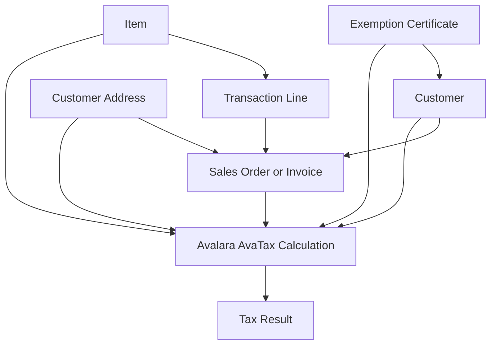
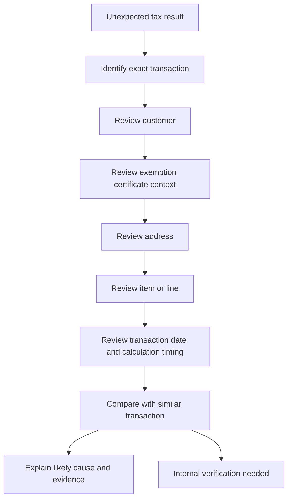

# Avalara Integration Knowledge Hub

## Purpose

This section organizes public-safe Avalara knowledge for the NetSuite Intelligence Platform.

The goal is not to reproduce Avalara documentation. The goal is to help readers and AI assistants reason through common NetSuite and Avalara questions using connected concepts, record relationships, business process context, and troubleshooting paths.

## Public-Safe Scope

This section may include:

- public Avalara concepts
- public AvaTax product capabilities
- NetSuite-centered reasoning
- generic integration patterns
- public-safe troubleshooting guidance
- record relationship explanations
- AI reasoning guidance

This section must not include:

- company-specific tax configuration
- private exemption decisions
- internal NetSuite custom fields
- saved searches
- workflows
- SuiteScripts
- integration mappings
- customer-specific examples
- screenshots from private systems
- proprietary process details

Private implementation knowledge belongs in a private repository.

## Knowledge Clusters

### Exemption Management

The Exemption Management cluster explains how customer, certificate, item, address, transaction, and timing context can affect exemption-related tax results.

Start here:

1. [Exemption Certificates](exemptions/EXEMPTION_CERTIFICATES.md)
2. [Customer Exemptions](exemptions/CUSTOMER_EXEMPTIONS.md)
3. [Item Taxability](exemptions/ITEM_TAXABILITY.md)
4. [Why Is Customer Tax Exempt?](exemptions/WHY_IS_CUSTOMER_TAX_EXEMPT.md)
5. [Exemption Troubleshooting](exemptions/EXEMPTION_TROUBLESHOOTING.md)
6. [Common Exemption Scenarios](exemptions/COMMON_EXEMPTION_SCENARIOS.md)

Recommended learning path:

```text
Exemption Certificates
  -> Customer Exemptions
  -> Item Taxability
  -> Why Is Customer Tax Exempt?
  -> Exemption Troubleshooting
  -> Common Exemption Scenarios
```

## Exemption Management Relationship Map



## Exemption Troubleshooting Flow



## Coverage Status

| Cluster | Foundation | Integration | Troubleshooting | Reference | Reasoning |
|---|---:|---:|---:|---:|---:|
| Exemption Management | 100% | 100% | 100% | 100% | 80% |
| Transactions | 0% | 0% | 0% | 0% | 0% |
| Returns | 0% | 0% | 0% | 0% | 0% |
| Compliance | 0% | 0% | 0% | 0% | 0% |
| Connector Troubleshooting | 0% | 0% | 0% | 0% | 0% |

Coverage percentages are directional, not formal validation scores. They represent whether the cluster can currently support useful AI-assisted reasoning.

## Suggested Next Cluster: Transactions

After Exemption Management, the next recommended cluster is Transactions.

Planned transaction articles:

- Sales Orders
- Invoices
- Cash Sales
- Credit Memos
- Transaction Lifecycle
- Why Did Avalara Calculate Tax?
- Why Did Tax Change Between Order and Invoice?

## AI Retrieval Guidance

When a user asks an exemption question, retrieve the Exemption Management cluster before answering.

Strong retrieval signals include:

- customer tax exempt
- exemption certificate
- resale certificate
- no tax calculated
- tax calculated for exempt customer
- item taxability
- same customer different tax result
- same item different tax result
- Avalara exemption issue

The assistant should usually retrieve:

1. the scenario or troubleshooting article,
2. the specific concept article,
3. and the related record relationship context.

## Public Sources

- https://developer.avalara.com/products/avatax/
- https://knowledge.avalara.com/

## Related Framework Documents

- [AI Knowledge Metadata](../../../knowledge-engine/AI_KNOWLEDGE_METADATA.md)
- [ERP Intelligence Knowledge Model](../../../knowledge-engine/KNOWLEDGE_MODEL.md)
- [Knowledge Cluster Article Template](../../../templates/KNOWLEDGE_CLUSTER_TEMPLATE.md)
