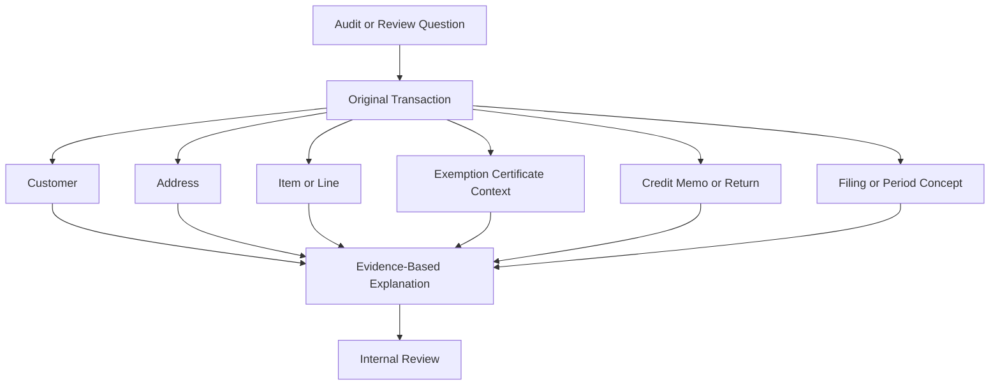

# Audit Concepts

## Quick Summary

Audit concepts explain how transaction records, tax results, exemptions, credits, returns, and filing context may be reviewed as evidence.

This article does not provide legal advice, audit defense strategy, company-specific procedures, jurisdiction positions, or filing instructions. Its purpose is to help an AI assistant understand audit readiness at a public-safe conceptual level.

The core reasoning rule is:

> Audit readiness depends on being able to explain tax outcomes with evidence, not just tax totals.

## Business Purpose

Sales tax audit questions often require connecting multiple pieces of evidence: the original transaction, customer and address context, item lines, exemption certificates, credits, refunds, and filing periods.

Employees may ask why a transaction was taxed, why a customer was exempt, why a credit memo changed tax, or what evidence supports a tax result. A consultant-style assistant should help users identify the records and relationships that may be relevant, while routing company-specific audit, legal, tax, and compliance decisions to internal review.

## Public-Safe Audit Definition

At a high level, a sales tax audit is a review of tax-related activity and supporting evidence.

For AI reasoning, audit concepts include:

- transaction evidence
- customer and address context
- item and line-level tax treatment
- exemption certificate support
- credit memo and return adjustments
- filing or reporting period concepts
- explanation of why a tax result occurred

This article is educational only and should not be treated as audit, legal, accounting, or tax advice.

## Avalara Perspective

Avalara public materials describe AvaTax as real-time sales and use tax determination across jurisdictions and describe broader compliance workflows through its public knowledge and product resources.

For audit reasoning, the important concept is that calculation results should be explainable through transaction data and related compliance context. The assistant should connect records and evidence, not make audit conclusions.

## NetSuite Perspective

In NetSuite-centered reasoning, audit evidence often begins with transaction records and then expands outward.

Common record relationships include:

- invoice to customer
- invoice to customer address
- invoice line to item
- invoice to exemption context
- invoice to credit memo
- cash sale to refund or correction activity
- credit memo to original invoice or cash sale
- transaction date to tax period concept

The assistant should help identify these relationships so users know where to look for supporting evidence.

## Audit Evidence Map



This map is a general reasoning model. It is not a company-specific audit workflow.

## Common Evidence Categories

| Evidence Category | What It Helps Explain | Related Records |
|---|---|---|
| Transaction evidence | What was sold, billed, credited, or refunded. | Invoice, cash sale, credit memo, transaction lines. |
| Customer evidence | Who the transaction involved and whether customer context affected tax. | Customer, customer address, exemption context. |
| Address evidence | Where the transaction was sourced, billed, or shipped. | Ship-to, bill-to, customer address. |
| Item evidence | What product or charge was taxed or not taxed. | Item, transaction line, charge line. |
| Exemption evidence | Why a transaction may have been exempt. | Exemption certificate, customer, jurisdiction, dates. |
| Return or credit evidence | How a prior transaction was reduced or corrected. | Credit memo, return authorization, original invoice or cash sale. |
| Timing evidence | When calculation, correction, or filing-related activity occurred. | Transaction date, credit date, tax period concept. |

## Consultant Reasoning Sequence

When a user asks an audit-related question, the assistant should:

1. Identify whether the question is conceptual, transaction-specific, exemption-specific, or filing-specific.
2. Start with the exact transaction if one is involved.
3. Review line-level detail before relying on totals.
4. Connect customer, address, item, exemption, and date context.
5. If credits or refunds are involved, compare them to the original transaction.
6. If filing or period context is involved, retrieve filing concepts.
7. Avoid final audit, legal, accounting, or tax conclusions.
8. Route company-specific audit response, reporting, or policy questions to internal review.

## Diagnostic Decision Tree

```text
If the user asks what records matter for audit readiness:
  Explain evidence categories conceptually.

If the user asks why a transaction was taxed:
  Retrieve transaction and troubleshooting articles.

If the user asks why a customer was exempt:
  Retrieve exemption certificate and exemption troubleshooting articles.

If the user asks how a credit memo affects audit evidence:
  Retrieve return lifecycle, refund tax reasoning, and credit memo articles.

If the user asks about filing periods or reported totals:
  Retrieve filing concepts and recommend internal review for company-specific details.

If the user asks how to respond to an audit or what legal position to take:
  Do not answer from the public repository.
  Route to internal tax, accounting, legal, or compliance review.
```

## Common Employee Questions

- What records would help explain this tax result?
- Why does line-level detail matter?
- Does the exemption certificate support the no-tax result?
- How do credit memos affect tax evidence?
- Why does transaction timing matter?
- Can the GPT help prepare for an audit?
- Can the GPT tell us how to respond to an auditor?

## Common Misconceptions

| Misconception | Better Reasoning |
|---|---|
| Audit readiness means only matching totals. | Evidence should explain transaction-level and line-level tax outcomes. |
| The current customer record explains historical transactions. | Historical timing matters. Current values may not match the original calculation context. |
| A credit memo is only a financial record. | It may also be evidence of a correction, return, or tax adjustment. |
| A no-tax result is always supported by exemption. | No-tax results may also involve item, address, jurisdiction, timing, or transaction context. |
| A public GPT should provide audit response strategy. | Audit responses and legal positions require internal review. |

## Public-Safe Boundaries

This article may explain:

- general evidence categories
- why transaction context matters
- why exemption support matters
- how credit memos and returns relate to original transactions
- why filing and period concepts matter
- when to escalate audit questions

This article must not include:

- audit response strategy
- legal advice
- tax positions
- jurisdiction-specific positions
- filing calendars
- company-specific reports
- private Avalara settings
- internal reconciliation procedures
- customer-specific examples
- screenshots
- custom fields, saved searches, workflows, or scripts

## AI Reasoning Guidance

The assistant should use this article when the user asks about audit readiness, audit evidence, tax review, supporting documentation, exemption support, transaction proof, or why records matter for compliance review.

The assistant should retrieve this article with:

- [Filing Concepts](FILING_CONCEPTS.md) for filing or period questions,
- [Public Nexus Overview](PUBLIC_NEXUS_OVERVIEW.md) for nexus-related questions,
- [Transaction Lifecycle](../transactions/TRANSACTION_LIFECYCLE.md) for transaction-specific questions,
- [Return Lifecycle](../returns/RETURN_LIFECYCLE.md) and [Refund Tax Reasoning](../returns/REFUND_TAX_REASONING.md) for credits or refunds,
- [Exemption Certificates](../exemptions/EXEMPTION_CERTIFICATES.md) for exemption support,
- and [Common Avalara Error Patterns](../troubleshooting/COMMON_AVALARA_ERROR_PATTERNS.md) for unexpected calculation results.

The assistant should avoid giving audit, legal, filing, remittance, registration, nexus, or tax-position advice from the public repository.

## Related Articles

- [Filing Concepts](FILING_CONCEPTS.md)
- [Public Nexus Overview](PUBLIC_NEXUS_OVERVIEW.md)
- [Transaction Lifecycle](../transactions/TRANSACTION_LIFECYCLE.md)
- [Return Lifecycle](../returns/RETURN_LIFECYCLE.md)
- [Refund Tax Reasoning](../returns/REFUND_TAX_REASONING.md)
- [Exemption Certificates](../exemptions/EXEMPTION_CERTIFICATES.md)
- [Common Avalara Error Patterns](../troubleshooting/COMMON_AVALARA_ERROR_PATTERNS.md)

## Public Sources

- https://developer.avalara.com/products/avatax/
- https://knowledge.avalara.com/

## Public-Safety Review

This article is public-safe. It avoids audit response strategy, legal advice, company-specific tax positions, nexus decisions, filing calendars, registrations, private reports, private Avalara settings, internal reconciliation procedures, customer examples, screenshots, custom fields, saved searches, workflows, scripts, and proprietary process details.
