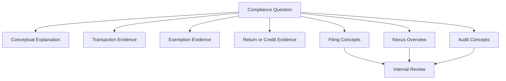

# Compliance FAQ

## Quick Summary

This FAQ helps an AI assistant answer common Avalara and NetSuite compliance questions in a public-safe way.

The goal is to explain concepts, route users to the right evidence, and identify when a question requires internal tax, accounting, legal, or compliance review. It does not provide company-specific nexus decisions, filing calendars, registration guidance, remittance instructions, audit strategy, or legal advice.

## Business Purpose

Compliance questions often start as everyday business questions:

- Why did this transaction calculate tax?
- Does this state require tax?
- Does a credit memo affect filing?
- What records support this exempt sale?
- Can we explain why tax was or was not charged?

A consultant-style assistant should separate these into three categories:

1. **Conceptual questions** that can be answered publicly.
2. **Transaction-specific questions** that require record comparison.
3. **Company-specific compliance questions** that require internal review.

## FAQ

### Is calculating tax the same as filing sales tax returns?

No. Tax calculation and filing are related, but they are not the same.

Tax calculation determines a tax result for a specific transaction context, such as an invoice, cash sale, or credit memo. Filing is a broader compliance process that may involve reviewing finalized transaction activity, adjustments, credits, returns, and reporting periods.

Use [Filing Concepts](FILING_CONCEPTS.md) and [Transaction Lifecycle](../transactions/TRANSACTION_LIFECYCLE.md) together when this question appears.

### Does a sales order determine what gets filed?

Not necessarily. A sales order may be an early transaction stage. Filing and compliance review typically depend on finalized transaction activity, which may involve invoices, cash sales, credit memos, refunds, or other records depending on the business process.

A GPT should not assume the sales order is the final compliance record. It should identify the transaction lifecycle and downstream records.

### Why do invoices, cash sales, and credit memos matter for compliance?

They help explain the transaction evidence behind tax results.

Invoices and cash sales may show tax charged on sales activity. Credit memos may reduce, reverse, or correct prior tax results. Together, these records help explain why a customer was charged, not charged, credited, or refunded tax.

Use [Transaction Lifecycle](../transactions/TRANSACTION_LIFECYCLE.md), [Credit Memos](../transactions/CREDIT_MEMOS.md), and [Return Lifecycle](../returns/RETURN_LIFECYCLE.md).

### Does a credit memo affect compliance review?

Conceptually, yes. A credit memo may represent a correction, return, refund, or reduction of a prior transaction. That can be relevant when reviewing transaction evidence and period-based compliance concepts.

However, the public repository should not define how a specific company reports or files those credits. Company-specific reporting and filing treatment belongs in private documentation or internal review.

### What is nexus?

Nexus is a high-level compliance concept describing a sufficient connection between a business and a jurisdiction that may create sales tax obligations.

Common public categories include physical nexus and economic nexus. This public repository can explain those concepts generally, but it must not state where a specific company has nexus, where it should register, or where it should file.

Use [Public Nexus Overview](PUBLIC_NEXUS_OVERVIEW.md).

### Can the GPT tell us where we have nexus?

No, not from the public repository.

Company-specific nexus positions, registration status, filing states, tax positions, and jurisdiction decisions belong in private documentation and require internal tax, accounting, legal, or compliance review.

The assistant may explain nexus conceptually and identify what kind of internal review is needed.

### If a transaction calculates tax, does that prove nexus?

No. A transaction tax result should not be treated as a final nexus determination.

Tax calculation depends on supplied transaction context, address, customer, item, exemption, date, and configuration. Nexus is a broader compliance concept that may require internal review.

### If a transaction does not calculate tax, does that mean there is no nexus?

No. A no-tax result may be caused by exemption context, item treatment, address context, transaction timing, or other calculation inputs.

Use [Tax Did Not Calculate](../troubleshooting/TAX_DID_NOT_CALCULATE.md), [Why Is Customer Tax Exempt?](../exemptions/WHY_IS_CUSTOMER_TAX_EXEMPT.md), and [Common Avalara Error Patterns](../troubleshooting/COMMON_AVALARA_ERROR_PATTERNS.md).

### What records help explain a compliance question?

Common evidence records include:

- invoice
- cash sale
- credit memo
- customer
- customer address
- item and transaction line
- exemption certificate
- return or refund record
- transaction date

Use [Audit Concepts](AUDIT_CONCEPTS.md) for evidence categories and record relationships.

### What records support an exempt sale?

An exempt sale may require reviewing customer context, exemption certificate context, address, item, transaction date, and line-level transaction detail.

The assistant should not assume a customer is exempt just because tax did not calculate. It should retrieve exemption articles and guide the user through evidence review.

Use [Exemption Certificates](../exemptions/EXEMPTION_CERTIFICATES.md), [Customer Exemptions](../exemptions/CUSTOMER_EXEMPTIONS.md), and [Exemption Troubleshooting](../exemptions/EXEMPTION_TROUBLESHOOTING.md).

### Does an exemption certificate always apply to every transaction?

No. Exemption behavior may depend on customer, certificate, jurisdiction, item, address, date, and transaction context.

The assistant should avoid saying a certificate applies to every transaction unless the specific transaction evidence supports that explanation.

### How do returns and refunds relate to compliance?

Returns and refunds may reduce, reverse, or correct prior transaction activity. They are important because they help explain why tax was credited or adjusted after the original sale.

The assistant should compare the return or credit record to the original transaction before explaining the tax result.

Use [Return Lifecycle](../returns/RETURN_LIFECYCLE.md), [Refund Tax Reasoning](../returns/REFUND_TAX_REASONING.md), and [Return Troubleshooting](../returns/RETURN_TROUBLESHOOTING.md).

### Should refund tax always equal original tax?

No. Refund tax may differ when the return is partial, line-specific, charge-specific, timing-dependent, or based on a credit record that does not mirror the full original transaction.

The assistant should compare original and credit records line by line.

### Can the GPT help with audit readiness?

Yes, at a conceptual level.

The GPT can help identify evidence categories, records to compare, and questions to ask. It should not provide audit response strategy, legal advice, tax positions, jurisdiction-specific conclusions, or company-specific audit procedures from the public repository.

Use [Audit Concepts](AUDIT_CONCEPTS.md).

### Can the GPT tell us how to respond to an auditor?

No, not from the public repository.

Audit response strategy, legal positions, jurisdiction-specific responses, and formal tax correspondence require internal tax, accounting, legal, or compliance review.

### What should the assistant do when a compliance question starts with an unexpected tax result?

Start with the transaction issue first.

For example:

- If tax did not calculate, retrieve [Tax Did Not Calculate](../troubleshooting/TAX_DID_NOT_CALCULATE.md).
- If tax calculated unexpectedly, retrieve [Tax Calculated Unexpectedly](../troubleshooting/TAX_CALCULATED_UNEXPECTEDLY.md).
- If the issue involves a certificate, retrieve exemption articles.
- If the issue involves a credit or refund, retrieve return articles.
- If the issue involves filing, retrieve compliance articles.

### When should a compliance question be escalated internally?

Escalate when the question involves:

- company-specific nexus positions
- registration status
- filing calendars
- remittance decisions
- tax positions
- audit response strategy
- legal interpretation
- private Avalara configuration
- internal reports
- private customer examples
- accounting policy
- unexplained transaction behavior after visible evidence review

## Compliance Retrieval Map

## AI Reasoning Guidance

The assistant should use this FAQ when a user asks broad compliance questions involving filing, nexus, audit readiness, transaction evidence, exemptions, credits, refunds, or whether tax results prove a compliance obligation.

The assistant should classify the question before answering:

1. **Conceptual**: answer publicly and cite/retrieve concept articles.
2. **Transaction-specific**: retrieve transaction, exemption, return, and troubleshooting articles.
3. **Company-specific compliance**: explain the concept and route to internal review.

The assistant should avoid final tax, legal, filing, registration, remittance, nexus, audit, or tax-position advice from the public repository.

## Related Articles

- [Filing Concepts](FILING_CONCEPTS.md)
- [Public Nexus Overview](PUBLIC_NEXUS_OVERVIEW.md)
- [Audit Concepts](AUDIT_CONCEPTS.md)
- [Transaction Lifecycle](../transactions/TRANSACTION_LIFECYCLE.md)
- [Return Lifecycle](../returns/RETURN_LIFECYCLE.md)
- [Refund Tax Reasoning](../returns/REFUND_TAX_REASONING.md)
- [Exemption Certificates](../exemptions/EXEMPTION_CERTIFICATES.md)
- [Common Avalara Error Patterns](../troubleshooting/COMMON_AVALARA_ERROR_PATTERNS.md)

## Public Sources

- https://developer.avalara.com/products/avatax/
- https://knowledge.avalara.com/

## Public-Safety Review

This FAQ is public-safe. It avoids company-specific nexus states, registrations, filing calendars, remittance decisions, tax positions, audit strategy, legal advice, private Avalara settings, internal reports, customer examples, screenshots, custom fields, saved searches, workflows, scripts, and proprietary process details.
