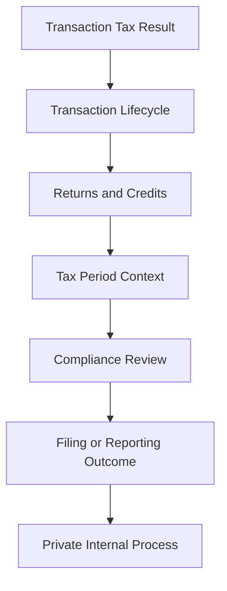

# Filing Concepts

## Quick Summary

Filing concepts explain how calculated transaction tax eventually relates to compliance reporting and sales tax returns.

AvaTax-style transaction calculation and filing are connected, but they are not the same activity. A transaction tax result answers, "What tax should be calculated for this transaction context?" A filing or compliance workflow asks, "How are finalized tax transactions summarized, reviewed, adjusted, and reported for a tax period?"

This article provides public-safe filing concepts for AI reasoning. It does not document filing procedures, filing calendars, nexus decisions, registration details, private reports, accounting policy, or tax configuration.

## Business Purpose

Employees may ask filing-related questions when tax results, invoices, credit memos, refunds, or corrections appear to affect reporting. Customer service, ecommerce, accounting, operations, and systems teams may all see pieces of the transaction lifecycle, but filing and compliance concepts require broader context.

A consultant-style assistant should help users understand the relationship between transaction evidence and compliance concepts while avoiding final tax, legal, or filing conclusions.

## Core Distinction

| Concept | What It Answers | Example Reasoning Question |
|---|---|---|
| Tax calculation | What tax result was determined for a transaction? | Why did this invoice calculate tax? |
| Transaction lifecycle | How did tax change across sales order, invoice, cash sale, or credit memo? | Why did the invoice differ from the sales order? |
| Return/refund reasoning | How did a credit or return affect the original transaction? | Why was tax refunded differently than expected? |
| Filing/compliance workflow | How are transaction results reviewed and reported for a period? | How do finalized transactions relate to filing? |

## Avalara Perspective

Avalara public developer material describes AvaTax as real-time sales and use tax determination at the point of transaction. It also identifies broader compliance workflows and separate Returns-related products in the product navigation.

For AI reasoning, the important distinction is that transaction calculation produces tax results, while filing concepts involve period-based review, reporting, and compliance workflows built from finalized transaction activity.

## NetSuite Perspective

In NetSuite, filing-related reasoning usually starts with transaction records and their lifecycle.

The assistant should understand that these records may contribute to compliance analysis:

- invoices
- cash sales
- credit memos
- refunds or returns
- customer records
- customer addresses
- item and line details
- transaction dates
- tax amounts

However, a public repository should not define how a specific company files, which jurisdictions it files in, which registrations it has, which reports it uses, or what its internal review process is.

## Filing Reasoning Model



This is a generic reasoning model. It is not a company-specific filing process.

## Common Filing Concepts

| Concept | Public-Safe Explanation | Why It Matters |
|---|---|---|
| Tax period | A reporting period used to organize transaction activity. | Filing questions usually depend on timing. |
| Finalized transaction | A transaction that may be used for reporting or compliance review. | Draft or early-stage records may not be the final source of truth. |
| Adjustment | A correction, credit, refund, or change that affects prior transaction activity. | Credit memos and returns may affect compliance analysis. |
| Jurisdiction | A taxing authority or location-based tax area. | Filing responsibility is commonly jurisdiction-based. |
| Registration | Authorization or requirement context for collecting and remitting tax. | Public docs should discuss conceptually only, not company-specific registrations. |
| Return filing | The process of reporting tax activity to an authority. | This is different from calculating tax on one transaction. |
| Reconciliation | Reviewing transaction activity against expected totals. | Helps explain why transaction accuracy matters upstream. |

## Records That May Affect Compliance Reasoning

| Record or Data Point | Why It Matters |
|---|---|
| Invoice | Often represents customer billing and tax charged. |
| Cash Sale | May represent completed sale and payment context. |
| Credit Memo | May reduce, reverse, or correct prior transaction tax. |
| Transaction Date | Helps associate activity with the correct period conceptually. |
| Customer Address | Helps explain jurisdiction context. |
| Item and Line Details | Product taxability and line-level treatment can affect tax results. |
| Exemption Context | May explain why tax was not charged. |
| Return or Refund Record | May affect adjustments or corrections. |

## Consultant Reasoning Sequence

When a user asks a filing-related question, the assistant should:

1. Identify whether the question is about a transaction, a correction, or a compliance process.
2. If the question is about a transaction, retrieve transaction and troubleshooting articles first.
3. If the question is about a refund or credit, retrieve return and credit memo articles.
4. If the question is about filing or reporting, explain the concept at a high level and recommend internal review for company-specific details.
5. Avoid giving legal, filing, registration, nexus, or remittance instructions.

## Diagnostic Decision Tree

```text
If the user asks why tax calculated:
  Use transaction and troubleshooting articles.

If the user asks whether tax should have been charged:
  Explain that this may require transaction evidence and internal tax review.

If the user asks how a credit memo affects filing:
  Explain that credits can affect period-based compliance review, then retrieve return and credit memo articles.

If the user asks where or when the company files:
  Do not answer from the public repository.
  Explain that company-specific filing calendars, registrations, and nexus decisions belong in private documentation.

If the user asks how Avalara filing works generally:
  Provide a high-level concept explanation and refer to public Avalara materials.
```

## Common Employee Questions

- Is calculating tax the same thing as filing sales tax returns?
- How do invoices relate to filing?
- How do credit memos affect compliance review?
- Why does transaction timing matter?
- Does a refund affect tax reporting?
- Can the GPT tell me where we file?
- Why are transaction corrections important for compliance?

## Common Misconceptions

| Misconception | Better Reasoning |
|---|---|
| If tax calculated correctly, filing is automatically complete. | Calculation and filing are connected but separate concepts. |
| A sales order is always the filing source. | Later records such as invoices, cash sales, or credit memos may be more relevant depending on process. |
| A credit memo only affects the customer balance. | Credits may also affect tax reporting and compliance review concepts. |
| Public documentation should list company filing states. | Company-specific nexus, registrations, and filing calendars belong in private documentation. |
| A GPT should make filing decisions from public documentation. | Filing decisions require internal, legal, accounting, or tax review. |

## Public-Safe Boundaries

This public article may explain:

- the difference between transaction calculation and filing concepts
- why finalized transactions matter
- why credits, returns, and refunds can affect compliance reasoning
- why jurisdiction and timing matter conceptually
- when to retrieve transaction or return articles

This public article must not include:

- company-specific filing calendars
- nexus decisions
- tax registrations
- jurisdiction lists
- private Avalara settings
- filing reports
- reconciliation procedures
- screenshots
- internal accounting policies
- customer-specific examples

## AI Reasoning Guidance

The assistant should use this article when a user asks how tax calculation relates to filing, reporting, sales tax returns, tax periods, adjustments, or compliance review.

The assistant should retrieve this article with:

- [Transaction Lifecycle](../transactions/TRANSACTION_LIFECYCLE.md) for transaction timing questions,
- [Return Lifecycle](../returns/RETURN_LIFECYCLE.md) for credit or refund questions,
- [Refund Tax Reasoning](../returns/REFUND_TAX_REASONING.md) for customer refund questions,
- and troubleshooting articles when the filing concern begins with an unexpected transaction result.

The assistant should avoid answering company-specific filing, nexus, registration, remittance, or legal questions from the public repository.

## Related Articles

- [Transaction Lifecycle](../transactions/TRANSACTION_LIFECYCLE.md)
- [Return Lifecycle](../returns/RETURN_LIFECYCLE.md)
- [Refund Tax Reasoning](../returns/REFUND_TAX_REASONING.md)
- [Common Avalara Error Patterns](../troubleshooting/COMMON_AVALARA_ERROR_PATTERNS.md)

## Public Sources

- https://developer.avalara.com/products/avatax/
- https://knowledge.avalara.com/

## Public-Safety Review

This article is public-safe. It avoids company-specific filing calendars, nexus decisions, registrations, tax configuration, private reports, internal accounting procedures, customer examples, screenshots, custom fields, saved searches, workflows, scripts, and proprietary process details.
