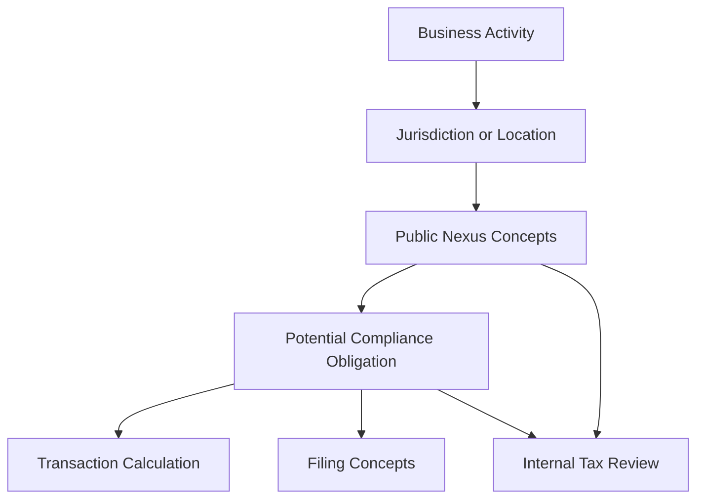

# Public Nexus Overview

## Quick Summary

Nexus is a public sales tax compliance concept that describes a connection between a business and a taxing jurisdiction. When a business has sufficient connection with a jurisdiction, that jurisdiction may require the business to register, collect, report, and remit sales tax.

This article explains nexus at a high level so an AI assistant can understand the concept. It does not make nexus decisions, list company-specific nexus states, provide thresholds, or instruct users where to register or file.

## Business Purpose

Nexus questions often appear when employees ask why tax is charged in one state but not another, why tax obligations change as sales grow, or whether sales activity creates compliance responsibilities.

A consultant-style assistant should recognize that nexus is related to tax calculation and filing, but it is not the same as either one. Nexus affects whether a business may have obligations in a jurisdiction. Transaction calculation determines tax on a specific transaction. Filing is the reporting and remittance process for finalized activity.

## Public-Safe Definition

At a high level:

> Nexus means a sufficient business connection with a jurisdiction that may create sales tax obligations.

Common public categories include:

- **Physical nexus**: connection created by physical presence or business activity in a jurisdiction.
- **Economic nexus**: connection created by reaching sales revenue and/or transaction thresholds in a jurisdiction.
- **Marketplace-related obligations**: sales through marketplace platforms may be treated differently depending on jurisdiction rules and marketplace facilitator laws.

This article is educational only. Actual nexus determination requires internal review and authoritative tax guidance.

## Avalara Perspective

Avalara public materials describe economic nexus as a connection between a state and a business that can require the business to register to collect and remit sales tax. Avalara also explains that economic nexus may be triggered by sales revenue and/or number of transactions in a state.

Avalara developer materials describe AvaTax as real-time sales and use tax determination across jurisdictions at the point of transaction. For AI reasoning, the important distinction is that AvaTax calculation and nexus analysis are connected compliance concepts, but they are not the same decision.

## NetSuite Perspective

In NetSuite-centered reasoning, nexus questions usually connect to transaction evidence:

- customer address
- ship-to location
- bill-to location
- transaction date
- invoice or cash sale activity
- credit memo or return activity
- item and line details
- tax result

However, these records are evidence for review. They do not, by themselves, authorize the assistant to decide where a company has nexus, where it should register, or where it should file.

## Relationship to Transaction Tax

| Concept | What It Means | What the Assistant Should Do |
|---|---|---|
| Nexus | Compliance connection with a jurisdiction. | Explain conceptually and route company-specific questions to internal review. |
| Registration | Authorization or requirement context for collecting tax. | Do not answer company-specific registration questions from public docs. |
| Tax calculation | Tax result on a specific transaction. | Use transaction and troubleshooting articles. |
| Filing | Reporting and remitting finalized tax activity. | Explain high-level concepts only unless private sources are available. |
| Exemption | Customer, certificate, item, or transaction context may affect tax result. | Retrieve exemption articles when the question is exemption-related. |

## Nexus Reasoning Model



This is a conceptual model. It is not a company-specific nexus analysis.

## Consultant Reasoning Sequence

When a user asks about nexus, the assistant should:

1. Identify whether the question is conceptual or company-specific.
2. If conceptual, explain nexus at a high level.
3. If the question involves a specific transaction, retrieve transaction and troubleshooting articles.
4. If the question involves filing, retrieve filing concepts.
5. If the question asks where the company has nexus, where it should register, or whether a state obligation exists, route to internal tax/accounting/legal review.
6. Avoid listing private jurisdiction decisions, thresholds, or registration status from the public repository.

## Diagnostic Decision Tree

```text
If the user asks "What is nexus?":
  Provide a public, conceptual explanation.

If the user asks "Why did this transaction calculate tax?":
  Retrieve transaction and troubleshooting articles before discussing nexus.

If the user asks "Do we have nexus in this state?":
  Do not answer from the public repository.
  Explain that company-specific nexus determinations require internal review.

If the user asks "Does sales volume matter?":
  Explain economic nexus conceptually, without giving current thresholds as advice.

If the user asks "Should we register or file there?":
  Route to internal tax, accounting, or legal review.
```

## Common Employee Questions

- What does nexus mean?
- Is nexus why tax is charged in some states?
- Does sales volume create tax obligations?
- Is nexus the same as sales tax calculation?
- Can the GPT tell me where we have nexus?
- Why does a customer address matter for tax?
- Should a transaction result be treated as a nexus decision?

## Common Misconceptions

| Misconception | Better Reasoning |
|---|---|
| Nexus and tax calculation are the same thing. | Nexus is a compliance obligation concept; calculation is a transaction result. |
| If a transaction calculates tax, that proves nexus. | Tax results can depend on many inputs and should not be treated as a final nexus determination. |
| If a transaction does not calculate tax, there is no nexus. | No-tax results may come from exemption, item, address, timing, or configuration context. |
| Public documentation should list company nexus states. | Company-specific nexus positions belong in private documentation. |
| A GPT should decide whether registration is required. | Registration and nexus decisions require internal tax/accounting/legal review. |

## Public-Safe Boundaries

This article may include:

- high-level nexus definitions
- the difference between physical and economic nexus
- the relationship between nexus, transaction calculation, and filing
- public-safe reasoning guidance
- escalation guidance for company-specific questions

This article must not include:

- company-specific nexus states
- registration status
- filing calendars
- state-by-state obligation decisions
- current threshold advice for a company
- tax positions
- legal conclusions
- private Avalara settings
- internal reports
- screenshots
- customer-specific examples

## AI Reasoning Guidance

The assistant should use this article when a user asks about nexus, economic nexus, physical presence, sales volume, jurisdiction obligations, registration, or whether nexus explains a tax result.

The assistant should retrieve this article with:

- [Filing Concepts](FILING_CONCEPTS.md) for compliance workflow questions,
- [Transaction Lifecycle](../transactions/TRANSACTION_LIFECYCLE.md) for transaction-specific questions,
- and [Common Avalara Error Patterns](../troubleshooting/COMMON_AVALARA_ERROR_PATTERNS.md) if the question begins with an unexpected tax result.

The assistant should not provide final nexus, registration, filing, legal, or tax-position advice from the public repository.

## Related Articles

- [Filing Concepts](FILING_CONCEPTS.md)
- [Transaction Lifecycle](../transactions/TRANSACTION_LIFECYCLE.md)
- [Return Lifecycle](../returns/RETURN_LIFECYCLE.md)
- [Common Avalara Error Patterns](../troubleshooting/COMMON_AVALARA_ERROR_PATTERNS.md)

## Public Sources

- https://www.avalara.com/us/en/learn/guides/state-by-state-guide-economic-nexus-laws.html
- https://developer.avalara.com/products/avatax/
- https://knowledge.avalara.com/

## Public-Safety Review

This article is public-safe. It avoids company-specific nexus states, registration status, filing calendars, thresholds as advice, tax positions, private Avalara settings, internal reports, customer examples, screenshots, custom fields, saved searches, workflows, scripts, and proprietary process details.
