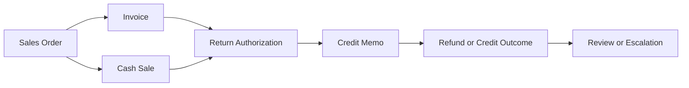

# Return Lifecycle

## Quick Summary

The return lifecycle explains how tax reasoning changes when a sale is reduced, reversed, refunded, or corrected.

In a NetSuite and Avalara environment, a return-related question should not start with the return record alone. It should start with the relationship between the return or credit record and the original transaction that created the tax result.

The core reasoning rule is:

> A return is usually a correction to a prior transaction, so review the original transaction before explaining the return tax result.

## Business Purpose

Return and refund questions affect customer service, accounting, ecommerce, operations, and compliance workflows. A customer may ask why tax was refunded differently than expected. Accounting may need to understand whether a credit memo is reducing the original invoice correctly. Customer service may need to explain why an item return did or did not include tax.

This article gives a public-safe reasoning model for returns without documenting company-specific return authorization processes, accounting rules, tax configuration, internal mappings, or customer examples.

## Lifecycle Overview



Not every NetSuite account or return process uses every stage in the same way. This diagram is a generic reasoning model, not a company-specific workflow.

## Core Concepts

| Concept | Meaning | Why It Matters |
|---|---|---|
| Original transaction | The invoice or cash sale that created the original tax result. | Return tax should usually be reviewed against this record first. |
| Return event | A business event where goods, charges, or amounts are reversed, reduced, or corrected. | The return may not mirror the original transaction exactly. |
| Credit memo | A correction or reduction record that may reverse some or all of a prior transaction. | It is often the key tax-review record for refund questions. |
| Return authorization | A return-management record used in some workflows before crediting or refunding. | It may help explain item, quantity, and timing context. |
| Refund tax | Tax reduced or returned to the customer as part of the credit/refund process. | It should be evaluated using original transaction context and correction context. |
| Calculation timing | When the original sale and return-related record calculated tax. | Dates and changed context may explain differences. |

## NetSuite Perspective

In NetSuite, return reasoning should follow the transaction chain. A sales order may lead to an invoice or cash sale. A return authorization may lead to a credit memo. The credit memo may reduce or correct the original transaction.

A consultant-style review should identify:

1. The original sale transaction.
2. The return or credit transaction.
3. Whether the return covers the full transaction or only certain lines.
4. Whether item, quantity, amount, shipping, address, customer, or exemption context changed.
5. Whether the return happened in a different tax period or after record changes.
6. Whether the question is about customer explanation, accounting review, tax correction, or escalation.

## Avalara Perspective

Avalara public materials describe AvaTax as real-time sales and use tax determination across jurisdictions and as supporting tax calculation during checkout, invoicing, or order processing. Public Avalara materials also describe broader compliance workflows and separate Returns-related products from AvaTax calculation capabilities.

For AI reasoning, this means the assistant should keep two concepts separate:

1. **Transaction tax calculation**: tax determined on sales, billing, correction, or refund-related transaction records.
2. **Returns compliance or filing**: broader reporting and filing concepts that may use transaction history but are not the same as a single customer return.

## Return Stage Comparison

| Stage | Typical Role | Most Important Review Question |
|---|---|---|
| Invoice | Customer billing record. | What tax was originally calculated and why? |
| Cash Sale | Completed sale/payment record. | Is this the original taxable transaction being reversed or reduced? |
| Return Authorization | Return intake or approval stage in some workflows. | What items, quantities, and reason context are being returned? |
| Credit Memo | Correction, reduction, or reversal stage. | Does the credit memo line up with the original transaction and returned items? |
| Refund or Credit Outcome | Customer-facing financial result. | Does the amount credited match the expected return logic? |

## Data Points to Compare

| Data Point | Why It Can Affect Return Tax Reasoning |
|---|---|
| Original transaction type | Invoice and cash sale workflows may be reviewed differently. |
| Original transaction date | Tax content, jurisdiction treatment, and exemption context may depend on timing. |
| Return or credit date | The correction event may occur after record values changed. |
| Customer | Customer context may affect exemption or tax treatment. |
| Address | Location context can affect the original tax and the return-related tax result. |
| Item or line | Returned items may not match every original line. |
| Quantity | Partial returns often do not equal the original transaction amount. |
| Shipping or charges | Freight, shipping, handling, or miscellaneous charges may be treated differently from item lines. |
| Exemption context | A certificate or exemption update after the sale may not explain the original tax result. |
| Recalculation timing | Current record values may not match the values used when tax originally calculated. |

## Decision Logic

```text
If a user asks about return or refund tax:
  Identify the credit memo, refund, return authorization, invoice, or cash sale involved.

If a credit memo exists:
  Compare it to the original invoice or cash sale.

If the return is partial:
  Compare only the returned lines, quantities, and related charges.

If the refund tax does not match expectation:
  Compare customer, address, item, quantity, amount, date, exemption, and calculation timing.

If the original transaction and return record do not explain the difference:
  Escalate for internal accounting, tax configuration, or integration review.
```

## Common Employee Questions

- Why did the customer get a different tax refund than expected?
- Why does the credit memo tax not match the invoice tax?
- Should I review the invoice or the credit memo first?
- Why did a returned item not refund tax?
- Does a return recalculate tax or reverse original tax?
- Why does a partial return behave differently than a full return?
- What changed between the original transaction and the return?

## Troubleshooting Notes

| Symptom | Likely Review Areas | First Checks |
|---|---|---|
| Credit memo tax does not match invoice tax. | Original transaction, returned lines, amount, date, address, item context. | Compare the credit memo to the original invoice or cash sale. |
| Partial return tax seems wrong. | Returned quantity, line selection, charges, item treatment. | Review only the returned lines and related charges. |
| Customer expected tax refund but none appeared. | Original tax result, customer exemption, item treatment, address, credit memo lines. | Confirm whether tax was charged on the original transaction. |
| Return happened after customer exemption changed. | Historical calculation timing and current record state. | Separate original sale date from current exemption context. |
| Shipping or handling refund differs from item refund. | Charge type, line context, jurisdiction treatment, and return policy. | Review charge lines separately from item lines. |

## Best Practices

- Start with the original taxable transaction.
- Compare the return or credit record to the original transaction line by line.
- Separate full returns from partial returns.
- Separate item lines from shipping, handling, discount, or miscellaneous charge lines.
- Separate historical calculation context from current record values.
- Avoid promising a tax refund outcome without reviewing the original transaction evidence.
- Move private return process, accounting policy, and tax configuration details to a private repository.

## AI Reasoning Guidance

The assistant should use this article when a user asks about return tax, refund tax, credit memo tax, returned items, partial returns, or why a tax credit does not match the original sale.

The assistant should retrieve this article with [Transaction Lifecycle](../transactions/TRANSACTION_LIFECYCLE.md), [Credit Memos](../transactions/CREDIT_MEMOS.md), and the relevant troubleshooting article when the issue involves mismatch, exemption, address, or item taxability.

The assistant should avoid making final tax determinations. It should explain what evidence to compare and when internal accounting, tax, or systems review may be required.

## Related Articles

- [Transaction Lifecycle](../transactions/TRANSACTION_LIFECYCLE.md)
- [Invoices](../transactions/INVOICES.md)
- [Cash Sales](../transactions/CASH_SALES.md)
- [Credit Memos](../transactions/CREDIT_MEMOS.md)
- [Order and Invoice Tax Mismatch](../troubleshooting/ORDER_INVOICE_TAX_MISMATCH.md)

## Public Sources

- https://developer.avalara.com/products/avatax/
- https://knowledge.avalara.com/

## Public-Safety Review

This article avoids company-specific return processes, accounting policies, tax configuration, nexus decisions, internal mappings, custom fields, saved searches, scripts, screenshots, customer examples, and proprietary workflow details.
