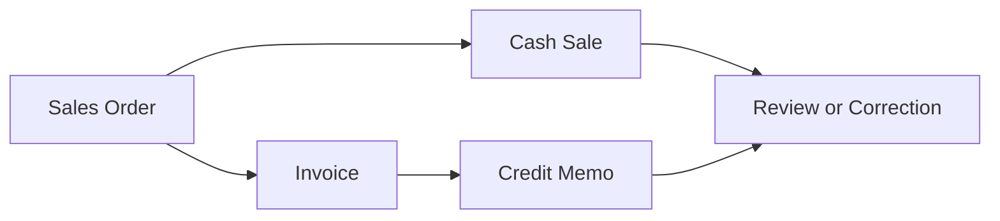

# Transaction Lifecycle

## Quick Summary

The transaction lifecycle explains how tax results can change as a NetSuite transaction moves from order entry to billing, payment, correction, or reversal. In an Avalara-connected environment, each transaction stage may represent its own calculation context.

The key reasoning rule is simple:

> Do not compare tax amounts alone. Compare the transaction context that produced each tax amount.

## Business Purpose

Many tax questions are lifecycle questions, not single-record questions. A user may ask why tax changed between a sales order and invoice, why a credit memo did not match the invoice, or why a cash sale behaved differently from an invoiced order.

This article helps the assistant reason across transaction stages so it can explain likely causes, identify the right records to compare, and avoid treating one transaction as automatically authoritative.

## Lifecycle Overview



Not every NetSuite account or process uses every stage in the same way. This diagram is a general public-safe reasoning model, not a company-specific process map.

## Core Concepts

| Concept | Meaning | Why It Matters |
|---|---|---|
| Transaction stage | Where the record sits in the sales, billing, payment, or correction flow. | Tax results may be calculated at more than one stage. |
| Calculation context | Data present when a tax result was calculated. | Different context can produce different results. |
| Downstream transaction | A later record such as invoice, cash sale, or credit memo. | Later records may not exactly match earlier records. |
| Recalculation timing | When tax was calculated again after edits. | Current values may not explain historical results. |
| Correction transaction | A record used to reduce, reverse, or adjust a prior transaction. | It should be reviewed against the original record. |

## NetSuite Perspective

In NetSuite, tax review should follow the transaction chain. A sales order may show an expected tax result, an invoice may calculate differently, a cash sale may act as a completed transaction, and a credit memo may reverse or correct part of a prior record.

A consultant-style review should identify:

1. The exact transaction where the question started.
2. Whether there is an upstream or downstream transaction.
3. Whether customer, address, item, date, amount, or exemption context changed.
4. Whether tax was recalculated after edits.
5. Whether the question is about explanation, correction, or prevention.

## Avalara Perspective

Avalara public materials describe AvaTax as real-time sales and use tax determination across jurisdictions, with calculation affected by supplied transaction data and tax content such as location, product taxability, exemption logic, shipping rules, and jurisdiction-aware treatment.

For lifecycle reasoning, the important point is that each NetSuite transaction can be understood as a calculation event with its own inputs.

## Transaction Stage Comparison

| Stage | Typical Role | Most Important Review Question |
|---|---|---|
| Sales Order | Early order or estimate stage. | Is this an expected tax result or only a pre-billing calculation? |
| Invoice | Customer-facing billing stage. | Did context change from the sales order? |
| Cash Sale | Completed sale/payment stage. | Is this the primary calculation event with no later invoice? |
| Credit Memo | Correction or reversal stage. | What original transaction is being corrected and why? |

## Data Points to Compare Across Stages

| Data Point | Why It Can Change the Result |
|---|---|
| Customer | Different customer records may have different exemption context. |
| Address | Location context can affect calculation. |
| Item or Line | Product treatment may differ by item or charge. |
| Quantity or Amount | Amount changes may change the total tax result. |
| Transaction Date | Tax content or context may differ by date. |
| Exemption Context | Certificate or exemption data may not have existed at the earlier stage. |
| Shipping or Charges | Added or changed charges can affect line-level results. |
| Recalculation Timing | Later edits may not affect an earlier tax calculation unless recalculated. |

## Decision Logic

```text
If a user asks why tax changed, identify both transactions being compared.

If comparing sales order to invoice:
  Compare customer, address, items, amounts, dates, exemption context, and recalculation timing.

If reviewing a cash sale:
  Treat the cash sale as its own calculation event.

If reviewing a credit memo:
  Start with the original invoice or cash sale.

If the visible record comparison does not explain the result:
  Escalate for internal configuration or integration review.
```

## Common Employee Questions

- Why did tax change between the sales order and invoice?
- Why did the invoice charge tax when the sales order did not?
- Why did the sales order show tax but the credit memo did not match it?
- Is the cash sale the final tax calculation?
- Which record should I check first?
- Did changing the customer, item, or address after the order affect tax?

## Troubleshooting Notes

| Symptom | Likely Review Areas | First Checks |
|---|---|---|
| Tax changed between order and invoice. | Customer, address, item, date, amount, exemption context, recalculation timing. | Compare sales order and invoice side by side. |
| Invoice tax differs from expected sales order tax. | Downstream transaction context changed. | Review invoice as its own calculation event. |
| Credit memo tax does not match invoice tax. | Correction lines, dates, amounts, address, original transaction. | Start with the original invoice. |
| Cash sale tax looks unexpected. | Customer, address, item, exemption context, date. | Review the cash sale itself. |

## Best Practices

- Identify the transaction stage before explaining a tax result.
- Compare records side by side when tax changes across stages.
- Review line-level details when only part of a transaction changed.
- Separate current record values from historical calculation timing.
- Avoid assuming a correction is needed until the likely cause is known.
- Keep public documentation generic and move private implementation details to a private repository.

## AI Reasoning Guidance

The assistant should use this article when the user asks why tax changed, why two related transactions differ, or which record should be reviewed first.

The assistant should identify the transaction chain, compare data points across stages, and explain likely causes without making final tax determinations. It should recommend internal review when private configuration, accounting policy, or implementation details are needed.

## Related Articles

- [Sales Orders](SALES_ORDERS.md)
- [Invoices](INVOICES.md)
- [Cash Sales](CASH_SALES.md)
- [Credit Memos](CREDIT_MEMOS.md)
- [Exemption Troubleshooting](../exemptions/EXEMPTION_TROUBLESHOOTING.md)
- [Why Is Customer Tax Exempt?](../exemptions/WHY_IS_CUSTOMER_TAX_EXEMPT.md)

## Public Sources

- https://developer.avalara.com/products/avatax/
- https://knowledge.avalara.com/

## Public-Safety Review

This article avoids company-specific transaction flows, private examples, custom fields, internal tax decisions, scripts, screenshots, and proprietary process details.
