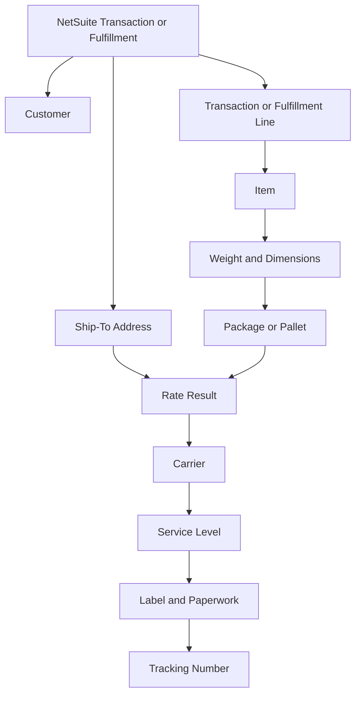
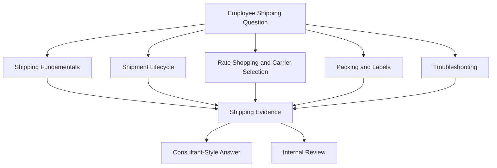

# Pacejet Integration Knowledge Hub

## Purpose

This section organizes public-safe Pacejet knowledge for the NetSuite Intelligence Platform.

The goal is not to reproduce Pacejet or Descartes documentation. The goal is to help readers and AI assistants reason through common NetSuite and Pacejet shipping questions using connected concepts, record relationships, shipment lifecycle context, operational workflows, and troubleshooting paths.

Pacejet should be treated as a shipping intelligence domain connected to NetSuite transaction, fulfillment, customer, address, item, carrier, package, label, and shipment data.

## Public-Safe Scope

This section may include:

- public Pacejet concepts
- public Descartes Pacejet product capabilities
- NetSuite-centered shipping reasoning
- generic shipping and fulfillment concepts
- public-safe troubleshooting guidance
- shipment lifecycle explanations
- carrier, package, label, and address relationship models
- AI retrieval guidance

This section must not include company-specific shipping rules, carrier account numbers, negotiated rates, private carrier credentials, custom fields, saved searches, workflows, SuiteScripts, warehouse SOPs, customer examples, screenshots, pricing logic, package rules, internal shipping policies, or proprietary process details.

Private implementation knowledge belongs in a private repository.

## Knowledge Clusters

### Shipping Fundamentals

The Shipping Fundamentals cluster should explain the core concepts an assistant needs before troubleshooting Pacejet or NetSuite shipping questions.

Planned articles:

1. Shipping Overview
2. Parcel vs. LTL Freight
3. Carrier Services
4. Shipment Data Model
5. Address Validation Concepts

Recommended learning path:

```text
Shipping Overview
  -> Parcel vs. LTL Freight
  -> Carrier Services
  -> Shipment Data Model
  -> Address Validation Concepts
```

### Shipment Lifecycle

The Shipment Lifecycle cluster should explain how shipping-related questions move from order or fulfillment context into packing, rating, labeling, shipping, tracking, and review.

Planned articles:

1. Shipment Lifecycle
2. Fulfillment and Shipment Relationship
3. Package and Pallet Reasoning
4. Labels and Paperwork
5. Tracking and Carrier Performance

Recommended learning path:

```text
Shipment Lifecycle
  -> Fulfillment and Shipment Relationship
  -> Package and Pallet Reasoning
  -> Labels and Paperwork
  -> Tracking and Carrier Performance
```

### Rate Shopping and Carrier Selection

The Rate Shopping and Carrier Selection cluster should explain how cost, service level, transit time, carrier availability, package data, address context, and rules can affect carrier decisions.

Planned articles:

1. Rate Shopping Concepts
2. Carrier Selection Reasoning
3. Shipping Rules Concepts
4. Freight Quote Reasoning
5. Service Level Comparison

Recommended learning path:

```text
Rate Shopping Concepts
  -> Carrier Selection Reasoning
  -> Shipping Rules Concepts
  -> Freight Quote Reasoning
  -> Service Level Comparison
```

### Packing and Labels

The Packing and Labels cluster should explain how package data, dimensions, weights, scan-packing, paperwork, and label output affect fulfillment accuracy.

Planned articles:

1. Packing Concepts
2. Predictive Packing
3. Scan-Packing Reasoning
4. Label Generation
5. Shipping Paperwork

Recommended learning path:

```text
Packing Concepts
  -> Predictive Packing
  -> Scan-Packing Reasoning
  -> Label Generation
  -> Shipping Paperwork
```

### Troubleshooting

The Troubleshooting cluster should explain how support cases are investigated from observable shipping symptoms.

Planned articles:

1. Shipping Rate Not Returned
2. Unexpected Carrier or Service
3. Address Validation Issue
4. Label Did Not Print
5. Shipment Did Not Update NetSuite
6. Package Weight or Dimension Issue
7. Freight Quote Mismatch
8. Tracking or Carrier Status Issue

Recommended learning path:

```text
Common Shipping Symptoms
  -> Rate Not Returned
  -> Unexpected Carrier or Service
  -> Address Validation Issue
  -> Label Did Not Print
  -> Shipment Did Not Update NetSuite
```

## Public Research Summary

Descartes Pacejet publicly describes Pacejet as ERP-integrated multi-carrier shipping software for freight, parcel, and wholesale shipments. Public materials describe capabilities such as rate shopping, predictive packing, scan-packing, labels and paperwork, shipping rules, reporting and analytics, export shipping, custom views and searches, custom shipping data, address validation, carrier performance, and integrations/APIs.

For this repository, those capabilities should be translated into NetSuite-centered reasoning models, not copied as product documentation.

## Shipment Lifecycle Map


This lifecycle map is a generic reasoning model. It is not a company-specific shipping process map.

## Shipping Data Relationship Map



This map teaches the assistant that shipping outcomes are produced from related transaction, address, item, package, carrier, service, and label context.

## Cross-Cluster Reasoning Map



## Coverage Status

| Cluster | Foundation | Integration | Troubleshooting | Reference | Reasoning |
|---|---:|---:|---:|---:|---:|
| Shipping Fundamentals | 10% | 10% | 0% | 0% | 10% |
| Shipment Lifecycle | 10% | 10% | 0% | 0% | 10% |
| Rate Shopping and Carrier Selection | 10% | 10% | 0% | 0% | 10% |
| Packing and Labels | 10% | 10% | 0% | 0% | 10% |
| Troubleshooting | 0% | 0% | 0% | 0% | 0% |

Coverage percentages are directional, not formal validation scores. They represent whether the cluster can currently support useful AI-assisted reasoning.

## Suggested Next Cluster: Shipping Fundamentals

The first recommended Pacejet cluster is Shipping Fundamentals.

Start with:

1. SHIPPING_OVERVIEW.md
2. PARCEL_VS_LTL_FREIGHT.md
3. SHIPMENT_DATA_MODEL.md
4. ADDRESS_VALIDATION_CONCEPTS.md

This will establish the concepts needed before writing rate shopping, packing, label, and troubleshooting articles.

## AI Retrieval Guidance

When a user asks a Pacejet question, retrieve based on the question type.

### Shipping lifecycle retrieval signals

- shipment lifecycle
- item fulfillment shipping
- order shipped
- shipment created
- tracking number
- shipment status
- shipping workflow

The assistant should usually retrieve:

1. the shipment lifecycle article,
2. the specific process article,
3. and the troubleshooting article if the question includes an unexpected result.

### Rate and carrier retrieval signals

- rate shopping
- shipping rate
- freight quote
- carrier selection
- service level
- cheapest carrier
- transit time
- unexpected carrier

The assistant should usually retrieve:

1. the rate shopping article,
2. the carrier selection article,
3. and package, address, and rules articles when relevant.

### Packing and label retrieval signals

- package weight
- dimensions
- pallet
- scan pack
- label did not print
- paperwork
- shipping label
- packing slip

The assistant should usually retrieve:

1. the packing concepts article,
2. the label generation article,
3. and the specific troubleshooting article.

### Troubleshooting retrieval signals

- no rate returned
- label error
- address validation failed
- shipment did not update
- wrong carrier
- freight quote mismatch
- tracking issue
- package dimensions wrong

The assistant should usually retrieve:

1. the common shipping symptom article,
2. the specific troubleshooting article,
3. and the relevant lifecycle, rate, packing, address, or label article.

Private carrier setup, negotiated rates, shipping rules, account credentials, warehouse SOPs, custom fields, saved searches, workflows, SuiteScripts, and customer-specific examples must be routed to private documentation or internal review.

## Public Sources

- https://www.pacejet.com/
- https://pacejet.help.descartesservices.com/

## Related Framework Documents

- [AI Knowledge Metadata](../../../knowledge-engine/AI_KNOWLEDGE_METADATA.md)
- [ERP Intelligence Knowledge Model](../../../knowledge-engine/KNOWLEDGE_MODEL.md)
- [ERP Intelligence Knowledge Graph](../../../knowledge-engine/KNOWLEDGE_GRAPH.md)
- [Knowledge Cluster Article Template](../../../templates/KNOWLEDGE_CLUSTER_TEMPLATE.md)
