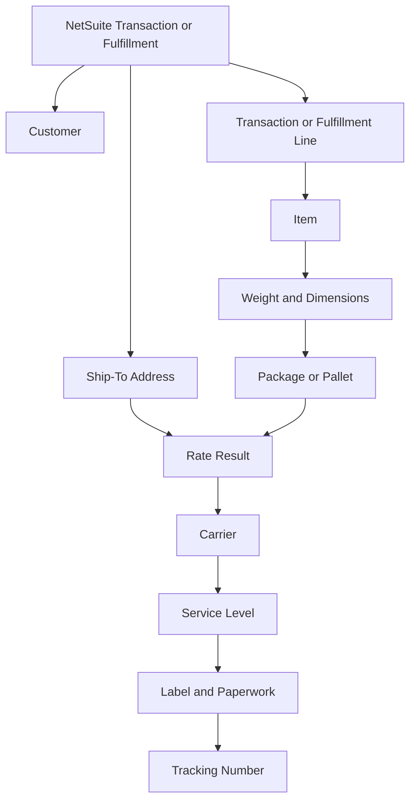
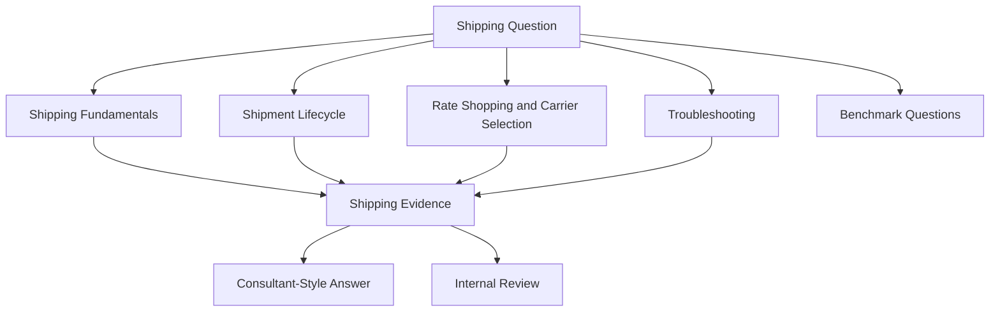

# Pacejet Integration Knowledge Hub

## Purpose

This section organizes public-safe Pacejet knowledge for the NetSuite Intelligence Platform.

The goal is not to reproduce Pacejet or Descartes documentation. The goal is to help humans and AI assistants reason through NetSuite and Pacejet shipping questions using connected concepts, record relationships, shipment lifecycle context, rate-shopping logic, packing evidence, label outputs, tracking context, and troubleshooting paths.

Pacejet should be treated as a shipping intelligence domain connected to NetSuite transaction, fulfillment, customer, address, item, carrier, service, package, label, shipment, and tracking data.

## Public-Safe Scope

This section may include:

- public Pacejet concepts
- public Descartes Pacejet product capabilities
- NetSuite-centered shipping reasoning
- generic shipping and fulfillment concepts
- public-safe troubleshooting guidance
- shipment lifecycle explanations
- carrier, service, package, label, address, tracking, and shipment relationship models
- benchmark questions for AI evaluation
- AI retrieval guidance

This section must not include company-specific shipping rules, carrier account numbers, negotiated rates, private carrier credentials, custom fields, saved searches, workflows, SuiteScripts, warehouse SOPs, customer examples, screenshots, pricing logic, package rules, internal shipping policies, or proprietary process details.

Private implementation knowledge belongs in a private repository or internal knowledge source.

## Knowledge Clusters

### Shipping Fundamentals

The Shipping Fundamentals cluster explains the core concepts an assistant needs before troubleshooting Pacejet or NetSuite shipping questions.

Completed articles:

1. [Shipping Overview](fundamentals/SHIPPING_OVERVIEW.md)
2. [Parcel vs LTL Freight](fundamentals/PARCEL_VS_LTL_FREIGHT.md)
3. [Shipment Data Model](fundamentals/SHIPMENT_DATA_MODEL.md)
4. [Address Validation Concepts](fundamentals/ADDRESS_VALIDATION_CONCEPTS.md)
5. [Carrier Services](fundamentals/CARRIER_SERVICES.md)

Recommended retrieval path:

```text
Shipping Overview
  -> Shipment Data Model
  -> Parcel vs LTL Freight
  -> Carrier Services
  -> Address Validation Concepts
```

### Shipment Lifecycle

The Shipment Lifecycle cluster explains how shipping-related questions move from order or fulfillment context into packing, rating, carrier/service selection, labels, shipment creation, tracking, and review.

Completed articles:

1. [Shipment Lifecycle](lifecycle/SHIPMENT_LIFECYCLE.md)
2. [Fulfillment and Shipment Relationship](lifecycle/FULFILLMENT_AND_SHIPMENT_RELATIONSHIP.md)
3. [Package and Pallet Reasoning](lifecycle/PACKAGE_AND_PALLET_REASONING.md)
4. [Labels and Paperwork](lifecycle/LABELS_AND_PAPERWORK.md)
5. [Tracking and Carrier Performance](lifecycle/TRACKING_AND_CARRIER_PERFORMANCE.md)

Recommended retrieval path:

```text
Shipment Lifecycle
  -> Fulfillment and Shipment Relationship
  -> Package and Pallet Reasoning
  -> Labels and Paperwork
  -> Tracking and Carrier Performance
```

### Rate Shopping and Carrier Selection

The Rate Shopping and Carrier Selection cluster explains how shipment context, cost, service level, transit time, carrier availability, package data, address context, and rules can affect carrier and service outcomes.

Completed articles:

1. [Rate Shopping Concepts](rate-shopping/RATE_SHOPPING_CONCEPTS.md)
2. [Carrier Selection](rate-shopping/CARRIER_SELECTION.md)
3. [Service Level Comparison](rate-shopping/SERVICE_LEVEL_COMPARISON.md)
4. [Option Comparison](rate-shopping/OPTION_COMPARISON.md)
5. [Rule Concepts](rate-shopping/RULE_CONCEPTS.md)

Recommended retrieval path:

```text
Rate Shopping Concepts
  -> Carrier Selection
  -> Service Level Comparison
  -> Option Comparison
  -> Rule Concepts
```

### Troubleshooting

The Troubleshooting cluster explains how support cases should be investigated from observable shipping symptoms.

Completed seed articles:

1. [Rate Not Returned Overview](troubleshooting/RATE_NOT_RETURNED_OVERVIEW.md)
2. [Address Validation Issue Overview](troubleshooting/ADDRESS_VALIDATION_ISSUE_OVERVIEW.md)
3. [Label Output Issue Overview](troubleshooting/LABEL_OUTPUT_ISSUE_OVERVIEW.md)
4. [Shipment Update Issue Overview](troubleshooting/SHIPMENT_UPDATE_ISSUE_OVERVIEW.md)
5. [Package Measurement Issue Overview](troubleshooting/PACKAGE_MEASUREMENT_ISSUE_OVERVIEW.md)
6. [Freight Quote Overview](troubleshooting/FREIGHT_QUOTE_OVERVIEW.md)
7. [Tracking Status Issue Overview](troubleshooting/TRACKING_STATUS_ISSUE_OVERVIEW.md)

Recommended retrieval path:

```text
Common Shipping Symptom
  -> Shipment Lifecycle
  -> Shipment Data Model
  -> Symptom-Specific Troubleshooting Seed
  -> Related Lifecycle or Rate-Shopping Article
```

### Evaluation

The Evaluation cluster tests whether an AI assistant can use the Pacejet knowledge base like a consultant.

Completed articles:

1. [Pacejet Benchmark Questions](PACEJET_BENCHMARK_QUESTIONS.md)
2. [Troubleshooting Progress Addendum](TROUBLESHOOTING_PROGRESS_ADDENDUM.md)

Recommended retrieval path:

```text
Benchmark Question
  -> Expected Retrieval
  -> Expected Reasoning
  -> Public-Safe Boundary Review
```

### Packing and Labels

The Packing and Labels cluster is the next recommended expansion area.

Planned seed articles:

1. Packing Concepts
2. Predictive Packing
3. Scan-Packing Reasoning
4. Label Generation
5. Shipping Paperwork

These articles should build on the existing shipment lifecycle, package and pallet reasoning, labels and paperwork, and troubleshooting seed articles.

## Public Research Summary

Public Pacejet materials describe ERP-integrated multi-carrier shipping software for freight, parcel, and wholesale shipments. Public materials describe capabilities such as rate shopping, predictive packing, scan-packing, labels and paperwork, shipping rules, reporting and analytics, export shipping, custom views and searches, custom shipping data, address validation, carrier performance, and integrations/APIs.

For this repository, those capabilities should be translated into NetSuite-centered reasoning models, not copied as product documentation.

## Shipment Lifecycle Map


This lifecycle map is a generic reasoning model. It is not a company-specific shipping process map.

## Shipping Data Relationship Map



This map teaches the assistant that shipping outcomes are produced from related transaction, address, item, package, carrier, service, label, and tracking context.

## Cross-Cluster Reasoning Map



## AI Retrieval Guidance

When answering a Pacejet question, an AI assistant should:

1. Identify the visible symptom or question type.
2. Identify the lifecycle stage involved.
3. Retrieve the relevant fundamentals, lifecycle, rate-shopping, or troubleshooting article.
4. Compare record evidence before suggesting likely explanations.
5. Separate public concepts from private setup, rules, procedures, or configuration.
6. Escalate when private carrier setup, warehouse process, account-specific configuration, pricing, credentials, custom fields, saved searches, workflows, scripts, or proprietary logic are required.

## Coverage Status

| Cluster | Foundation | Integration | Troubleshooting | Reference | Reasoning |
|---|---:|---:|---:|---:|---:|
| Shipping Fundamentals | 80% | 40% | 20% | 30% | 80% |
| Shipment Lifecycle | 80% | 50% | 50% | 30% | 80% |
| Rate Shopping and Carrier Selection | 70% | 50% | 50% | 25% | 70% |
| Troubleshooting | 70% | 40% | 70% | 20% | 70% |
| Evaluation | 60% | 40% | 60% | 20% | 70% |
| Packing and Labels | 20% | 20% | 30% | 10% | 30% |

Coverage percentages are directional, not formal validation scores. They represent whether the cluster can currently support useful AI-assisted reasoning.

## Suggested Next Cluster

The next recommended Pacejet cluster is Packing and Labels.

Start with:

1. PACKING_CONCEPTS.md
2. PREDICTIVE_PACKING.md
3. SCAN_PACKING_REASONING.md
4. LABEL_GENERATION.md
5. SHIPPING_PAPERWORK.md

These articles should stay conceptual, public-safe, and linked to existing lifecycle, troubleshooting, and shipment data articles.
