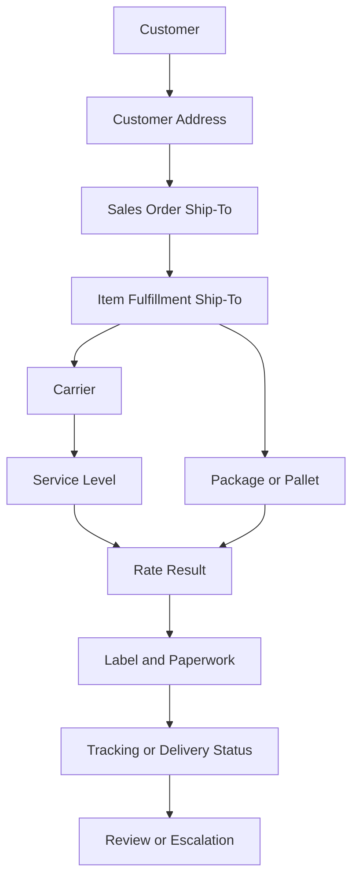

# Address Validation Concepts

## Quick Summary

Address validation is the process of reviewing or confirming whether a ship-to address is usable for shipping, rating, labeling, and delivery.

In a NetSuite and Pacejet environment, address validation should not be treated as a standalone checkbox. It is connected to customer address data, fulfillment context, carrier availability, rate results, label output, delivery accuracy, and shipment updates.

The core reasoning rule is:

> Review the address in the same context that produced the shipping outcome: fulfillment, carrier, service, package, rate, and label.

## Business Purpose

Address quality affects shipping cost, delivery success, customer experience, carrier corrections, label accuracy, and operational efficiency.

Employees may ask why an address failed validation, why no rate returned, why a carrier option was unavailable, why a label did not generate, or why a shipment required correction. A consultant-style assistant should identify the exact ship-to context and compare address evidence before assuming the root cause.

This article provides a public-safe reasoning model for address validation without documenting company-specific shipping rules or customer examples.

## Public Pacejet Perspective

Public Pacejet materials describe address validation as a shipping capability that helps reduce carrier corrections and improve confidence before labels are created. Public Pacejet materials also connect shipping outcomes to rate shopping, packing, labels and paperwork, carrier services, analytics, and ERP integration.

For AI reasoning, the important point is that address validation is part of the broader shipment data model. An address issue can affect rates, carrier availability, labels, paperwork, tracking, and delivery outcomes.

## NetSuite Perspective

In NetSuite-centered reasoning, the assistant should identify where the address came from and where the issue appeared.

Address-related evidence may include:

- customer record
- customer address book entry
- sales order ship-to address
- item fulfillment ship-to address
- shipment or package context
- carrier and service selected or attempted
- rate response or missing rate
- label or paperwork output
- tracking or delivery status

The assistant should compare these records before explaining the outcome.

## Address Validation Relationship Map



This map is a generic reasoning model. It is not a company-specific shipping workflow.

## Common Address Concepts

| Concept | Meaning | Why It Matters |
|---|---|---|
| Ship-to address | Destination used for shipping. | Affects rating, carrier availability, label output, and delivery. |
| Address completeness | Whether required address components are present. | Missing or inconsistent data can block validation or rating. |
| Address correction | Carrier or system adjustment to address data. | May create cost, delay, or customer-service issues. |
| Residential/commercial context | Address classification used in many shipping workflows. | May affect rates, services, and carrier treatment. |
| Destination context | Location, region, or service area. | May affect carrier availability and delivery options. |
| Label address | Address printed or transmitted on shipping output. | Must align with the intended delivery context. |

## Data Points to Compare

| Data Point | Why It Matters |
|---|---|
| Customer address | May be the original source of the shipping destination. |
| Sales order ship-to address | Shows the address context at order stage. |
| Fulfillment ship-to address | Shows the address used for shipping execution. |
| Package or pallet context | Some carrier services may depend on package and destination together. |
| Carrier and service | Different carriers and services may respond differently to the same destination. |
| Rate response | Missing or unexpected rates may be address-related. |
| Label output | Label generation may reveal whether the address was accepted for shipping. |
| Tracking or delivery status | Delivery issues may point back to address quality or carrier handling. |

## Diagnostic Decision Tree

```text
If address validation failed:
  Identify the exact record and ship-to address involved.
  Compare customer address, order address, and fulfillment address.
  Review completeness and consistency of the destination data.
  Review carrier and service context.

If no rate returned:
  Check whether address validation or service availability may be part of the issue.
  Compare address, package, carrier, service, and shipment mode.

If label did not generate:
  Review whether the address was accepted in the label context.
  Compare address data with carrier and service requirements conceptually.

If tracking or delivery issue occurred:
  Compare the label address, intended address, and shipment status.

If visible data does not explain the issue:
  Escalate for internal shipping or system review.
```

## Common Employee Questions

- Why did address validation fail?
- Why did the same customer address work before but not now?
- Why did no carrier rate come back for this address?
- Why did the label not print after address validation?
- Is the problem with the customer address, fulfillment address, carrier, or shipping system?
- Should I review the sales order or item fulfillment address first?
- Can an address issue affect tracking or delivery?

## Troubleshooting Notes

| Symptom | Likely Review Areas | First Check |
|---|---|---|
| Address validation failed. | Customer address, sales order address, fulfillment address, carrier/service context. | Identify the exact ship-to address used at shipping time. |
| No rate returned. | Address, shipment mode, package data, carrier availability, service level. | Confirm whether the address was valid enough for rating. |
| Label did not print. | Address acceptance, carrier service, package data, label output. | Review the address in the label-generation context. |
| Delivery issue occurred. | Label address, tracking status, carrier status, intended destination. | Compare the printed/transmitted address to the intended address. |
| Same customer, different address behavior. | Address book entry, order address, fulfillment address, edits, timing. | Compare the specific address values used on each shipment. |

## Common Misconceptions

| Misconception | Better Reasoning |
|---|---|
| Address validation only matters after the label prints. | Address quality can affect rating, carrier availability, labels, tracking, and delivery. |
| If the customer record looks right, the shipment address must be right. | The order or fulfillment may contain a different address context. |
| An address validation failure always means the address is impossible to ship to. | It means the address should be reviewed in the carrier and shipment context. |
| A missing rate is always a carrier problem. | Address data may be one of several factors affecting rates. |
| Public documentation should list exact internal address rules. | Company-specific rules and procedures belong in private documentation. |

## Public-Safe Boundaries

This article may explain:

- general address validation concepts
- ship-to address reasoning
- how address quality can affect rates, labels, carrier availability, tracking, and delivery
- public-safe troubleshooting paths
- escalation guidance

This article must not include company-specific customer addresses, internal shipping rules, carrier account setup, negotiated rates, screenshots, or proprietary procedures.

## AI Reasoning Guidance

The assistant should use this article when a user asks about address validation, missing rates related to address, label address issues, carrier address corrections, or delivery issues that may connect back to address data.

The assistant should retrieve this article with [Shipment Data Model](SHIPMENT_DATA_MODEL.md) and [Shipping Overview](SHIPPING_OVERVIEW.md). If the question involves parcel versus freight, retrieve [Parcel vs LTL Freight](PARCEL_VS_LTL_FREIGHT.md). If the question involves label output, retrieve label-generation articles when available.

The assistant should avoid final operational conclusions when the explanation depends on account-specific setup or internal shipping procedures.

## Related Articles

- [Shipping Overview](SHIPPING_OVERVIEW.md)
- [Shipment Data Model](SHIPMENT_DATA_MODEL.md)
- [Parcel vs LTL Freight](PARCEL_VS_LTL_FREIGHT.md)
- [Pacejet Integration Knowledge Hub](../README.md)

## Public Sources

- https://www.pacejet.com/

## Public-Safety Review

This article is public-safe. It avoids company-specific customer addresses, internal shipping rules, account setup, negotiated rates, screenshots, and proprietary process details.
