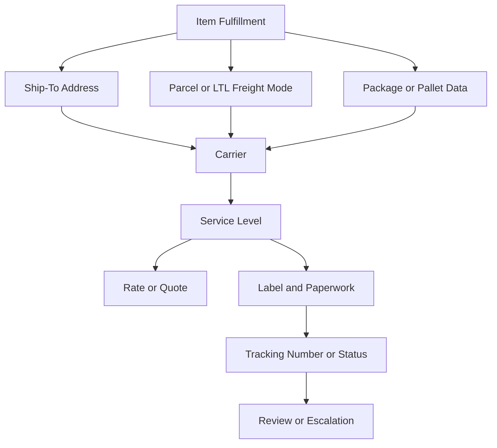

# Carrier Services

## Quick Summary

A carrier is the shipping provider. A service level is the specific shipping option used with that carrier.

In a NetSuite and Pacejet environment, carrier and service results should be evaluated through shipment context: fulfillment, address, item lines, package or pallet data, shipment mode, rate response, label output, and tracking behavior.

The core reasoning rule is:

> Do not evaluate carrier selection by carrier name alone. Review the service, address, package, shipment mode, and rate context that made the carrier option available or unavailable.

## Business Purpose

Employees may ask why a carrier was selected, why a service option was missing, why no rate returned, why a label did not generate, or why tracking behaved differently than expected.

A consultant-style assistant should separate the carrier from the service level, then compare shipment evidence before drawing conclusions.

## Public Pacejet Perspective

Public Pacejet materials describe multi-carrier shipping capabilities connected to rate shopping, carrier selection, packing, labels and paperwork, tracking, address validation, carrier performance, analytics, and ERP integration.

For AI reasoning, the important point is that carrier outcomes are contextual. A carrier or service may appear, disappear, rate differently, or produce different label behavior depending on shipment data.

## NetSuite Perspective

In NetSuite-centered reasoning, carrier and service questions usually connect to:

- sales order or fulfillment context
- customer and ship-to address
- parcel or LTL freight mode
- item lines, quantities, weights, and dimensions
- package, box, pallet, or handling data
- carrier and service selection
- rate or quote response
- label and paperwork output
- tracking and shipment status

The assistant should compare these relationships before explaining the carrier result.

## Core Concepts

| Concept | Meaning | Why It Matters |
|---|---|---|
| Carrier | The shipping provider. | Determines available services, labels, tracking, and delivery handling. |
| Service level | The shipping option or delivery service used with a carrier. | Affects cost, transit expectations, label output, and availability. |
| Carrier availability | Whether a carrier can be used for the shipment context. | May depend on destination, package, shipment mode, and service. |
| Service availability | Whether a specific service is valid for the shipment. | Missing service options may be data-related or setup-related. |
| Transit expectation | General delivery timing expectation for a service. | Helps compare service choices but should not be treated as a guarantee. |
| Rate response | The rate or quote returned for a carrier/service option. | Helps explain cost and selection context. |
| Label output | The shipping label or paperwork generated after service selection. | Label issues may depend on carrier, service, address, and package context. |
| Tracking behavior | Shipment status or tracking evidence after shipping. | Tracking may vary by carrier and service. |

## Carrier and Service Relationship Map



This map is a generic reasoning model. It is not a company-specific carrier routing model.

## Data Points to Compare

| Data Point | Why It Matters |
|---|---|
| Shipment mode | Parcel and LTL freight may use different carrier and service logic. |
| Ship-to address | Destination can affect carrier and service availability. |
| Package or pallet data | Weight, dimensions, and handling context can affect service options. |
| Carrier selected or attempted | Identifies the provider involved in the shipping result. |
| Service level selected or attempted | Shows the specific service context being rated, labeled, or tracked. |
| Rate or quote response | Helps explain cost and availability. |
| Label or paperwork output | Shows whether the service produced the required shipping output. |
| Tracking or shipment status | Shows whether the shipment was created and traceable. |

## Diagnostic Decision Tree

```text
If a carrier option is missing:
  Confirm the shipment mode.
  Review ship-to address, package/pallet data, carrier, and service context.
  Determine whether the issue is carrier availability, service availability, or rate response.

If a service level looks unexpected:
  Compare service level to shipment mode, address, package data, and rate response.
  Do not assume the selected service is wrong without evidence.

If a label did not generate:
  Review the selected carrier and service.
  Compare address and package data.
  Determine whether the issue is label output, carrier/service context, or internal setup.

If tracking did not appear:
  Confirm whether a label or shipment was created.
  Review carrier and service context.
  Compare tracking output and shipment status.
```

## Consultant Reasoning Sequence

When a user asks about a carrier or service issue, the assistant should:

1. Identify whether the question is about carrier availability, service level, rate, label, tracking, or shipment update behavior.
2. Identify the exact fulfillment, shipment, rate, label, or tracking context.
3. Separate carrier name from service level.
4. Review shipment mode, address, package/pallet data, weight, dimensions, carrier, and service.
5. Compare expected carrier/service behavior to the actual result.
6. Avoid assuming the carrier, Pacejet, or NetSuite failed until the shipment evidence is reviewed.
7. Escalate when account-specific setup, service rules, operating procedures, or technical configuration need review.

## Common Employee Questions

- Why did this carrier appear?
- Why did this carrier not appear?
- Why did this service level show up instead of another one?
- Why did no rate return for this carrier?
- Why did a label not generate for this service?
- Why did tracking behave differently for this shipment?
- Is the problem with the carrier, service, address, package, Pacejet, NetSuite, or internal setup?

## Troubleshooting Notes

| Symptom | Likely Review Areas | First Check |
|---|---|---|
| Carrier missing. | Address, shipment mode, package data, service availability. | Confirm the expected carrier and shipment mode. |
| Service missing. | Carrier, destination, package/pallet data, service level context. | Separate carrier availability from service availability. |
| Rate not returned. | Address, package, carrier, service, shipment mode. | Review the rate context before assuming failure. |
| Label did not generate. | Carrier, service, address, package, label output. | Confirm which service was selected. |
| Tracking not visible. | Shipment creation, label output, carrier/service, tracking status. | Confirm whether shipment creation completed. |
| Unexpected carrier selected. | Rate response, service level, address, package, shipment mode. | Compare selected carrier to the available options. |

## Common Misconceptions

| Misconception | Better Reasoning |
|---|---|
| Carrier and service level are the same thing. | The carrier is the provider; the service level is the option used with that provider. |
| If a carrier is available, all services should be available. | Service availability may depend on address, package, shipment mode, and other context. |
| The cheapest carrier should always be selected. | Carrier selection may depend on cost, service, availability, shipment context, and business rules. |
| A missing carrier always means the carrier failed. | Missing options may be caused by address, package, service, shipment mode, or setup context. |
| Tracking should behave the same for every carrier. | Tracking behavior may vary by carrier and service. |

## Public-Safe Boundaries

This article may explain carrier and service concepts, generic relationship models, public-safe rate, label, and tracking dependencies, symptom-to-evidence troubleshooting paths, and escalation guidance.

This article must not include carrier account details, internal service rules, customer examples, screenshots, pricing logic, or proprietary operating procedures.

## AI Reasoning Guidance

The assistant should use this article when a user asks about carrier selection, service levels, missing carrier options, missing services, rate availability, label output tied to carrier/service, or tracking behavior tied to carrier/service.

The assistant should retrieve this article with [Shipment Data Model](SHIPMENT_DATA_MODEL.md), [Shipping Overview](SHIPPING_OVERVIEW.md), and [Parcel vs LTL Freight](PARCEL_VS_LTL_FREIGHT.md). If the question involves address behavior, retrieve [Address Validation Concepts](ADDRESS_VALIDATION_CONCEPTS.md).

The assistant should avoid final operational conclusions when the explanation depends on account-specific setup, internal service rules, or technical configuration.

## Related Articles

- [Shipping Overview](SHIPPING_OVERVIEW.md)
- [Parcel vs LTL Freight](PARCEL_VS_LTL_FREIGHT.md)
- [Shipment Data Model](SHIPMENT_DATA_MODEL.md)
- [Address Validation Concepts](ADDRESS_VALIDATION_CONCEPTS.md)
- [Pacejet Integration Knowledge Hub](../README.md)

## Public Sources

- https://www.pacejet.com/

## Public-Safety Review

This article is public-safe. It avoids carrier account details, internal service rules, customer examples, screenshots, pricing logic, and proprietary operating procedures.
