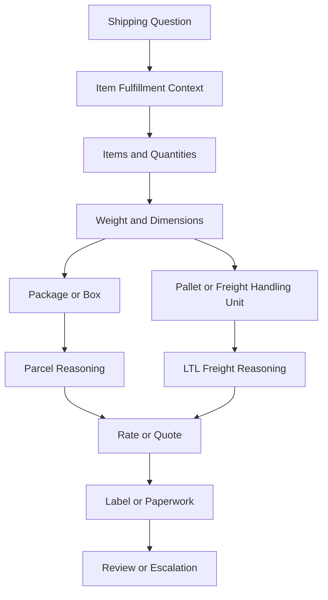

# Parcel vs LTL Freight

## Quick Summary

Parcel and LTL freight are different shipping modes. They may involve different package data, carrier services, rating logic, paperwork, shipment handling, and troubleshooting paths.

The core reasoning rule is:

> Do not troubleshoot a shipping issue until you know whether the shipment is being treated as parcel, LTL freight, or another shipping mode.

A parcel shipment is usually package-oriented. An LTL freight shipment is usually freight- or pallet-oriented. The exact operational setup depends on private business rules, carrier setup, item data, and warehouse processes, so this article stays conceptual and public-safe.

## Business Purpose

Employees may ask why a shipment rated as freight, why a parcel label did not generate, why a freight quote looks different from a parcel rate, why a palletized shipment behaves differently, or why a carrier option is not available.

A consultant-style assistant should first classify the shipping mode before diagnosing the issue. Parcel and LTL freight may use different evidence, different carrier services, and different paperwork expectations.

## Public Pacejet Perspective

Public Pacejet materials describe support for multi-carrier shipping across freight, parcel, and wholesale shipment scenarios. Public product content also describes capabilities such as rate shopping, packing, labels and paperwork, address validation, rules, analytics, carrier performance, and integrations.

For AI reasoning, the important point is that shipping mode affects the evidence the assistant should review. A freight issue should not be investigated exactly like a parcel label issue, and a parcel shipment should not be explained as freight unless the record context supports that conclusion.

## NetSuite Perspective

In NetSuite-centered reasoning, parcel versus LTL freight questions usually connect to:

- sales order or fulfillment context
- item lines and quantities
- item weights and dimensions
- package, pallet, or handling-unit data
- ship-to address
- carrier and service options
- rate results
- labels and paperwork
- tracking or shipment status

The assistant should identify the fulfillment and shipping context before explaining the carrier outcome.

## Concept Comparison

| Concept | Parcel Shipping | LTL Freight |
|---|---|---|
| Typical unit | Package or box. | Pallet, crate, or larger freight handling unit. |
| Common focus | Package weight, dimensions, label, tracking. | Freight quote, pallet details, accessorials, paperwork, carrier service. |
| Rating evidence | Package dimensions, weight, destination, service level. | Freight shipment details, destination, pallet or handling data, service context. |
| Paperwork | Parcel label and tracking information. | Freight paperwork may be more involved depending on carrier and shipment context. |
| Troubleshooting start | Package, address, carrier service, label output. | Freight quote, pallet data, address, carrier availability, paperwork context. |
| Public-safe boundary | Avoid private package rules and negotiated rates. | Avoid private freight classes, tariffs, accessorial logic, and carrier agreements. |

## Shipment Mode Reasoning Model

This map is a generic reasoning model. It is not a company-specific shipping process.

## Data Points to Compare

| Data Point | Why It Matters |
|---|---|
| Shipment mode | Determines whether parcel or freight reasoning should be used. |
| Item quantity | More units may change packing, palletization, or shipping mode. |
| Weight | Affects rating, carrier options, and whether parcel or freight is plausible. |
| Dimensions | Can affect package, pallet, and carrier service availability. |
| Package or pallet data | Helps explain rate, quote, label, and paperwork outcomes. |
| Ship-to address | Affects carrier availability, validation, rate, and delivery context. |
| Carrier service | Parcel and freight carriers or services may behave differently. |
| Label or paperwork output | Parcel labels and freight paperwork may have different dependencies. |

## Consultant Reasoning Sequence

When a user asks about a parcel or freight issue, the assistant should:

1. Identify whether the question involves parcel, LTL freight, or an unknown mode.
2. Start from the exact sales order, fulfillment, shipment, package, or quote context.
3. Review item lines, quantities, weight, dimensions, address, package, pallet, carrier, and service data.
4. Determine whether the symptom is about rate, carrier selection, label, paperwork, tracking, or NetSuite update behavior.
5. Compare the actual shipment mode to the expected shipment mode.
6. Avoid assuming the shipment was rated incorrectly until record evidence is reviewed.
7. Escalate when private carrier setup, negotiated rates, package rules, freight class, accessorial logic, warehouse SOPs, or account-specific shipping rules are required.

## Common Employee Questions

- What is the difference between parcel and LTL freight?
- Why did this shipment rate as freight?
- Why did this shipment not show a parcel option?
- Why does a freight quote look different from a parcel rate?
- Why did the label or paperwork behave differently?
- Does item weight or dimension affect shipping mode?
- Should I review the package, pallet, item, address, carrier, or fulfillment first?

## Troubleshooting Notes

| Symptom | Likely Review Areas | First Check |
|---|---|---|
| No parcel rate returned. | Address, package weight, dimensions, carrier service, shipment mode. | Confirm whether the shipment is expected to be parcel. |
| Freight quote looks unexpected. | Pallet or freight data, address, carrier, service, quantities, dimensions. | Compare freight shipment details to fulfillment context. |
| Label did not print. | Shipment mode, carrier service, package/pallet data, paperwork requirements. | Identify whether the output is parcel label or freight paperwork. |
| Carrier option missing. | Address, carrier availability, service level, package or freight context. | Review shipment mode and carrier/service evidence. |
| Shipment mode seems wrong. | Item quantities, weights, dimensions, package/pallet data, private rules. | Compare fulfillment data to shipping mode result. |

## Common Misconceptions

| Misconception | Better Reasoning |
|---|---|
| Parcel and freight should troubleshoot the same way. | They may involve different rating, package, paperwork, carrier, and handling context. |
| A freight quote is just a larger parcel rate. | Freight may involve different carrier services, handling units, paperwork, and private rate logic. |
| If a shipment is heavy, it must be freight. | Weight matters, but shipping mode can also depend on dimensions, packages, pallets, carrier services, and private rules. |
| A missing parcel rate proves the carrier failed. | Missing rates may come from address, package, service, carrier availability, or configuration context. |
| Public documentation should define company freight rules. | Company-specific freight thresholds, carrier agreements, and package logic belong in private documentation. |

## Public-Safe Boundaries

This article may explain:

- parcel and LTL freight concepts
- generic package versus pallet reasoning
- public-safe rate and label dependencies
- high-level carrier and service concepts
- escalation guidance

This article must not include:

- company-specific parcel or freight rules
- negotiated rates
- carrier account details
- freight classes used by a company
- accessorial decision logic
- package algorithms
- warehouse SOPs
- custom fields, saved searches, workflows, or scripts
- customer examples
- screenshots

## AI Reasoning Guidance

The assistant should use this article when a user asks about parcel shipping, LTL freight, freight quotes, package versus pallet behavior, missing parcel rates, freight paperwork, or why a shipment used one shipping mode instead of another.

The assistant should retrieve this article with [Shipping Overview](SHIPPING_OVERVIEW.md). If the question involves rates, retrieve rate shopping and carrier selection articles when available. If it involves labels or paperwork, retrieve packing and label articles when available.

The assistant should avoid final operational conclusions when private shipping rules, carrier agreements, freight class decisions, warehouse SOPs, or account-specific configuration are required.

## Related Articles

- [Shipping Overview](SHIPPING_OVERVIEW.md)
- [Pacejet Integration Knowledge Hub](../README.md)

## Public Sources

- https://www.pacejet.com/

## Public-Safety Review

This article is public-safe. It avoids company-specific shipping rules, carrier account details, negotiated rates, freight classes, accessorial logic, package algorithms, warehouse SOPs, customer examples, screenshots, custom fields, saved searches, workflows, SuiteScripts, pricing, and proprietary process details.
