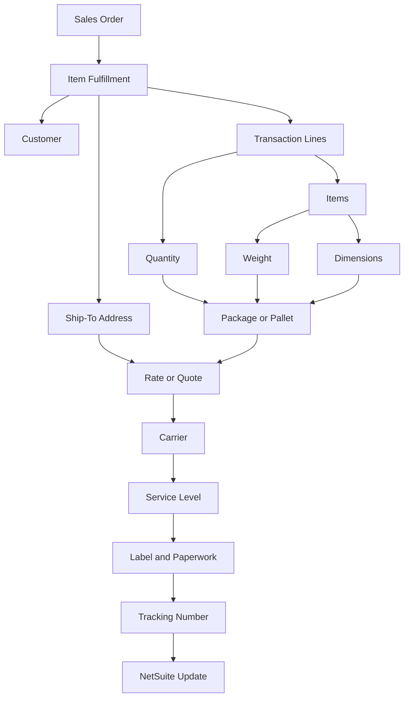

# Shipment Data Model

## Quick Summary

The shipment data model explains the records and data points that may affect a Pacejet shipping result in a NetSuite-centered environment.

A shipping result should not be explained from one field or one output alone. Rates, carrier choices, labels, paperwork, tracking, and NetSuite update behavior can all depend on the combined shipment context.

The core reasoning rule is:

> Shipping outcomes are produced by relationships between order, fulfillment, customer, address, item, package, carrier, service, label, and tracking data.

## Business Purpose

Employees often see only the final symptom: no rate returned, unexpected carrier, label did not print, address validation failed, tracking did not update, or freight quote did not match expectation.

A consultant-style assistant should work backward from the symptom to the data model. The question is not only what happened. The better question is what data produced this shipping outcome.

This article gives the assistant a public-safe data model for investigating shipping questions without documenting company-specific shipping operations.

## Public Pacejet Perspective

Public Pacejet materials describe an ERP-integrated multi-carrier shipping platform for freight, parcel, and wholesale shipments. Public product content describes capabilities such as rate shopping, predictive packing, packing and scan-packing, labels and paperwork, shipping rules, reporting and analytics, export shipping, address validation, carrier performance, and integrations/APIs.

For AI reasoning, those capabilities imply that shipping behavior is data-dependent. The assistant should identify which records and data points influenced the output before explaining or escalating an issue.

## NetSuite Perspective

In NetSuite-centered reasoning, the starting point is usually a sales order, fulfillment, shipment, or related shipping context.

Important data often comes from:

- customer and ship-to address
- item and transaction line details
- quantity, weight, and dimensions
- package, box, pallet, or handling-unit data
- carrier and service selections
- rate or quote response
- label and paperwork output
- tracking number and shipment status
- update behavior back to NetSuite

The assistant should compare these records as a connected model.

## Core Data Model

| Data Area | Example Data | Why It Matters |
|---|---|---|
| Order context | Sales order, fulfillment, shipment source. | Establishes what is being shipped and from which business process stage. |
| Customer context | Customer and shipping destination relationship. | Helps explain destination and service context. |
| Address context | Ship-to address, validation, destination. | Affects carrier availability, rate, validation, label, and delivery. |
| Item context | Items, quantities, line details. | Determines what needs to be packed and shipped. |
| Weight and dimension context | Item or package weight, dimensions, pallet data. | Affects parcel/freight classification, rates, carrier services, and labels. |
| Package context | Boxes, packages, pallets, handling units. | Helps explain rate, label, paperwork, and shipment outputs. |
| Carrier context | Carrier, service level, transit or delivery options. | Determines rate, label, tracking, and service behavior. |
| Output context | Label, paperwork, tracking number, shipment status. | Shows whether shipping execution succeeded and what evidence was produced. |
| Update context | Data written back to NetSuite or downstream records. | Helps diagnose synchronization or shipment update questions. |

## Shipment Data Relationship Map

This map is a generic reasoning model. It is not a company-specific shipping integration map.

## Data Points to Compare by Symptom

| Symptom | Data Areas to Review First |
|---|---|
| No rate returned. | Address, carrier availability, service, package, weight, dimensions, shipment mode. |
| Unexpected carrier selected. | Rate result, service level, carrier context, package data, address, rules boundary. |
| Label did not print. | Carrier, service, address, package data, label output, print environment boundary. |
| Freight quote mismatch. | Shipment mode, pallet or freight data, address, weight, dimensions, carrier, service. |
| Tracking did not update. | Label or shipment creation, tracking number, carrier status, NetSuite update context. |
| Shipment did not update NetSuite. | Shipment output, tracking, integration/update context, internal setup boundary. |
| Address validation failed. | Ship-to address completeness, destination, customer address context, carrier/address validation context. |

## Consultant Reasoning Sequence

When investigating a Pacejet shipping question, the assistant should:

1. Identify the observable symptom.
2. Identify the record where the user noticed the issue.
3. Identify the order, fulfillment, shipment, package, label, or tracking context.
4. Compare customer and address data.
5. Compare item lines, quantities, weight, and dimensions.
6. Identify whether the shipment is parcel, LTL freight, or another shipping mode.
7. Review carrier, service, rate, label, and tracking context.
8. Separate public-visible evidence from internal setup or operational rules.
9. Escalate when account-specific setup or internal operations need review.

## Common Employee Questions

- What data controls shipping rates?
- Why does item weight matter?
- Why do dimensions matter?
- What records should I compare before troubleshooting a shipment?
- Why did the shipment pick this carrier?
- Why did the label not print?
- Why did tracking not update?
- Is this a data issue, carrier issue, Pacejet issue, NetSuite issue, or internal setup issue?

## Common Misconceptions

| Misconception | Better Reasoning |
|---|---|
| A shipping issue can be diagnosed from the final error alone. | The symptom should be mapped back to order, fulfillment, address, item, package, carrier, service, label, and tracking context. |
| The carrier choice explains everything. | Carrier choice is an output of shipment data, service options, rate context, and operational rules. |
| Item data is only inventory data. | Item weight, dimensions, quantity, and line data can affect packaging, rates, labels, and freight reasoning. |
| Address validation is separate from rating. | Address quality can affect validation, carrier availability, delivery, and rating. |
| Public docs should describe exact company shipping rules. | Company-specific rules and workflows belong in private documentation. |

## Public-Safe Boundaries

This article may explain:

- generic shipping data relationships
- NetSuite-centered shipment reasoning
- public-safe package, carrier, service, label, and tracking concepts
- symptom-to-data comparison paths
- escalation boundaries

This article must not include company-specific shipping operations, customer examples, screenshots, account details, negotiated rates, or proprietary decision logic.

## AI Reasoning Guidance

The assistant should use this article when a user asks what data affects a shipping result, which records to compare, why rates or labels behave differently, or how to investigate a Pacejet symptom.

The assistant should retrieve this article with [Shipping Overview](SHIPPING_OVERVIEW.md) and [Parcel vs LTL Freight](PARCEL_VS_LTL_FREIGHT.md). If the question involves rates, labels, carrier selection, address validation, or shipment updates, retrieve the related specific article when available.

The assistant should avoid final operational conclusions when the explanation depends on account-specific setup or internal operating rules.

## Related Articles

- [Shipping Overview](SHIPPING_OVERVIEW.md)
- [Parcel vs LTL Freight](PARCEL_VS_LTL_FREIGHT.md)
- [Pacejet Integration Knowledge Hub](../README.md)

## Public Sources

- https://www.pacejet.com/

## Public-Safety Review

This article is public-safe. It avoids company-specific shipping operations, customer examples, screenshots, account details, negotiated rates, pricing, and proprietary process details.
