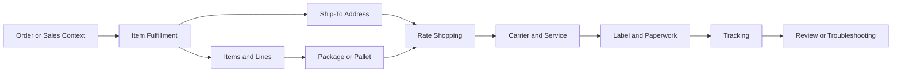

# Shipping Overview

## Quick Summary

Pacejet is a shipping platform that connects shipping activity to ERP data and carrier workflows. In a NetSuite-centered environment, shipping questions should be reasoned through the relationship between the order or fulfillment, customer, address, item lines, packages, carrier services, labels, tracking, and shipment status.

The core reasoning rule is:

> Do not evaluate a shipping result by looking only at the carrier or rate. Review the shipment context that produced the carrier, rate, package, label, and tracking outcome.

## Business Purpose

Shipping affects customer experience, fulfillment speed, freight cost, warehouse accuracy, carrier selection, tracking visibility, and operational review.

Employees may ask why a rate was not returned, why a carrier was selected, why a label did not print, why an address failed validation, why freight differed from parcel, or why shipment information did not update back to NetSuite.

This article provides the conceptual foundation for those questions without documenting company-specific shipping rules, carrier accounts, package logic, negotiated rates, warehouse procedures, or private configuration.

## Public Pacejet Perspective

Public Pacejet materials describe Descartes Pacejet as ERP-integrated multi-carrier shipping software for freight, parcel, and wholesale shipments. Public product content describes capabilities such as rate shopping, predictive packing, packing and scan-packing, labels and paperwork, shipping rules, reporting and analytics, export shipping, address validation, carrier performance, and integrations/APIs.

For this repository, those capabilities should be translated into reasoning models:

- What shipment question is being asked?
- What NetSuite record or fulfillment context produced the shipment?
- What address, item, package, carrier, and service data were involved?
- What output was expected?
- What evidence should be reviewed before escalation?

## NetSuite Perspective

In NetSuite-centered reasoning, shipping usually starts from transaction and fulfillment context.

Common records and data points include:

- sales order or order context
- item fulfillment or fulfillment context
- customer
- ship-to address
- item and line details
- item weights or dimensions
- package or pallet information
- carrier and service level
- rate result
- label and paperwork
- tracking number or shipment status

The assistant should connect these records before explaining a shipping result.

## Core Shipping Concepts

| Concept | Meaning | Why It Matters |
|---|---|---|
| Shipment context | The full set of records and data used to produce a shipping outcome. | Rates, carriers, labels, and tracking depend on context. |
| Multi-carrier shipping | Ability to evaluate or use more than one carrier or service. | Carrier choice may depend on cost, service, transit time, address, package, and rules. |
| Parcel | Package-oriented shipping commonly used for smaller shipments. | Parcel workflows often rely on package weight, dimensions, labels, and tracking. |
| LTL freight | Less-than-truckload freight shipping for larger or palletized shipments. | Freight workflows may involve different rating, carrier, and paperwork considerations. |
| Rate shopping | Comparing available carrier/service options for a shipment. | Rate results depend on shipment data, not just carrier preference. |
| Packing | Determining package, box, pallet, weight, dimension, or scan-pack context. | Packing data can affect rates, labels, and carrier selection. |
| Label generation | Producing shipping labels and related paperwork. | Label issues may come from address, package, carrier, service, or printer context. |
| Tracking | Carrier or shipment status information after shipment creation. | Tracking helps connect operational status back to the shipment. |

## Shipment Reasoning Model

This map is a generic reasoning model. It is not a company-specific shipping workflow.

## Records and Evidence to Review

| Evidence | Why It Matters |
|---|---|
| Order or fulfillment record | Establishes the source shipping context. |
| Customer and ship-to address | Affects address validation, rating, carrier availability, and delivery. |
| Item lines | Determine what is being shipped. |
| Weight and dimensions | Affect parcel, freight, rate, package, and carrier logic. |
| Package or pallet details | Help explain rates, labels, and freight outcomes. |
| Carrier and service | Show which shipping option was selected or attempted. |
| Label or paperwork status | Helps troubleshoot output and printing problems. |
| Tracking number or status | Helps verify whether shipment creation succeeded. |

## Consultant Reasoning Sequence

When answering a Pacejet shipping question, the assistant should:

1. Identify the observable symptom or question.
2. Identify the NetSuite record or fulfillment context.
3. Determine whether the question is about rating, packing, carrier selection, label generation, tracking, or NetSuite update behavior.
4. Review customer, address, item, line, package, carrier, and service context.
5. Compare expected outcome to actual outcome.
6. Avoid assuming Pacejet, NetSuite, or the carrier failed until record evidence is reviewed.
7. Escalate when private carrier setup, shipping rules, negotiated rates, credentials, printer setup, custom fields, workflows, scripts, or warehouse SOPs are needed.

## Common Employee Questions

- What is Pacejet used for?
- Why did a certain carrier or service appear?
- Why did no shipping rate come back?
- Why did the label not print?
- Why did the address fail validation?
- Why did the shipment not update back to NetSuite?
- Why does package weight or dimension matter?
- Is this a NetSuite issue, Pacejet issue, carrier issue, or data issue?

## Common Misconceptions

| Misconception | Better Reasoning |
|---|---|
| Shipping is only about picking a carrier. | Shipping outcomes depend on order, fulfillment, address, item, package, carrier, service, label, and tracking context. |
| The cheapest rate should always be selected. | Carrier selection may depend on cost, service level, transit time, rules, package data, and business context. |
| A label error means Pacejet failed. | Label errors may involve address, carrier, service, package, printer, paperwork, or private configuration context. |
| Parcel and freight behave the same way. | Parcel and LTL freight can have different data, carrier, paperwork, and rating needs. |
| Current item data always explains a prior shipment. | Historical shipment context may differ from current item or package values. |

## Public-Safe Boundaries

This article may explain:

- public Pacejet concepts
- shipping lifecycle reasoning
- generic record relationships
- generic rate, packing, label, and tracking concepts
- public-safe troubleshooting direction

This article must not include:

- company-specific carrier accounts
- negotiated rates
- private shipping rules
- package algorithms or package rules
- internal warehouse SOPs
- custom fields, saved searches, workflows, or scripts
- private printer setup
- customer examples
- screenshots
- proprietary shipping decisions

## AI Reasoning Guidance

The assistant should use this article when a user asks broad Pacejet questions, asks what Pacejet does, or asks where to start when investigating a shipping issue.

The assistant should identify whether the question is about:

- shipment lifecycle,
- rate shopping,
- carrier selection,
- packing,
- labels and paperwork,
- address validation,
- tracking,
- or NetSuite update behavior.

Then it should retrieve the more specific article for that topic when available.

The assistant should avoid making final operational conclusions when private shipping configuration, carrier agreements, warehouse SOPs, printer setup, custom fields, workflows, scripts, or account-specific rules are required.

## Related Articles

- [Pacejet Integration Knowledge Hub](../README.md)

## Public Sources

- https://www.pacejet.com/

## Public-Safety Review

This article is public-safe. It avoids company-specific shipping rules, carrier account numbers, negotiated rates, private credentials, package algorithms, warehouse SOPs, customer examples, screenshots, custom fields, saved searches, workflows, SuiteScripts, pricing, and proprietary process details.
