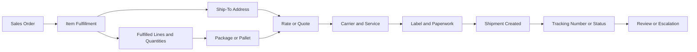

# Fulfillment and Shipment Relationship

## Quick Summary

Fulfillment and shipment are closely related, but they are not always the same thing.

In a NetSuite and Pacejet context, fulfillment usually represents the operational record or stage where items are prepared to ship. Shipment context represents the shipping output that may include packages, carrier/service selection, labels, paperwork, tracking, and status updates.

The core reasoning rule is:

> Start with the fulfillment, then trace what shipping output was created from it.

## Business Purpose

Many shipping questions begin when a user sees a mismatch between what was fulfilled and what happened in shipping.

Examples include:

- items were fulfilled but no shipment appears
- shipment exists but tracking is missing
- label printed but fulfillment did not update as expected
- rate was returned but shipment was not completed
- package or pallet data does not match the fulfilled items
- freight or parcel handling does not match expectation

A consultant-style assistant should compare the fulfillment context to the shipment output before diagnosing the issue.

## Public Pacejet Perspective

Public Pacejet materials describe ERP-integrated shipping for freight, parcel, and wholesale shipments. Public content also describes rate shopping, packing, labels and paperwork, tracking, address validation, carrier performance, and integrations.

For AI reasoning, these capabilities imply a relationship between ERP fulfillment context and shipping execution. The assistant should not jump directly to a carrier or label conclusion without first identifying what fulfillment data produced the shipment context.

## NetSuite Perspective

In NetSuite-centered reasoning, the item fulfillment is often the key bridge between an order and a shipment.

The assistant should review:

- source order context
- item fulfillment context
- fulfilled items and quantities
- ship-to address
- package, pallet, or handling data
- carrier and service context
- label and paperwork output
- tracking number or shipment status
- any visible update behavior back to NetSuite

The exact implementation may vary, so this article stays conceptual and public-safe.

## Relationship Map



This map is a generic reasoning model. It is not a company-specific shipping workflow.

## Fulfillment vs Shipment Concepts

| Concept | Meaning | Why It Matters |
|---|---|---|
| Sales order | Source order context. | Helps identify what was expected to ship. |
| Item fulfillment | Operational fulfillment context. | Shows which items and quantities moved into shipping. |
| Fulfilled lines | Specific items and quantities being shipped. | Drives package, rate, and label context. |
| Shipment | Shipping execution output. | Shows carrier/service, label, paperwork, tracking, or status evidence. |
| Tracking | Carrier or shipment status reference. | Helps confirm whether shipping execution completed. |
| Update behavior | Visible data written back to NetSuite or related records. | Helps diagnose status or synchronization questions. |

## Data Points to Compare

| Data Point | Why It Matters |
|---|---|
| Source order | Establishes expected items, customer, and destination context. |
| Fulfillment record | Shows what moved into the shipping stage. |
| Fulfilled quantities | Helps explain partial shipments and package differences. |
| Item weight and dimensions | Affects package, pallet, rate, and label behavior. |
| Ship-to address | Affects validation, rating, carrier options, label, and delivery. |
| Package or pallet data | Connects fulfilled items to shipping output. |
| Carrier and service | Shows the selected or attempted shipping option. |
| Label or paperwork | Shows whether shipping output was generated. |
| Tracking and shipment status | Helps confirm whether the shipment completed or needs review. |

## Stage-Based Diagnostic Flow

```text
If items are fulfilled but no shipment appears:
  Review the fulfillment context and shipment output context.
  Confirm whether shipping execution occurred after fulfillment.

If a shipment exists but tracking is missing:
  Review label or shipment creation evidence.
  Confirm whether tracking should have been produced at that lifecycle stage.

If shipment details do not match fulfillment:
  Compare fulfilled lines, quantities, package data, carrier, and service.

If a label printed but the fulfillment looks incomplete:
  Separate label output from fulfillment status.
  Review shipment and update behavior.

If visible evidence does not explain the issue:
  Escalate for internal review.
```

## Consultant Reasoning Sequence

When answering fulfillment-to-shipment questions, the assistant should:

1. Identify the exact record where the issue was noticed.
2. Determine whether the user is asking about fulfillment, shipment output, label, tracking, or update behavior.
3. Compare the source order to the fulfillment.
4. Compare the fulfillment to the shipment output.
5. Review item lines, quantities, address, package, carrier, service, label, and tracking context.
6. Avoid assuming that fulfillment completion automatically means shipment completion.
7. Escalate when internal operating rules or setup need review.

## Common Employee Questions

- If the order is fulfilled, does that mean it shipped?
- Why did the shipment not appear after fulfillment?
- Why is tracking missing after a label was created?
- Why do shipment items not match the fulfilled items?
- Why did the label print but the record did not update as expected?
- Should I start with the sales order, fulfillment, label, or tracking number?

## Common Misconceptions

| Misconception | Better Reasoning |
|---|---|
| Fulfilled always means shipped. | Fulfillment and shipment are related but should be verified through shipping output. |
| A label always proves the shipment lifecycle is complete. | Label output is important, but tracking and update evidence may still need review. |
| Tracking should exist before shipment creation. | Tracking usually depends on shipment or label output. |
| The sales order alone explains the shipment. | Fulfillment, package, carrier, service, label, and tracking data may all matter. |
| Every mismatch is a system failure. | Some mismatches may reflect lifecycle stage, partial fulfillment, package context, or review timing. |

## Public-Safe Boundaries

This article may explain fulfillment-to-shipment concepts, public-safe record relationships, stage-based reasoning, and escalation guidance.

This article must not include company-specific shipping procedures, customer examples, screenshots, account setup, pricing, or proprietary operating rules.

## AI Reasoning Guidance

The assistant should use this article when a user asks about the relationship between fulfillment and shipping, tracking updates, shipment creation, label output after fulfillment, or mismatches between fulfilled items and shipment output.

The assistant should usually retrieve this article with [Shipment Lifecycle](SHIPMENT_LIFECYCLE.md), [Shipment Data Model](../fundamentals/SHIPMENT_DATA_MODEL.md), and the relevant symptom-specific article when available.

## Related Articles

- [Shipment Lifecycle](SHIPMENT_LIFECYCLE.md)
- [Shipping Overview](../fundamentals/SHIPPING_OVERVIEW.md)
- [Shipment Data Model](../fundamentals/SHIPMENT_DATA_MODEL.md)
- [Parcel vs LTL Freight](../fundamentals/PARCEL_VS_LTL_FREIGHT.md)
- [Carrier Services](../fundamentals/CARRIER_SERVICES.md)
- [Address Validation Concepts](../fundamentals/ADDRESS_VALIDATION_CONCEPTS.md)
- [Pacejet Integration Knowledge Hub](../README.md)

## Public Sources

- https://www.pacejet.com/

## Public-Safety Review

This article is public-safe. It avoids company-specific shipping procedures, customer examples, screenshots, account setup, pricing, and proprietary operating rules.
