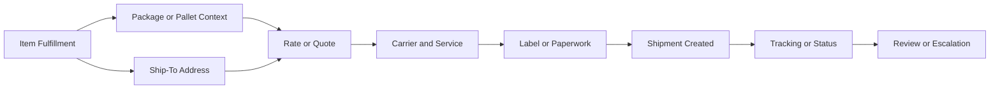

# Labels and Paperwork

## Quick Summary

Labels and paperwork are shipping outputs created after fulfillment, packing, rating, carrier/service selection, and address context are established.

In a NetSuite and Pacejet environment, label or paperwork issues should be reviewed as part of the shipment lifecycle, not as isolated output problems.

The core reasoning rule is:

> Do not troubleshoot a label or paperwork issue until you understand the shipment context that produced the output.

## Business Purpose

Employees may ask why a label did not generate, why paperwork looks different than expected, why freight documents appeared instead of a parcel label, why tracking did not appear after label creation, or why a label does not match the intended shipment.

A consultant-style assistant should work backward from the label or paperwork symptom to the shipment evidence: fulfillment, address, package, pallet, carrier, service, rate, shipment mode, and tracking context.

## Public Pacejet Perspective

Public Pacejet materials describe shipping capabilities connected to labels and paperwork, parcel and freight shipping, packing, rate shopping, address validation, carrier performance, and ERP integration.

For AI reasoning, labels and paperwork should be treated as outputs of the shipping lifecycle. They are affected by upstream shipment data and may differ depending on parcel versus freight context, carrier/service selection, destination, package or pallet data, and shipment completion status.

## NetSuite Perspective

In NetSuite-centered reasoning, label and paperwork questions usually connect to an item fulfillment or shipment context.

The assistant should compare:

- item fulfillment
- fulfilled lines and quantities
- ship-to address
- package or pallet context
- parcel versus LTL freight mode
- carrier and service
- rate or quote result
- label or paperwork output
- tracking number or shipment status

## Label and Paperwork Lifecycle Map



This map is a generic reasoning model. It is not a company-specific shipping workflow.

## Label vs Paperwork Concepts

| Concept | Meaning | Why It Matters |
|---|---|---|
| Parcel label | Label commonly associated with package shipping. | Supports package-level shipping and tracking. |
| Freight paperwork | Documents or outputs commonly associated with freight context. | May differ from parcel label workflows. |
| Label output | The visible result of carrier/service and shipment context. | Helps determine whether shipping execution advanced. |
| Paperwork context | Supporting shipment documents. | May depend on shipment mode, destination, service, or carrier. |
| Tracking output | Tracking number or status tied to shipment creation. | May appear after label or shipment creation succeeds. |

## Data Points to Compare

| Data Point | Why It Matters |
|---|---|
| Fulfillment | Shows what shipping output should relate back to. |
| Ship-to address | Affects carrier, service, label, and delivery context. |
| Shipment mode | Helps distinguish parcel label from freight paperwork expectations. |
| Package or pallet data | Influences rate, carrier/service, and output type. |
| Carrier and service | Determines what output should be created. |
| Rate or quote result | Shows whether carrier/service context was established before output. |
| Label or paperwork status | Shows whether shipping output was created. |
| Tracking or shipment status | Helps confirm whether shipment creation progressed beyond output. |

## Diagnostic Decision Tree

```text
If a label did not generate:
  Review fulfillment, address, package/pallet, carrier, and service context.
  Confirm whether rating or service selection occurred before label output.

If paperwork looks different than expected:
  Identify whether the shipment is parcel, freight, export, or another context.
  Compare package/pallet data, carrier, service, and destination context.

If a label exists but tracking is missing:
  Confirm whether shipment creation completed after label output.
  Review tracking or status evidence.

If the label address looks wrong:
  Compare customer address, order address, fulfillment address, and label address.

If visible evidence does not explain the issue:
  Escalate for internal shipping or system review.
```

## Consultant Reasoning Sequence

When answering label or paperwork questions, the assistant should:

1. Identify whether the symptom involves label creation, paperwork type, label contents, tracking, or shipment status.
2. Identify the exact fulfillment, package, carrier, service, or label context.
3. Compare address, item lines, quantities, package/pallet data, carrier, service, and shipment mode.
4. Determine whether the expected output is a parcel label, freight paperwork, or another shipping output.
5. Review whether shipment and tracking evidence followed label output.
6. Avoid assuming a system failure until shipment evidence is reviewed.
7. Escalate when internal review is needed.

## Common Employee Questions

- Why did the label not generate?
- Why did paperwork generate instead of a parcel label?
- Why did tracking not appear after the label was created?
- Why does the label address look different than expected?
- Why did the carrier service affect the label output?
- Should I check the fulfillment, package, address, carrier, or shipment first?

## Common Misconceptions

| Misconception | Better Reasoning |
|---|---|
| A label issue is always an output issue. | Label output can depend on fulfillment, address, package, carrier, service, and shipment context. |
| A label means the shipment is fully complete. | Tracking and shipment status may still need review. |
| Parcel labels and freight paperwork are interchangeable. | Parcel and freight outputs may serve different shipping contexts. |
| The customer address always matches the label address. | The label may reflect the address used in the shipment context. |
| A missing label proves the carrier failed. | The issue may be upstream in data, rating, service selection, or output context. |

## Public-Safe Boundaries

This article may explain label and paperwork concepts, generic shipping output relationships, public-safe troubleshooting paths, and escalation guidance.

This article must not include company-specific output formats, customer examples, screenshots, pricing, or proprietary operating procedures.

## AI Reasoning Guidance

The assistant should use this article when a user asks about shipping labels, freight paperwork, missing labels, label address issues, tracking after label creation, or differences between parcel and freight outputs.

The assistant should usually retrieve this article with [Shipment Lifecycle](SHIPMENT_LIFECYCLE.md), [Package and Pallet Reasoning](PACKAGE_AND_PALLET_REASONING.md), [Shipment Data Model](../fundamentals/SHIPMENT_DATA_MODEL.md), and [Carrier Services](../fundamentals/CARRIER_SERVICES.md).

## Related Articles

- [Shipment Lifecycle](SHIPMENT_LIFECYCLE.md)
- [Fulfillment and Shipment Relationship](FULFILLMENT_AND_SHIPMENT_RELATIONSHIP.md)
- [Package and Pallet Reasoning](PACKAGE_AND_PALLET_REASONING.md)
- [Shipping Overview](../fundamentals/SHIPPING_OVERVIEW.md)
- [Shipment Data Model](../fundamentals/SHIPMENT_DATA_MODEL.md)
- [Carrier Services](../fundamentals/CARRIER_SERVICES.md)
- [Address Validation Concepts](../fundamentals/ADDRESS_VALIDATION_CONCEPTS.md)
- [Pacejet Integration Knowledge Hub](../README.md)

## Public Sources

- https://www.pacejet.com/

## Public-Safety Review

This article is public-safe. It avoids company-specific output formats, customer examples, screenshots, pricing, and proprietary operating procedures.
