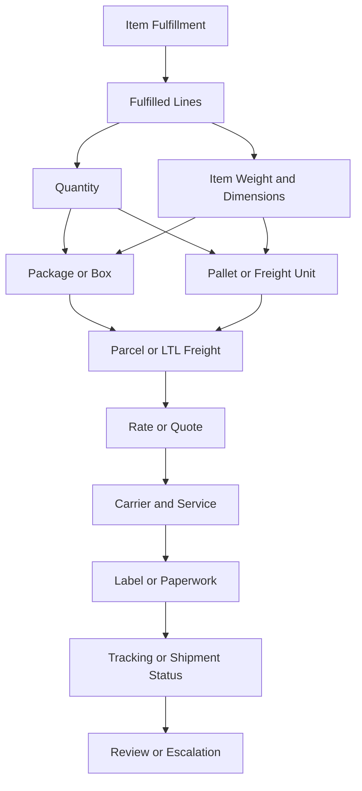

# Package and Pallet Reasoning

## Quick Summary

Package and pallet data connect fulfillment activity to shipping execution.

In a NetSuite and Pacejet context, package and pallet information can affect parcel versus freight reasoning, rate or quote results, carrier and service availability, label output, paperwork, tracking, and shipment review.

The core reasoning rule is:

> Do not explain a rate, carrier, label, or freight result until you understand the package or pallet context that produced it.

## Business Purpose

Employees may ask why a shipment rated higher than expected, why freight appeared instead of parcel, why a carrier service was missing, why a label did not generate, or why paperwork looked different than expected.

Many of those questions trace back to package or pallet context: what items were fulfilled, how many units were shipped, how weight and dimensions were represented, whether the shipment was parcel or freight, and what shipping output was expected.

## Public Pacejet Perspective

Public Pacejet materials describe packing-related capabilities including predictive packing, packing and scan-packing, labels and paperwork, rate shopping, parcel and freight shipping, and ERP integration. Pacejet states that predictive packing can estimate the number of boxes or pallets in shipments along with dimensions and weights, and public materials describe scan-pack workflows that help capture shipping data before shipment execution. citeturn444801view0

For AI reasoning, the important point is that packing data is not only a warehouse detail. It can influence rate shopping, carrier/service choices, labels, paperwork, and shipment review.

## NetSuite Perspective

In NetSuite-centered reasoning, package and pallet questions should start from the fulfillment context.

The assistant should compare:

- sales order or source order context
- item fulfillment
- fulfilled lines and quantities
- item weights and dimensions
- package, box, pallet, or handling-unit data
- parcel versus LTL freight context
- carrier and service context
- rate or quote result
- label and paperwork output
- tracking or shipment status

## Package vs Pallet Concepts

| Concept | Package / Box | Pallet / Freight Handling Unit |
|---|---|---|
| Common use | Parcel-oriented shipping. | LTL freight or larger shipment context. |
| Key data | Weight, dimensions, package count, label. | Pallet count, dimensions, weight, freight paperwork. |
| Common output | Parcel label and tracking. | Freight quote, paperwork, shipment status. |
| First review | Package data and service context. | Pallet/freight data and carrier context. |
| Common risk | Wrong weight, dimensions, package count, or label context. | Wrong handling-unit context, freight quote mismatch, or paperwork issue. |

## Package and Pallet Relationship Map



This map is a generic reasoning model. It is not a company-specific packing workflow.

## Data Points to Compare

| Data Point | Why It Matters |
|---|---|
| Fulfilled items | Determines what must be packed and shipped. |
| Quantities | Affects package count, pallet context, and partial shipment reasoning. |
| Weight | Affects rate, carrier/service options, and label context. |
| Dimensions | Affects parcel/freight classification, rate, and paperwork. |
| Package count | Helps explain rate and label output. |
| Pallet count | Helps explain freight quote and paperwork context. |
| Shipment mode | Determines whether parcel or freight reasoning applies. |
| Carrier/service | Shows which shipping option used the package or pallet data. |
| Label/paperwork | Shows the shipping output produced from the packing context. |

## Diagnostic Decision Tree

```text
If the rate looks wrong:
  Review package or pallet data before assuming a carrier issue.
  Compare items, quantities, weight, dimensions, shipment mode, carrier, and service.

If freight appeared instead of parcel:
  Review package and pallet context.
  Compare fulfilled items, quantities, dimensions, weight, and shipment mode.

If label output looks wrong:
  Review package count, service, carrier, and address context.
  Determine whether the expected output is a parcel label or freight paperwork.

If paperwork looks different than expected:
  Review whether the shipment is parcel, freight, export, retail, or another context.

If visible data does not explain the issue:
  Escalate for internal shipping review.
```

## Consultant Reasoning Sequence

When answering package or pallet questions, the assistant should:

1. Identify the exact shipment, fulfillment, package, pallet, label, or rate context.
2. Determine whether the shipment is parcel, LTL freight, or unknown.
3. Compare fulfilled items, quantities, weights, and dimensions.
4. Review package or pallet count and handling context.
5. Compare carrier, service, rate, label, and paperwork output.
6. Avoid assuming the selected shipping mode is wrong until evidence is reviewed.
7. Escalate when internal packing rules or operating procedures need review.

## Common Employee Questions

- Why does package weight matter?
- Why do dimensions matter?
- Why did this shipment rate as freight?
- Why did the label not match what I expected?
- Why is there freight paperwork instead of a parcel label?
- Why did the carrier option change after packing?
- Should I check the item, package, pallet, fulfillment, or carrier first?

## Common Misconceptions

| Misconception | Better Reasoning |
|---|---|
| Packing only matters in the warehouse. | Packing data can affect rates, carrier options, labels, paperwork, and tracking. |
| Package count does not affect shipping results. | Package count may affect rate, labels, and carrier/service behavior. |
| Freight and parcel use the same packing assumptions. | Freight and parcel can rely on different handling, paperwork, and rate context. |
| A rate issue is always a carrier issue. | Package or pallet context may be part of the explanation. |
| Current item data always explains a prior shipment. | Historical shipment context may differ from current item or package data. |

## Public-Safe Boundaries

This article may explain package and pallet concepts, public-safe packing relationships, symptom-to-evidence reasoning, and escalation guidance.

This article must not include company-specific packing rules, customer examples, screenshots, account setup, pricing, or proprietary operating procedures.

## AI Reasoning Guidance

The assistant should use this article when a user asks about package weight, dimensions, package count, pallet count, parcel versus freight behavior, rate changes after packing, label differences, or freight paperwork.

The assistant should usually retrieve this article with [Shipment Lifecycle](SHIPMENT_LIFECYCLE.md), [Fulfillment and Shipment Relationship](FULFILLMENT_AND_SHIPMENT_RELATIONSHIP.md), [Shipment Data Model](../fundamentals/SHIPMENT_DATA_MODEL.md), and [Parcel vs LTL Freight](../fundamentals/PARCEL_VS_LTL_FREIGHT.md).

## Related Articles

- [Shipment Lifecycle](SHIPMENT_LIFECYCLE.md)
- [Fulfillment and Shipment Relationship](FULFILLMENT_AND_SHIPMENT_RELATIONSHIP.md)
- [Shipping Overview](../fundamentals/SHIPPING_OVERVIEW.md)
- [Shipment Data Model](../fundamentals/SHIPMENT_DATA_MODEL.md)
- [Parcel vs LTL Freight](../fundamentals/PARCEL_VS_LTL_FREIGHT.md)
- [Carrier Services](../fundamentals/CARRIER_SERVICES.md)
- [Pacejet Integration Knowledge Hub](../README.md)

## Public Sources

- https://www.pacejet.com/

## Public-Safety Review

This article is public-safe. It avoids company-specific packing rules, customer examples, screenshots, account setup, pricing, and proprietary operating procedures.
