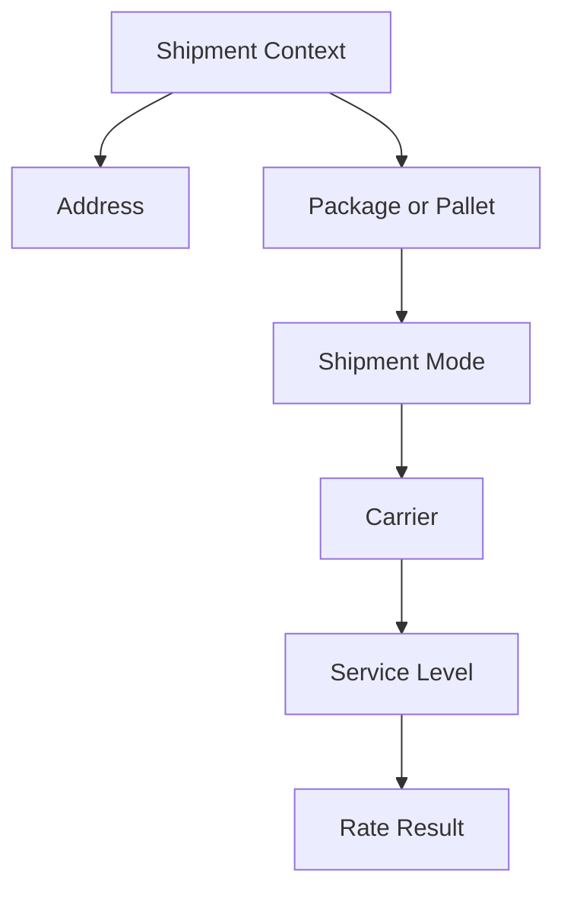

# Carrier Selection

## Purpose

Carrier selection explains why a shipping provider and service option may appear for a shipment.

The key idea is simple:

> Review shipment context before explaining carrier selection.

## Context to Review

| Context | Why It Matters |
|---|---|
| Shipment record | Shows where the question appeared. |
| Address | Destination may affect available options. |
| Package or pallet | Physical shipment details may affect available options. |
| Shipment mode | Parcel and LTL may behave differently. |
| Carrier | Identifies the provider. |
| Service level | Identifies the option used with the provider. |
| Rate result | Shows which options were returned. |

## Simple Model

## Related Articles

- [Rate Shopping Concepts](RATE_SHOPPING_CONCEPTS.md)
- [Carrier Services](../fundamentals/CARRIER_SERVICES.md)
- [Shipment Data Model](../fundamentals/SHIPMENT_DATA_MODEL.md)
- [Shipment Lifecycle](../lifecycle/SHIPMENT_LIFECYCLE.md)

## Public-Safety Review

This article is public-safe and conceptual.
