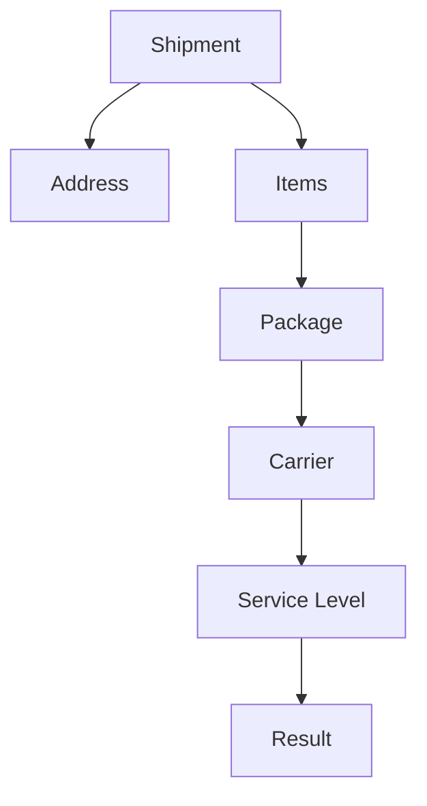

# Option Comparison

## Purpose

Option comparison helps an assistant explain why different shipping options may appear for the same shipment question.

The key idea is simple:

> Compare options through shipment context, not option names alone.

## Context to Review

| Context | Why It Matters |
|---|---|
| Shipment record | Shows where the question appeared. |
| Address | Shows destination context. |
| Items | Shows what is being shipped. |
| Package | Shows physical shipment context. |
| Carrier | Shows the provider. |
| Service level | Shows the specific option. |
| Result | Shows what was returned or selected. |

## Simple Model

## Guidance

When comparing options, review the visible shipment context first. Avoid explaining the result from the option name alone.

## Related Articles

- [Rate Shopping Concepts](RATE_SHOPPING_CONCEPTS.md)
- [Carrier Selection](CARRIER_SELECTION.md)
- [Service Level Comparison](SERVICE_LEVEL_COMPARISON.md)
- [Shipment Data Model](../fundamentals/SHIPMENT_DATA_MODEL.md)
- [Shipment Lifecycle](../lifecycle/SHIPMENT_LIFECYCLE.md)

## Public-Safety Review

This article is public-safe and conceptual.
