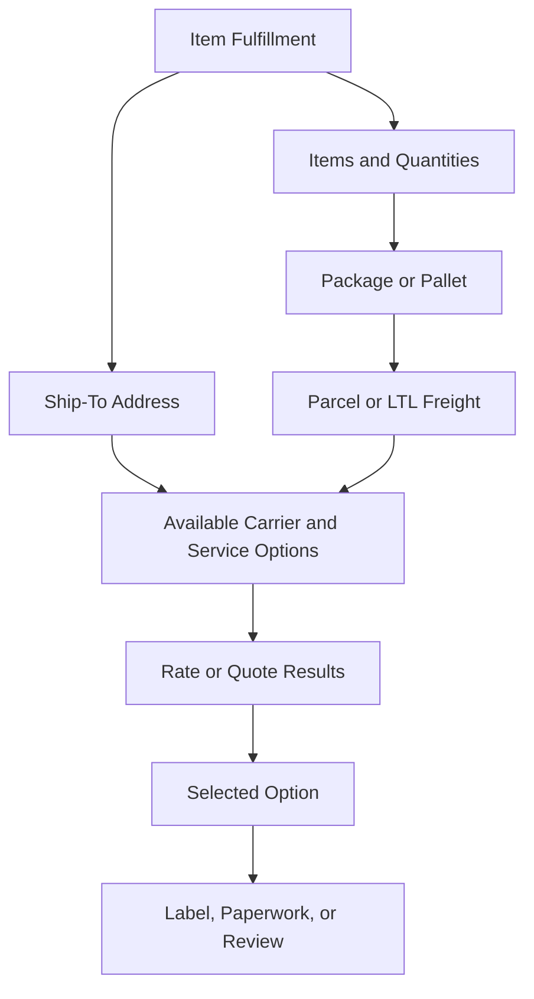

# Rate Shopping Concepts

## Quick Summary

Rate shopping is the process of comparing available shipping options for a shipment context.

In a NetSuite and Pacejet environment, rate shopping should be explained through the data used to request rates: fulfillment, address, item lines, package or pallet details, shipment mode, carrier, and service level.

The core reasoning rule is:

> A rate is an output of shipment context, not an isolated number.

## Business Purpose

Employees may ask why one rate appeared, why a rate did not appear, why a service looked different than expected, or why freight and parcel options behaved differently.

A consultant-style assistant should help the user understand which shipment details influenced the available options before suggesting a likely explanation.

## Conceptual Model

This is a generic reasoning model, not a company-specific shipping workflow.

## Data Points That Can Influence Rate Shopping

| Data Point | Why It Matters |
|---|---|
| Ship-to address | Destination context can influence available options. |
| Items and quantities | Determines what needs to ship. |
| Weight and dimensions | Can affect parcel, freight, and carrier choices. |
| Package or pallet context | Helps define the physical shipment. |
| Shipment mode | Parcel and LTL freight may follow different paths. |
| Carrier and service level | Determines which options are being compared. |
| Timing | Record state may differ before and after fulfillment or packing. |

## Consultant Reasoning Sequence

1. Identify where the rate question appeared.
2. Identify whether the shipment is parcel, freight, or unknown.
3. Review the address used for the rate request.
4. Review items, quantities, weights, and dimensions.
5. Review package or pallet context.
6. Review carrier and service options.
7. Compare the returned options to the expected result.
8. Escalate when visible evidence is not enough.

## Common Employee Questions

- Why did this rate appear?
- Why did a rate not appear?
- Why did one carrier or service show up instead of another?
- Why does freight rating behave differently from parcel rating?
- Why did a rate change after packing or fulfillment?
- What evidence should I review before escalating?

## Common Misconceptions

| Misconception | Better Reasoning |
|---|---|
| Rate shopping is only about finding the lowest price. | Rate shopping may involve cost, service, shipment mode, destination, and package context. |
| A rate can be explained without shipment details. | The rate is produced from shipment context. |
| Parcel and freight rates are interchangeable. | Parcel and freight may use different shipment evidence. |
| Carrier selection explains the full result. | Carrier selection is only one part of the rate-shopping context. |

## AI Reasoning Guidance

Use this article when a user asks about rate shopping, returned rates, missing rates, freight quotes, parcel rates, carrier/service comparison, or rate changes after fulfillment or packing.

Retrieve this article with:

- [Shipment Data Model](../fundamentals/SHIPMENT_DATA_MODEL.md)
- [Parcel vs LTL Freight](../fundamentals/PARCEL_VS_LTL_FREIGHT.md)
- [Carrier Services](../fundamentals/CARRIER_SERVICES.md)
- [Shipment Lifecycle](../lifecycle/SHIPMENT_LIFECYCLE.md)

## Related Articles

- [Shipping Overview](../fundamentals/SHIPPING_OVERVIEW.md)
- [Shipment Data Model](../fundamentals/SHIPMENT_DATA_MODEL.md)
- [Parcel vs LTL Freight](../fundamentals/PARCEL_VS_LTL_FREIGHT.md)
- [Carrier Services](../fundamentals/CARRIER_SERVICES.md)
- [Shipment Lifecycle](../lifecycle/SHIPMENT_LIFECYCLE.md)

## Public Sources

- https://www.pacejet.com/

## Public-Safety Review

This article is public-safe and conceptual. It avoids company-specific examples, screenshots, pricing, and proprietary procedures.
