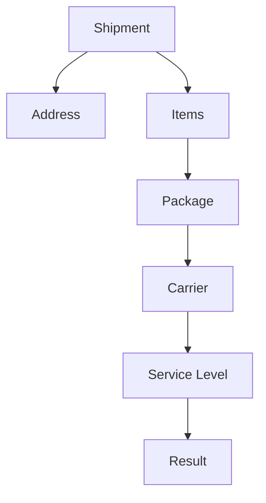

# Rule Concepts

## Purpose

Rule concepts help an assistant understand that shipping results may depend on comparison logic, option context, and shipment evidence.

The key idea is simple:

> Review the shipment context before explaining why an option appeared or did not appear.

## Context to Review

| Context | Why It Matters |
|---|---|
| Shipment | Shows the source question. |
| Address | Shows destination context. |
| Items | Shows what is being shipped. |
| Package | Shows physical shipment context. |
| Carrier | Shows the provider involved. |
| Service level | Shows the option being compared. |
| Result | Shows the visible outcome. |

## Simple Model

## Guidance

When a user asks why an option appeared, changed, or was not shown, compare the visible shipment context first.

Avoid explaining the result from the option name alone.

## Related Articles

- [Rate Shopping Concepts](RATE_SHOPPING_CONCEPTS.md)
- [Option Comparison](OPTION_COMPARISON.md)
- [Carrier Selection](CARRIER_SELECTION.md)
- [Service Level Comparison](SERVICE_LEVEL_COMPARISON.md)
- [Shipment Data Model](../fundamentals/SHIPMENT_DATA_MODEL.md)
- [Shipment Lifecycle](../lifecycle/SHIPMENT_LIFECYCLE.md)

## Public-Safety Review

This article is public-safe and conceptual.
