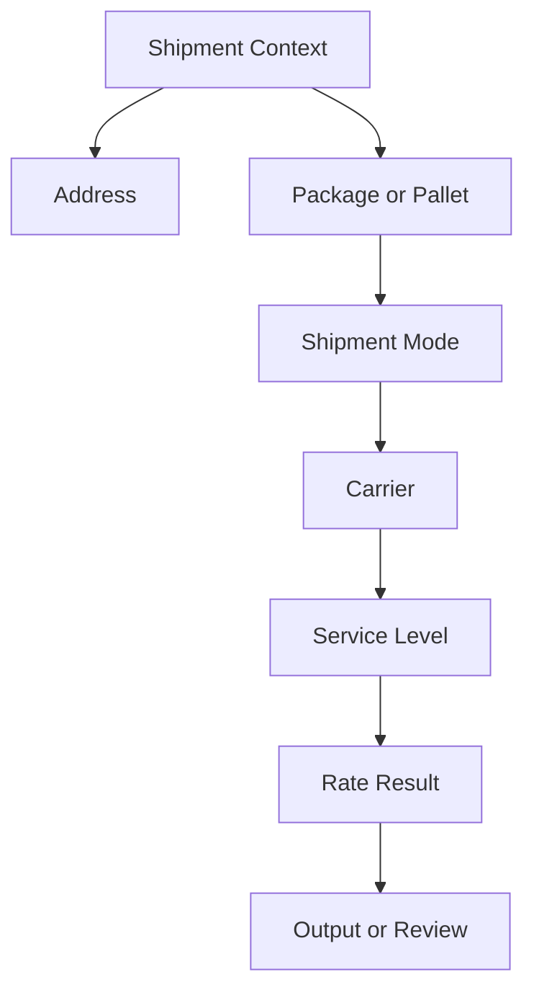

# Service Level Comparison

## Purpose

Service level comparison explains how different shipping options may be evaluated for a shipment.

A service level is not the same as the carrier. The carrier is the provider. The service level is the shipping option offered by that provider.

The key idea is simple:

> Compare service levels through shipment context, not by name alone.

## Context to Review

| Context | Why It Matters |
|---|---|
| Shipment record | Shows where the question appeared. |
| Address | Destination may affect available services. |
| Package or pallet | Physical shipment details may affect service options. |
| Shipment mode | Parcel and LTL may have different service choices. |
| Carrier | Identifies the provider offering the service. |
| Service level | Identifies the specific option being compared. |
| Rate result | Shows available service options for the shipment context. |
| Output | Label, paperwork, tracking, or review may differ by service. |

## Simple Model

## Consultant Guidance

When a user asks why one service level appeared instead of another, review the shipment record, destination, package or pallet context, shipment mode, carrier, and rate result.

Do not assume a service is better or worse from its name alone. Compare it to the shipment context and the available options.

## Related Articles

- [Rate Shopping Concepts](RATE_SHOPPING_CONCEPTS.md)
- [Carrier Selection](CARRIER_SELECTION.md)
- [Carrier Services](../fundamentals/CARRIER_SERVICES.md)
- [Shipment Data Model](../fundamentals/SHIPMENT_DATA_MODEL.md)
- [Shipment Lifecycle](../lifecycle/SHIPMENT_LIFECYCLE.md)

## Public Sources

- https://www.pacejet.com/

## Public-Safety Review

This article is public-safe and conceptual.
