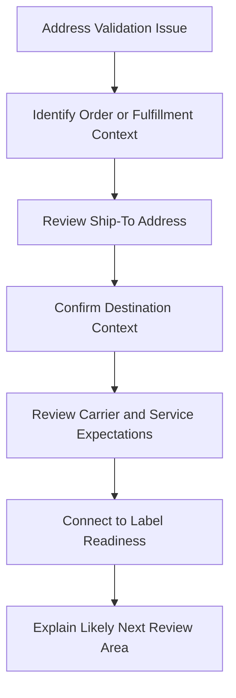

# Address Validation Issue Overview

## Quick Summary

An address validation issue should be treated as a shipment-readiness question, not only as an address-format question.

The assistant should connect the visible ship-to address, customer context, fulfillment stage, carrier/service requirements, and label readiness before suggesting a likely explanation.

## Reasoning Model

## First Review Areas

| Area | Why It Matters |
|---|---|
| Record context | Confirms whether the question appeared during quoting, fulfillment, packing, labeling, or review. |
| Ship-to address | Address completeness and destination context can affect validation, rating, and label creation. |
| Customer or recipient context | Helps distinguish a true address issue from a missing or inconsistent shipping destination. |
| Carrier and service | Some carrier/service combinations may require cleaner destination data before rating or label creation. |
| Label readiness | Address validation issues often surface before a label can be confidently produced. |

## Consultant Guidance

Do not assume the address itself is wrong just because validation failed or returned a warning. First determine where in the shipment lifecycle the issue appeared, then connect the address evidence to rating, carrier selection, and label generation context.

For AI retrieval, this article should route address-related shipping questions toward the address validation concepts article first, then toward shipment lifecycle and label-paperwork reasoning if the question involves downstream fulfillment impact.

## Related Articles

- [Address Validation Concepts](../fundamentals/ADDRESS_VALIDATION_CONCEPTS.md)
- [Shipment Data Model](../fundamentals/SHIPMENT_DATA_MODEL.md)
- [Shipment Lifecycle](../lifecycle/SHIPMENT_LIFECYCLE.md)
- [Labels and Paperwork](../lifecycle/LABELS_AND_PAPERWORK.md)
- [Rate Not Returned Overview](./RATE_NOT_RETURNED_OVERVIEW.md)

## Public Sources

- https://www.pacejet.com/
- https://pacejet.help.descartesservices.com/

## Public-Safety Review

This article is public-safe and conceptual. It avoids company-specific examples, screenshots, carrier account details, negotiated rates, custom fields, saved searches, workflows, scripts, and proprietary shipping procedures.
