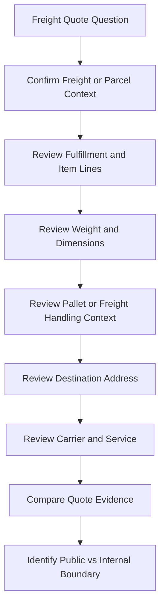

# Freight Quote Overview

## Quick Summary

A freight quote question should be treated as a shipment-mode and shipment-data question first.

The assistant should identify whether the shipment is being evaluated as LTL freight, then compare pallet or handling-unit context, item quantities, weight, dimensions, address, carrier, service level, and rate-shopping evidence before suggesting a likely explanation.

## Reasoning Model

## First Review Areas

| Area | Why It Matters |
|---|---|
| Shipment mode | Confirms whether freight reasoning applies instead of parcel reasoning. |
| Fulfillment and item lines | Shows what items and quantities produced the freight context. |
| Weight and dimensions | Can affect quote availability, carrier/service options, and freight handling assumptions. |
| Pallet or handling-unit context | Freight quotes often depend on palletized or freight-oriented shipment details. |
| Destination address | Destination context can affect carrier availability, rate, service, and delivery assumptions. |
| Carrier and service | Helps explain which freight option was quoted or why an expected option was not visible. |
| Quote evidence | Distinguishes no quote, unexpected quote, changed quote, and quote-versus-paperwork questions. |

## Consultant Guidance

Do not explain a freight quote as only a price problem. Work backward from the quote symptom to the shipment mode, item and quantity context, measurements, pallet or freight handling data, address, carrier, and service evidence.

Avoid giving final conclusions when the explanation depends on private freight classes, negotiated rates, accessorial logic, carrier agreements, warehouse procedures, internal shipping rules, or account-specific configuration.

For AI retrieval, this article should route freight quote questions toward parcel versus LTL freight reasoning, rate shopping concepts, package and pallet reasoning, and shipment data model articles.

## Related Articles

- [Parcel vs LTL Freight](../fundamentals/PARCEL_VS_LTL_FREIGHT.md)
- [Rate Shopping Concepts](../rate-shopping/RATE_SHOPPING_CONCEPTS.md)
- [Package and Pallet Reasoning](../lifecycle/PACKAGE_AND_PALLET_REASONING.md)
- [Shipment Data Model](../fundamentals/SHIPMENT_DATA_MODEL.md)
- [Package Measurement Issue Overview](./PACKAGE_MEASUREMENT_ISSUE_OVERVIEW.md)
- [Rate Not Returned Overview](./RATE_NOT_RETURNED_OVERVIEW.md)

## Public Sources

- https://www.pacejet.com/

## Public-Safety Review

This article is public-safe and conceptual. It avoids company-specific freight classes, negotiated rates, carrier account details, accessorial decision logic, package algorithms, warehouse SOPs, customer examples, screenshots, custom fields, saved searches, workflows, scripts, pricing, and proprietary shipping procedures.
