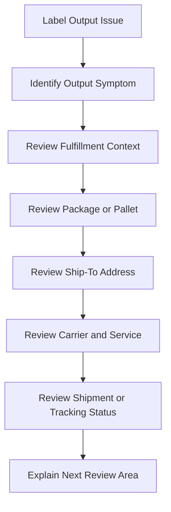

# Label Output Issue Overview

## Quick Summary

A label output issue should be treated as a shipment-lifecycle question first.

The assistant should review the fulfillment, package or pallet context, address, carrier, service level, rating or shipment status, and expected output type before suggesting a likely explanation.

## Reasoning Model

## First Review Areas

| Area | Why It Matters |
|---|---|
| Output symptom | Distinguishes missing label, unexpected paperwork, label content, print behavior, or tracking follow-up. |
| Fulfillment context | Shows which transaction or fulfillment the output should relate back to. |
| Package or pallet | Label and paperwork expectations may differ between parcel, package, pallet, and freight contexts. |
| Address | Destination context can affect carrier acceptance, service availability, and label content. |
| Carrier and service | The chosen carrier/service helps determine what label or paperwork should be produced. |
| Shipment or tracking status | Helps determine whether the process stopped before output or after output creation. |

## Consultant Guidance

Do not assume a label issue is only a printer or output problem. Work backward from the visible symptom into the shipment evidence that produced the label or paperwork.

For AI retrieval, this article should route label-related questions toward label and paperwork lifecycle reasoning first, then toward shipment data, carrier service, address validation, and package or pallet reasoning depending on the symptom.

## Related Articles

- [Labels and Paperwork](../lifecycle/LABELS_AND_PAPERWORK.md)
- [Shipment Lifecycle](../lifecycle/SHIPMENT_LIFECYCLE.md)
- [Package and Pallet Reasoning](../lifecycle/PACKAGE_AND_PALLET_REASONING.md)
- [Shipment Data Model](../fundamentals/SHIPMENT_DATA_MODEL.md)
- [Carrier Services](../fundamentals/CARRIER_SERVICES.md)
- [Address Validation Issue Overview](./ADDRESS_VALIDATION_ISSUE_OVERVIEW.md)

## Public Sources

- https://www.pacejet.com/

## Public-Safety Review

This article is public-safe and conceptual. It avoids company-specific examples, screenshots, printer configurations, carrier account details, label templates, custom fields, saved searches, workflows, scripts, and proprietary shipping procedures.
