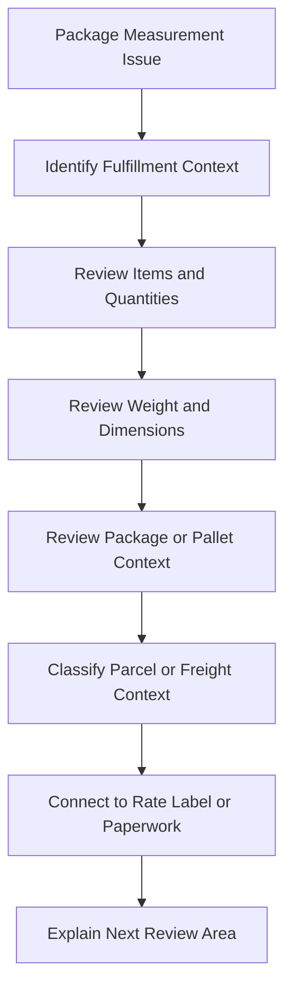

# Package Measurement Issue Overview

## Quick Summary

A package measurement issue should be treated as a shipment-data question first.

The assistant should connect item quantities, weight, dimensions, package or pallet count, shipment mode, rate result, carrier/service context, and label or paperwork output before suggesting a likely explanation.

## Reasoning Model

## First Review Areas

| Area | Why It Matters |
|---|---|
| Fulfillment context | Establishes what items and quantities were actually being shipped. |
| Item and line data | Measurement questions often depend on the fulfilled item mix and quantities. |
| Weight | Can affect rates, carrier/service availability, labels, and freight reasoning. |
| Dimensions | Can affect package selection, parcel versus freight reasoning, and paperwork expectations. |
| Package or pallet count | Helps explain why the shipment may rate, label, or produce paperwork differently than expected. |
| Shipment mode | Distinguishes parcel package reasoning from LTL freight or pallet reasoning. |
| Output context | Shows whether the measurement issue appeared during rating, carrier selection, label output, paperwork, or review. |

## Consultant Guidance

Do not assume the measurement itself is wrong until the shipment context is reviewed. A weight or dimension question may be caused by item data, quantity, package count, pallet context, shipment mode, or the point in the lifecycle where the user noticed the issue.

For AI retrieval, this article should route package measurement questions toward package and pallet reasoning first, then toward shipment data model, parcel versus LTL freight, rate, and label troubleshooting depending on the symptom.

## Related Articles

- [Package and Pallet Reasoning](../lifecycle/PACKAGE_AND_PALLET_REASONING.md)
- [Shipment Data Model](../fundamentals/SHIPMENT_DATA_MODEL.md)
- [Parcel vs LTL Freight](../fundamentals/PARCEL_VS_LTL_FREIGHT.md)
- [Shipment Lifecycle](../lifecycle/SHIPMENT_LIFECYCLE.md)
- [Rate Not Returned Overview](./RATE_NOT_RETURNED_OVERVIEW.md)
- [Label Output Issue Overview](./LABEL_OUTPUT_ISSUE_OVERVIEW.md)

## Public Sources

- https://www.pacejet.com/

## Public-Safety Review

This article is public-safe and conceptual. It avoids company-specific packing rules, package rules, item examples, customer examples, screenshots, carrier account details, negotiated rates, custom fields, saved searches, workflows, scripts, and proprietary shipping procedures.
