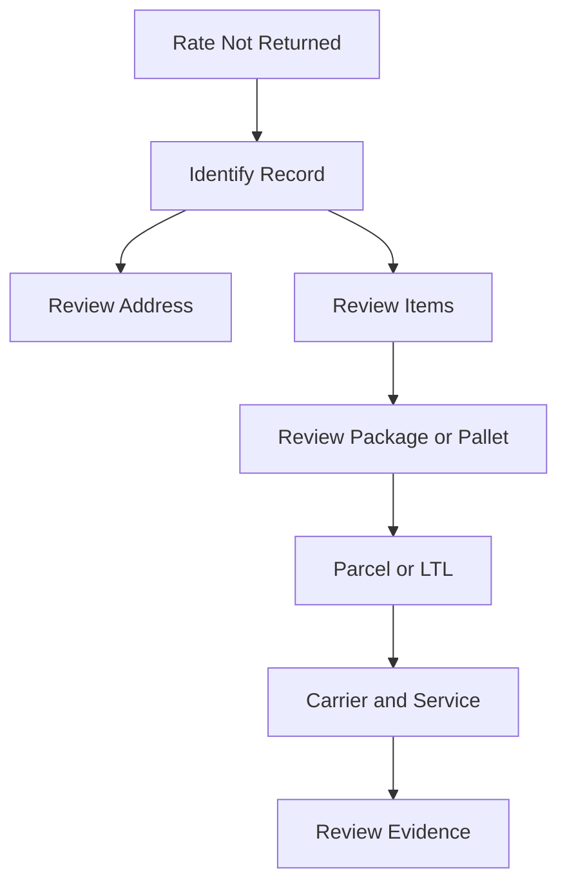

# Rate Not Returned Overview

## Quick Summary

A missing rate should be treated as a shipment-context question first.

The assistant should review the record, address, package or pallet details, shipment mode, carrier, service level, and item data before suggesting a likely explanation.

## Reasoning Model

## First Review Areas

| Area | Why It Matters |
|---|---|
| Record | Confirms where the issue appeared. |
| Address | Destination data may affect rate availability. |
| Items | Item and quantity context affects shipment data. |
| Package or pallet | Weight, dimensions, and handling context may affect rating. |
| Shipment mode | Parcel and LTL may follow different paths. |
| Carrier and service | Available options depend on shipment context. |

## Consultant Guidance

Do not assume a root cause from the missing rate alone. Start with the shipment lifecycle, compare the visible evidence, and escalate when the visible record context does not explain the result.

## Related Articles

- [Shipment Lifecycle](../lifecycle/SHIPMENT_LIFECYCLE.md)
- [Shipment Data Model](../fundamentals/SHIPMENT_DATA_MODEL.md)
- [Parcel vs LTL Freight](../fundamentals/PARCEL_VS_LTL_FREIGHT.md)
- [Address Validation Concepts](../fundamentals/ADDRESS_VALIDATION_CONCEPTS.md)
- [Carrier Services](../fundamentals/CARRIER_SERVICES.md)

## Public Sources

- https://www.pacejet.com/

## Public-Safety Review

This article is public-safe and conceptual. It avoids company-specific examples, screenshots, pricing, and proprietary procedures.
