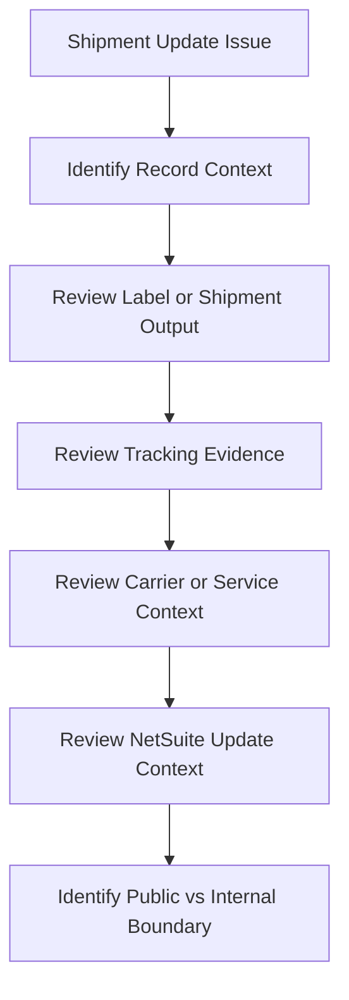

# Shipment Update Issue Overview

## Quick Summary

A shipment update issue should be treated as an evidence-flow question.

The assistant should determine whether the shipment, label, tracking number, carrier status, and NetSuite update context all exist before suggesting where the process may have stopped.

## Reasoning Model

## First Review Areas

| Area | Why It Matters |
|---|---|
| Record context | Confirms whether the issue was observed on an order, fulfillment, shipment, label, or tracking view. |
| Label or shipment output | Shows whether shipping execution produced an output before the expected update. |
| Tracking evidence | Helps determine whether a tracking number or carrier status exists to update back to NetSuite. |
| Carrier and service | Carrier/service context may affect what tracking or shipment evidence is available. |
| Update context | Distinguishes a missing shipping output from an update or synchronization question. |
| Internal boundary | Account-specific integration setup, workflows, scripts, or operating rules belong in private documentation. |

## Consultant Guidance

Do not assume a shipment update issue is automatically a NetSuite problem or a carrier problem. First determine whether the shipment evidence exists, then determine whether the question is about missing output, missing tracking, or missing update behavior.

For AI retrieval, this article should route update-related questions toward shipment lifecycle and shipment data model reasoning first, then toward tracking, label, or carrier-performance articles depending on the evidence available.

## Related Articles

- [Shipment Lifecycle](../lifecycle/SHIPMENT_LIFECYCLE.md)
- [Shipment Data Model](../fundamentals/SHIPMENT_DATA_MODEL.md)
- [Tracking and Carrier Performance](../lifecycle/TRACKING_AND_CARRIER_PERFORMANCE.md)
- [Labels and Paperwork](../lifecycle/LABELS_AND_PAPERWORK.md)
- [Label Output Issue Overview](./LABEL_OUTPUT_ISSUE_OVERVIEW.md)

## Public Sources

- https://www.pacejet.com/

## Public-Safety Review

This article is public-safe and conceptual. It avoids company-specific examples, screenshots, account setup, integration configuration, carrier account details, custom fields, saved searches, workflows, scripts, and proprietary shipping procedures.
