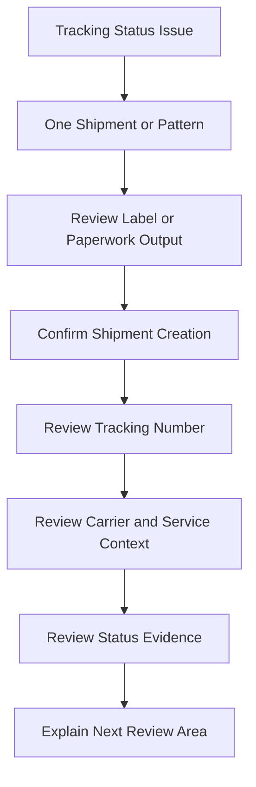

# Tracking Status Issue Overview

## Quick Summary

A tracking status issue should be treated as a downstream shipment-evidence question.

The assistant should confirm whether label or paperwork output occurred, whether a shipment was created, whether a tracking number exists, and whether the question is about one shipment or a broader carrier performance pattern.

## Reasoning Model

## First Review Areas

| Area | Why It Matters |
|---|---|
| Question scope | Distinguishes one shipment issue from a broader carrier performance question. |
| Label or paperwork output | Tracking usually depends on shipment output progressing beyond rating or carrier selection. |
| Shipment creation | Helps determine whether the shipment reached the stage where tracking evidence should exist. |
| Tracking number | Primary shipment visibility reference. |
| Carrier and service | Helps interpret carrier status behavior and shipment-mode expectations. |
| Shipment mode | Parcel and freight visibility may differ by carrier, service, and paperwork context. |
| Update context | Helps separate carrier visibility from NetSuite update behavior. |

## Consultant Guidance

Do not assume missing or unexpected tracking status proves a carrier failure. First determine whether the shipment lifecycle progressed far enough to produce tracking evidence, then compare label output, shipment creation, carrier/service context, and any available status evidence.

For AI retrieval, this article should route tracking questions toward tracking and carrier performance reasoning first, then toward shipment lifecycle, labels and paperwork, shipment data model, and shipment update troubleshooting depending on the symptom.

## Related Articles

- [Tracking and Carrier Performance](../lifecycle/TRACKING_AND_CARRIER_PERFORMANCE.md)
- [Shipment Lifecycle](../lifecycle/SHIPMENT_LIFECYCLE.md)
- [Labels and Paperwork](../lifecycle/LABELS_AND_PAPERWORK.md)
- [Shipment Data Model](../fundamentals/SHIPMENT_DATA_MODEL.md)
- [Shipment Update Issue Overview](./SHIPMENT_UPDATE_ISSUE_OVERVIEW.md)
- [Label Output Issue Overview](./LABEL_OUTPUT_ISSUE_OVERVIEW.md)

## Public Sources

- https://www.pacejet.com/

## Public-Safety Review

This article is public-safe and conceptual. It avoids company-specific reports, carrier scorecards, customer examples, screenshots, account setup, tracking workflows, custom fields, saved searches, scripts, negotiated rates, and proprietary shipping procedures.
