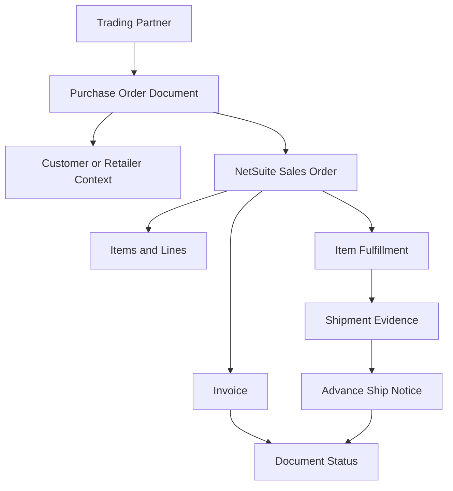

# SPS Commerce Integration Knowledge Hub

## Purpose

This section organizes public-safe SPS Commerce knowledge for the NetSuite Intelligence Platform.

The goal is not to reproduce SPS Commerce documentation. The goal is to help humans and AI assistants reason through NetSuite, SPS Commerce, EDI, retailer compliance, order lifecycle, shipment notice, invoice, document-status, and troubleshooting questions using connected concepts and public-safe record relationships.

SPS Commerce should be treated as an EDI and retail supply-chain intelligence domain connected to NetSuite customer, item, sales order, fulfillment, shipment, invoice, trading partner, document status, and exception data.

## Public-Safe Scope

This section may include:

- public SPS Commerce concepts
- public EDI and retail supply-chain concepts
- NetSuite-centered EDI reasoning
- generic trading partner and document lifecycle models
- public-safe troubleshooting guidance
- purchase order, acknowledgment, shipment notice, and invoice relationship models
- AI retrieval guidance
- benchmark questions for evaluation

This section must not include company-specific retailer maps, customer-specific examples, private trading-partner setup, credentials, private portal screenshots, custom fields, saved searches, workflows, scripts, internal compliance rules, pricing, chargeback decisions, or proprietary operating procedures.

Private implementation knowledge belongs in a private repository or internal knowledge source.

## Public Research Summary

Public SPS Commerce materials describe SPS as a retail supply-chain network and EDI solution provider. SPS public pages describe Fulfillment as supporting EDI capability, EDI compliance, system integrations, trading partner onboarding, and automated order documents. Public materials also describe EDI as a common language of supply-chain documents used for communication between suppliers and buyers.

For this repository, those public capabilities should be translated into NetSuite-centered reasoning models, not copied as product documentation.

## Knowledge Clusters

### EDI Fundamentals

The EDI Fundamentals cluster should explain the concepts an assistant needs before troubleshooting SPS Commerce or NetSuite EDI questions.

Planned seed articles:

1. EDI Overview
2. Trading Partner Concepts
3. EDI Document Types
4. Document Status Concepts
5. Public-Safe Compliance Boundaries

Recommended retrieval path:

```text
EDI Overview
  -> Trading Partner Concepts
  -> EDI Document Types
  -> Document Status Concepts
  -> Public-Safe Compliance Boundaries
```

### Order Lifecycle

The Order Lifecycle cluster should explain how retailer or trading partner documents move through a generic EDI process.

Planned seed articles:

1. Purchase Order Lifecycle
2. Purchase Order Acknowledgment Reasoning
3. Fulfillment and Shipment Notice Relationship
4. Invoice Relationship to Order and Shipment
5. Retailer Document Flow Overview

Recommended retrieval path:

```text
Purchase Order
  -> Acknowledgment
  -> Fulfillment or Shipment
  -> Advance Ship Notice
  -> Invoice
  -> Status or Exception Review
```

### Document Reasoning

The Document Reasoning cluster should explain how assistants compare related documents before diagnosing issues.

Planned seed articles:

1. Purchase Order Data Model
2. Acknowledgment Data Model
3. Advance Ship Notice Data Model
4. Invoice Data Model
5. Cross-Document Comparison

Recommended retrieval path:

```text
User Question
  -> Relevant Document
  -> Related NetSuite Record
  -> Related EDI Document
  -> Data Comparison
  -> Escalation Boundary
```

### Troubleshooting

The Troubleshooting cluster should explain how observable EDI symptoms should be investigated.

Planned seed articles:

1. Missing Purchase Order Overview
2. Acknowledgment Issue Overview
3. ASN or Shipment Notice Issue Overview
4. Invoice Rejection Overview
5. Document Status Issue Overview
6. Retailer Compliance Warning Overview
7. Mapping or Validation Error Overview

Recommended retrieval path:

```text
Observable EDI Symptom
  -> Document Lifecycle Stage
  -> Related NetSuite Record
  -> Related EDI Document
  -> Evidence Review
  -> Internal Review Boundary
```

### Evaluation

The Evaluation cluster should test whether an AI assistant can use the SPS Commerce knowledge base like an experienced NetSuite and EDI consultant.

Planned seed articles:

1. SPS Commerce Benchmark Questions
2. SPS Commerce Coverage Addendum

## EDI Document Lifecycle Map

```mermaid
flowchart LR
    Retailer[Retailer or Trading Partner]
    PO[Purchase Order]
    Acknowledgment[Purchase Order Acknowledgment]
    Fulfillment[NetSuite Fulfillment Context]
    ASN[Advance Ship Notice]
    Invoice[Invoice]
    Status[Document Status or Exception]
    Review[Review or Escalation]

    Retailer --> PO
    PO --> Acknowledgment
    Acknowledgment --> Fulfillment
    Fulfillment --> ASN
    ASN --> Invoice
    Invoice --> Status
    Status --> Review
```



This lifecycle map is a generic reasoning model. It is not a company-specific EDI process map.

## NetSuite and EDI Relationship Map



This map teaches the assistant that EDI outcomes should be reasoned through document relationships, NetSuite records, trading partner context, item and line data, fulfillment evidence, shipment evidence, invoice evidence, and visible status or exception data.

## AI Retrieval Guidance

When answering an SPS Commerce question, an AI assistant should:

1. Identify the visible symptom or document type.
2. Identify the lifecycle stage involved.
3. Retrieve the relevant fundamentals, lifecycle, document-reasoning, or troubleshooting article.
4. Compare related NetSuite records and EDI documents before suggesting likely explanations.
5. Separate public EDI concepts from private maps, retailer requirements, trading-partner setup, and internal operating rules.
6. Escalate when private retailer specifications, account-specific maps, custom fields, saved searches, workflows, scripts, credentials, chargeback decisions, or proprietary procedures are required.

## Suggested First Articles

The first recommended SPS Commerce cluster is EDI Fundamentals.

Start with:

1. `fundamentals/EDI_OVERVIEW.md`
2. `fundamentals/TRADING_PARTNER_CONCEPTS.md`
3. `fundamentals/EDI_DOCUMENT_TYPES.md`
4. `lifecycle/PURCHASE_ORDER_LIFECYCLE.md`
5. `lifecycle/DOCUMENT_STATUS_CONCEPTS.md`

These articles should stay conceptual, public-safe, and focused on AI reasoning rather than private implementation steps.

## Public Sources

- https://www.spscommerce.com/
- https://www.spscommerce.com/products/fulfillment/

## Public-Safety Review

This knowledge hub is public-safe. It avoids company-specific retailer maps, customer examples, account setup, screenshots, credentials, custom fields, saved searches, workflows, scripts, pricing, chargeback decisions, and proprietary operating procedures.
