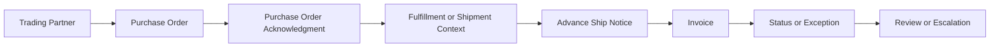

# EDI Document Types

## Quick Summary

EDI document types represent different business events in a trading partner relationship.

In a NetSuite and SPS Commerce context, the assistant should classify the document type before troubleshooting because a purchase order, acknowledgment, advance ship notice, invoice, and status message each belong to different lifecycle stages and evidence paths.

The core reasoning rule is:

> Identify the document type first. Different EDI documents answer different business questions.

## Business Purpose

Employees may describe an EDI issue using vague language such as "the order failed," "the retailer rejected it," "the ASN is missing," or "the invoice did not go through."

A consultant-style assistant should translate that symptom into the likely document type, then connect the document to the related trading partner, NetSuite record, lifecycle stage, and visible status evidence.

## Public SPS Commerce Perspective

Public SPS Commerce materials describe EDI as part of retail supply-chain communication and describe Fulfillment as supporting EDI capability, compliance, system integrations, trading partner onboarding, and automated order documents.

For AI reasoning, the important point is that document type provides the starting point for triage. The assistant should not treat all EDI issues as the same kind of failure.

## NetSuite Perspective

In NetSuite-centered reasoning, common EDI document questions may connect to:

- customer or trading partner context
- purchase order document
- sales order
- acknowledgment
- item fulfillment
- shipment evidence
- advance ship notice
- invoice
- document status or exception evidence

The assistant should compare the EDI document to the related NetSuite record before suggesting likely causes.

## Common EDI Document Categories

| Document Category | Common Business Meaning | NetSuite-Centered Reasoning Path |
|---|---|---|
| Purchase order | A buyer or retailer communicates an order request. | Compare partner context, order data, item lines, quantities, dates, and sales order creation or review. |
| Purchase order acknowledgment | A response to a purchase order or order expectation. | Compare original order details, accepted or changed lines, quantities, dates, and partner expectations. |
| Advance ship notice | A shipment notice that communicates shipping or packing details before delivery. | Compare fulfillment, shipment evidence, item lines, quantities, packaging, carrier, and document status. |
| Invoice | A billing document connected to an order or shipment. | Compare sales order, shipment or fulfillment evidence, invoice lines, quantities, amounts, and status. |
| Status or exception message | Visible evidence that a document was accepted, rejected, pending, or requires review. | Use as diagnostic evidence, not as a final root cause without document and record comparison. |

## Document Lifecycle Map

This map is a generic reasoning model. It is not a company-specific EDI workflow.

## Consultant Reasoning Sequence

When answering an EDI document question, the assistant should:

1. Identify the visible document type or symptom.
2. Identify the trading partner context if visible.
3. Identify the lifecycle stage for that document.
4. Identify the related NetSuite record.
5. Compare document evidence to NetSuite record evidence.
6. Determine whether the issue is missing, rejected, delayed, mismatched, duplicated, or unclear.
7. Avoid assuming the cause is SPS Commerce, NetSuite, the retailer, or mapping until evidence is reviewed.
8. Escalate when private maps, retailer specifications, account setup, credentials, custom fields, workflows, scripts, or operating procedures are needed.

## Common Employee Questions

- What kind of EDI document is this?
- Is this about the purchase order, acknowledgment, ASN, invoice, or document status?
- Why did the retailer reject the document?
- Why did the order not appear in NetSuite?
- Why is the ASN missing?
- Why did the invoice not match the shipment?
- What records should I compare before escalating?

## Common Misconceptions

| Misconception | Better Reasoning |
|---|---|
| All EDI errors should be diagnosed the same way. | The document type determines the lifecycle stage and review path. |
| A rejected document proves the source record is wrong. | Rejection should be compared with document status, partner context, and related NetSuite evidence. |
| An ASN issue is the same as an invoice issue. | Shipment notices and invoices answer different business questions and depend on different evidence. |
| Public documentation should define exact retailer document rules. | Retailer-specific rules and maps belong in private documentation or internal review. |

## AI Reasoning Guidance

Use this article when a user asks what an EDI document is, which document type is involved, why the document type matters, or how purchase orders, acknowledgments, ASNs, invoices, and statuses relate to NetSuite.

Retrieve this article with [EDI Overview](EDI_OVERVIEW.md) and [Trading Partner Concepts](TRADING_PARTNER_CONCEPTS.md). If the question involves a specific lifecycle symptom, retrieve the matching lifecycle or troubleshooting article when available.

## Related Articles

- [EDI Overview](EDI_OVERVIEW.md)
- [Trading Partner Concepts](TRADING_PARTNER_CONCEPTS.md)
- [SPS Commerce Integration Knowledge Hub](../README.md)

## Public Sources

- https://www.spscommerce.com/
- https://www.spscommerce.com/products/fulfillment/

## Public-Safety Review

This article is public-safe. It avoids company-specific retailer maps, customer examples, account setup, screenshots, credentials, custom fields, saved searches, workflows, scripts, pricing, chargeback decisions, and proprietary operating procedures.
