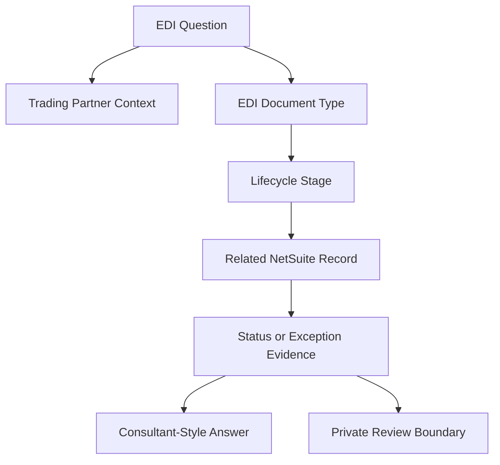

# EDI Overview

## Quick Summary

Electronic Data Interchange, or EDI, is a structured way for trading partners to exchange business documents electronically.

In a NetSuite and SPS Commerce context, EDI questions should be reasoned through document type, trading partner context, related NetSuite records, lifecycle stage, visible status, and exception evidence.

The core reasoning rule is:

> EDI is not only a file or message. It is a business-document conversation between trading partners.

## Business Purpose

Retail supply-chain teams use EDI to exchange documents such as purchase orders, acknowledgments, shipment notices, invoices, and related status or exception messages.

Employees may ask why an order did not appear, why a document failed, why an invoice was rejected, why a shipment notice is missing, or why a retailer says the information does not match expectations.

A consultant-style assistant should first identify the document type and lifecycle stage before suggesting a likely explanation.

## Public SPS Commerce Perspective

Public SPS Commerce materials describe EDI as a common language of supply-chain documents that helps suppliers and buyers communicate. SPS public pages describe Fulfillment as supporting EDI capability, EDI compliance, system integrations, and trading partner onboarding.

For AI reasoning, the important point is that EDI connects business documents, trading partner expectations, system integrations, and operational evidence. The assistant should not treat an EDI issue as only a technical file problem.

## NetSuite Perspective

In NetSuite-centered reasoning, an EDI question often connects to records such as:

- customer or trading partner context
- sales order
- item and transaction lines
- item fulfillment
- shipment evidence
- invoice
- document status or exception evidence

The assistant should compare the EDI document and related NetSuite record before drawing conclusions.

## Core EDI Concepts

| Concept | Meaning | Why It Matters |
|---|---|---|
| Trading partner | The buyer, retailer, supplier, or partner exchanging EDI documents. | Determines document expectations and lifecycle context. |
| EDI document | A structured business document exchanged electronically. | Represents a business event such as an order, shipment notice, or invoice. |
| Lifecycle stage | Where the document appears in the order-to-invoice process. | Helps classify the issue before troubleshooting. |
| Document status | Visible state of a document or exchange. | Helps separate missing, rejected, pending, or completed document questions. |
| Mapping boundary | Translation between document data and system records. | Often private and account-specific, so public content should stay conceptual. |

## EDI Reasoning Model

This map is a generic reasoning model. It is not a company-specific EDI workflow.

## Consultant Reasoning Sequence

When answering an EDI question, the assistant should:

1. Identify the trading partner or retailer context if visible.
2. Identify the document type involved.
3. Identify the lifecycle stage: order, acknowledgment, fulfillment, shipment notice, invoice, status, or exception.
4. Identify the related NetSuite record.
5. Compare document evidence to record evidence.
6. Determine whether the issue is missing, rejected, delayed, mismatched, or unclear.
7. Avoid assuming the cause is mapping, SPS Commerce, NetSuite, or the retailer until evidence is reviewed.
8. Escalate when private maps, retailer specifications, credentials, custom fields, workflows, scripts, or internal procedures are needed.

## Common Employee Questions

- What is EDI?
- Why did the retailer send a document electronically?
- Why did the order not appear in NetSuite?
- Why did an invoice or shipment notice fail?
- Is this an SPS Commerce issue, a NetSuite issue, a retailer issue, or a mapping issue?
- What evidence should I gather before escalating?

## Common Misconceptions

| Misconception | Better Reasoning |
|---|---|
| EDI is only a technical file transfer. | EDI represents structured business documents exchanged between trading partners. |
| Every EDI issue is a mapping issue. | The issue may involve lifecycle stage, document status, record data, partner expectations, or private setup. |
| The NetSuite record alone explains the EDI outcome. | The assistant should compare NetSuite record evidence with document and status evidence. |
| Public documentation should define exact retailer requirements. | Retailer-specific requirements and maps belong in private documentation or internal review. |

## AI Reasoning Guidance

Use this article when a user asks what EDI is, why SPS Commerce is involved, how EDI connects to NetSuite, or where to start with an EDI issue.

Retrieve this article with the SPS Commerce knowledge hub. If the question mentions a purchase order, acknowledgment, ASN, invoice, status, rejection, or mapping error, retrieve the related lifecycle or troubleshooting article when available.

## Related Articles

- [SPS Commerce Integration Knowledge Hub](../README.md)

## Public Sources

- https://www.spscommerce.com/
- https://www.spscommerce.com/products/fulfillment/

## Public-Safety Review

This article is public-safe. It avoids company-specific retailer maps, customer examples, account setup, screenshots, credentials, custom fields, saved searches, workflows, scripts, pricing, chargeback decisions, and proprietary operating procedures.
