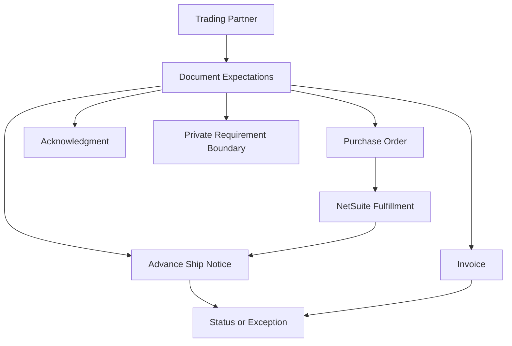

# Trading Partner Concepts

## Quick Summary

A trading partner is the organization on the other side of an EDI document exchange.

In a NetSuite and SPS Commerce context, trading partner context helps explain which documents are expected, which lifecycle stage applies, what data should be compared, and when private retailer-specific requirements may be involved.

The core reasoning rule is:

> Do not troubleshoot an EDI document without identifying the trading partner context when it is visible or relevant.

## Business Purpose

Employees may ask why one retailer's order behaved differently than another's, why a shipment notice was expected for one partner but not another, why an invoice was rejected, or why a document status depends on partner requirements.

A consultant-style assistant should treat trading partner context as part of the evidence, not as background detail.

## Public SPS Commerce Perspective

Public SPS Commerce materials describe EDI and supply-chain connections between suppliers, buyers, retailers, and trading partners. Public Fulfillment materials describe support for EDI capability, compliance, system integrations, and trading partner onboarding.

For AI reasoning, the important point is that EDI exchanges are partner-aware. A document question should be connected to the partner, document type, lifecycle stage, and related system records before drawing conclusions.

## NetSuite Perspective

In NetSuite-centered reasoning, a trading partner may be connected to records such as:

- customer or retailer context
- sales order
- purchase order document
- item and transaction lines
- item fulfillment
- shipment evidence
- invoice
- document status or exception evidence

The assistant should avoid assuming that two partners follow identical document expectations.

## Trading Partner Relationship Map

This map is a generic reasoning model. It is not a company-specific trading partner setup map.

## Key Concepts

| Concept | Meaning | Why It Matters |
|---|---|---|
| Trading partner | The buyer, retailer, supplier, or business partner exchanging EDI documents. | Helps define document expectations and lifecycle context. |
| Partner expectations | Requirements for documents, timing, data, or process behavior. | Often private or account-specific, so public guidance should stay conceptual. |
| Document flow | The sequence of documents exchanged with the partner. | Helps identify what should exist before or after a symptom. |
| Status evidence | Visible document status, rejection, warning, or exception. | Helps separate missing, delayed, rejected, or mismatched document issues. |
| Private boundary | Partner-specific maps, specifications, and setup details. | Requires internal review rather than public-repository conclusions. |

## Consultant Reasoning Sequence

When answering a trading partner question, the assistant should:

1. Identify the trading partner or retailer context if visible.
2. Identify the document type involved.
3. Identify the lifecycle stage involved.
4. Compare the related NetSuite record and EDI document evidence.
5. Determine whether the issue is about missing data, rejected data, timing, status, or partner-specific expectations.
6. Avoid assuming all partners behave the same way.
7. Escalate when private partner maps, retailer specifications, account setup, credentials, custom fields, workflows, scripts, or operating procedures are needed.

## Common Employee Questions

- What is a trading partner?
- Why does the retailer matter for EDI?
- Why did one partner accept a document while another rejected it?
- Why does this partner require a shipment notice?
- Is this a partner issue, SPS Commerce issue, NetSuite issue, or mapping issue?
- What evidence should I gather before escalating?

## Common Misconceptions

| Misconception | Better Reasoning |
|---|---|
| All trading partners use the same EDI expectations. | Document expectations may vary by partner and private setup. |
| A partner rejection proves NetSuite is wrong. | The assistant should compare document, record, status, and partner context first. |
| Public documentation should list exact retailer requirements. | Retailer-specific requirements belong in private documentation or internal review. |
| Trading partner context is optional. | Partner context may determine document expectations and troubleshooting paths. |

## AI Reasoning Guidance

Use this article when a user asks about a retailer, buyer, supplier, trading partner, partner-specific document behavior, EDI compliance expectations, or why the same document behaves differently across partners.

Retrieve this article with [EDI Overview](EDI_OVERVIEW.md). If the question mentions a purchase order, acknowledgment, ASN, invoice, status, rejection, or mapping error, retrieve the related lifecycle or troubleshooting article when available.

## Related Articles

- [EDI Overview](EDI_OVERVIEW.md)
- [SPS Commerce Integration Knowledge Hub](../README.md)

## Public Sources

- https://www.spscommerce.com/
- https://www.spscommerce.com/products/fulfillment/

## Public-Safety Review

This article is public-safe. It avoids company-specific retailer maps, customer examples, account setup, screenshots, credentials, custom fields, saved searches, workflows, scripts, pricing, chargeback decisions, and proprietary operating procedures.
