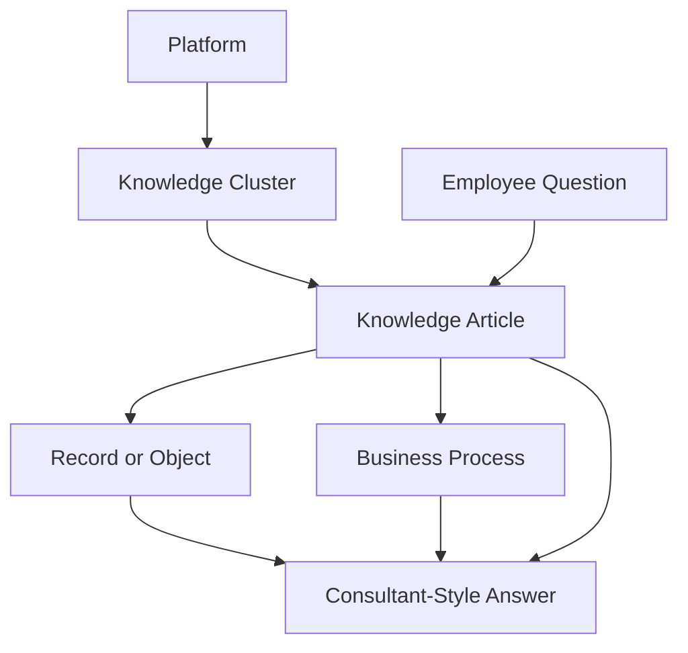
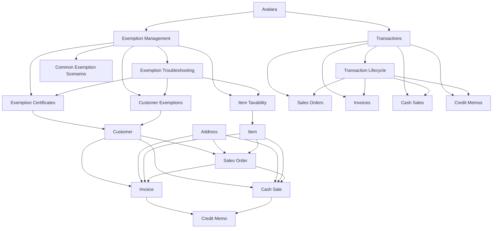

# ERP Intelligence Knowledge Graph

## Purpose

The ERP Intelligence Knowledge Graph explains how knowledge articles should connect across platforms, records, business processes, and employee questions.

The goal is to help a GPT retrieve connected context instead of answering from one document at a time.

## Core Idea

A strong ERP answer usually depends on relationships.

For example, a NetSuite tax question may require context from customer records, transaction records, item records, address context, exemption articles, and troubleshooting guides.

The knowledge graph makes those relationships visible.

## Relationship Types

| Relationship | Meaning | Example |
|---|---|---|
| Platform to Cluster | A platform contains a knowledge area. | Avalara to Exemption Management |
| Cluster to Article | A cluster contains related articles. | Transactions to Invoices |
| Article to Record | An article explains a record or object. | Invoices to Invoice |
| Record to Record | Two records interact in a process. | Sales Order to Invoice |
| Question to Article | A question is answered by an article. | Why did tax change? to Transaction Lifecycle |
| Article to Article | One article supports another. | Credit Memos to Invoices |

## General Knowledge Graph

## Avalara Knowledge Graph

## Retrieval Strategy

When a user asks a question, retrieve knowledge in this order:

1. The article that directly matches the question.
2. The article for the main NetSuite record involved.
3. The troubleshooting article for the cluster.
4. The lifecycle or process article when multiple records are involved.
5. Related record or concept articles that explain the surrounding context.

## Retrieval Examples

### Why did tax change between sales order and invoice?

Retrieve:

1. `docs/integrations/avalara/transactions/TRANSACTION_LIFECYCLE.md`
2. `docs/integrations/avalara/transactions/SALES_ORDERS.md`
3. `docs/integrations/avalara/transactions/INVOICES.md`
4. `docs/integrations/avalara/exemptions/EXEMPTION_TROUBLESHOOTING.md`

### Why did this customer not get charged tax?

Retrieve:

1. `docs/integrations/avalara/exemptions/WHY_IS_CUSTOMER_TAX_EXEMPT.md`
2. `docs/integrations/avalara/exemptions/CUSTOMER_EXEMPTIONS.md`
3. `docs/integrations/avalara/exemptions/EXEMPTION_CERTIFICATES.md`
4. The relevant transaction article.

### Should we create a credit memo for a tax issue?

Retrieve:

1. `docs/integrations/avalara/transactions/CREDIT_MEMOS.md`
2. `docs/integrations/avalara/transactions/INVOICES.md`
3. `docs/integrations/avalara/transactions/TRANSACTION_LIFECYCLE.md`
4. `docs/integrations/avalara/exemptions/EXEMPTION_TROUBLESHOOTING.md`

## Employee Question Categories

| Category | Retrieval Pattern |
|---|---|
| Why did tax calculate? | Transaction article plus troubleshooting |
| Why did tax not calculate? | Exemption article plus transaction context |
| Why did tax change? | Lifecycle article plus compared transaction articles |
| Why is customer exempt? | Customer exemption article plus certificate article |
| Should this be corrected? | Original transaction article plus correction article |
| What record should I check? | Knowledge graph plus record relationship article |

## Graph Quality Rules

Add a graph relationship when it improves reasoning.

Good reasons to add a relationship:

- two records are compared during troubleshooting,
- one article depends on another article,
- one employee question requires multiple articles,
- a process moves from one record to another,
- the GPT should retrieve both pages together.

Avoid adding relationships only because two topics are broadly related.

## Metadata Alignment

The knowledge graph should align with the metadata fields in `AI_KNOWLEDGE_METADATA.md`:

- `platform`
- `cluster`
- `knowledge_type`
- `primary_records`
- `related_records`
- `related_articles`
- `keywords`
- `employee_questions_answered`

These fields are the structured source of graph relationships.

## Public-Safe Boundary

This public graph should describe generic record and concept relationships only. Company-specific implementation details belong in a private knowledge source.

## Maintenance Guidance

When a new article is added:

1. Assign the correct platform and cluster.
2. List primary and related records.
3. Link related articles.
4. Add employee questions answered.
5. Update the cluster README when navigation changes.
6. Update this graph when a new relationship pattern is added.

## Related Documents

- [AI Knowledge Metadata](AI_KNOWLEDGE_METADATA.md)
- [ERP Intelligence Knowledge Model](KNOWLEDGE_MODEL.md)
- [Knowledge Cluster Article Template](../templates/KNOWLEDGE_CLUSTER_TEMPLATE.md)
- [Avalara Knowledge Hub](../docs/integrations/avalara/README.md)
